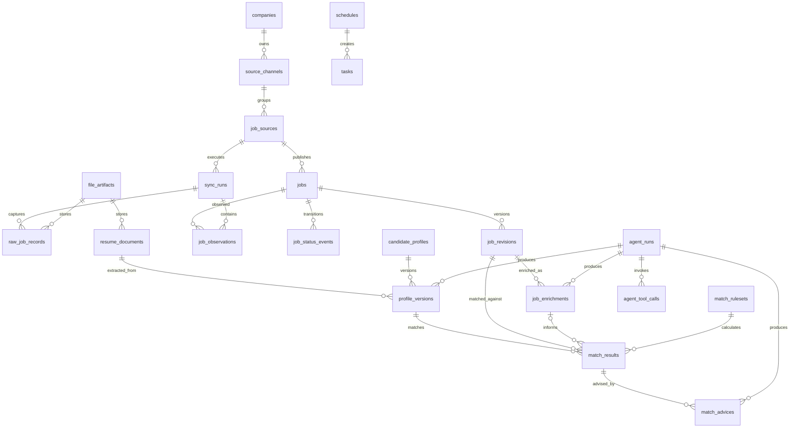

# 数据模型与 SQLite 表设计

> 状态：Accepted
> 版本：1.2.0
> 日期：2026-08-28
> 上位文档：[总体架构](./overall-arch.md)

## 1. 目的与约束

本文档固定首期持久化模型、数据所有权、关键约束和索引，作为 Drizzle Schema、迁移文件、Repository 契约与集成测试的设计依据。

设计约束：

- SQLite 使用 WAL、外键和 `busy_timeout`。
- 主键统一使用应用层生成的 UUIDv7 文本，避免依赖数据库自增 ID。
- 时间统一使用 Unix epoch milliseconds 的 `INTEGER`，应用层只以 UTC 解释。
- 布尔值使用带 `CHECK (value IN (0, 1))` 的 `INTEGER`。
- 枚举使用 `TEXT + CHECK`；允许扩展的注册表类型只使用 `TEXT`。
- 领域事实采用普通列；版本化快照、低频扩展字段和来源私有字段使用规范 JSON 文本。
- 所有 JSON 写入前必须通过 Zod 校验并按稳定键顺序序列化。
- 网络、文件解析或模型调用不得位于数据库事务中。

## 2. 数据分层与关系

数据分为四类：

1. **来源事实**：`raw_job_records`、`job_observations`。
2. **标准化事实**：`jobs`、`job_revisions`、`job_status_events`。
3. **用户事实**：`resume_documents`、`candidate_profiles`、`profile_versions`。
4. **推导结果**：`job_enrichments`、`match_results`、`match_advices`、`agent_runs`。

推导结果不得反向覆盖来源事实或标准化事实。

## 3. 表定义

以下类型使用 SQLite 物理类型表示；`json` 表示存为 `TEXT` 的规范 JSON。

### 3.1 `companies`

| 列             | 类型    | 约束                    | 说明                 |
| -------------- | ------- | ----------------------- | -------------------- |
| `id`           | TEXT    | PK                      | UUIDv7               |
| `slug`         | TEXT    | UNIQUE NOT NULL         | 稳定机器标识         |
| `name`         | TEXT    | NOT NULL                | 标准名称             |
| `aliases_json` | TEXT    | NOT NULL DEFAULT `'[]'` | 别名数组             |
| `industry`     | TEXT    | NULL                    | 行业标签             |
| `size_tag`     | TEXT    | NULL                    | 仅用于筛选的规模标签 |
| `enabled`      | INTEGER | NOT NULL CHECK          | 是否参与默认同步     |
| `created_at`   | INTEGER | NOT NULL                | 创建时间             |
| `updated_at`   | INTEGER | NOT NULL                | 修改时间             |

### 3.2 来源目录

#### 3.2.1 `source_channels`

逻辑渠道是公司下稳定、面向用户的实习、校招或社招入口，不承担具体官网的运行状态：

| 列             | 类型    | 约束                   | 说明                         |
| -------------- | ------- | ---------------------- | ---------------------------- |
| `id`           | TEXT    | PK                     | UUIDv7                       |
| `company_id`   | TEXT    | FK companies, NOT NULL | 所属公司                     |
| `channel`      | TEXT    | CHECK                  | `intern`、`campus`、`social` |
| `slug`         | TEXT    | UNIQUE NOT NULL        | 稳定的渠道级机器标识         |
| `enabled`      | INTEGER | NOT NULL CHECK         | 渠道总开关                   |
| `support_note` | TEXT    | NULL                   | 非敏感覆盖范围或阻断说明     |
| `created_at`   | INTEGER | NOT NULL               | 创建时间                     |
| `updated_at`   | INTEGER | NOT NULL               | 修改时间                     |

唯一约束：`(company_id, channel)`。每家公司恰好拥有三个逻辑渠道由 catalog seed 与集成测试共同保证。渠道支持状态由 required 物理来源派生，渠道健康只作为查询摘要，不重复持久化。

#### 3.2.2 `job_sources`

`job_sources` 表示可独立执行、限流、重试和观测的物理官网入口或协议：

| 列                     | 类型    | 约束                         | 说明                                          |
| ---------------------- | ------- | ---------------------------- | --------------------------------------------- |
| `id`                   | TEXT    | PK                           | UUIDv7                                        |
| `company_id`           | TEXT    | FK companies, NOT NULL       | 所属公司；与渠道公司必须一致                  |
| `channel_id`           | TEXT    | FK source_channels, NOT NULL | 所属逻辑渠道                                  |
| `slug`                 | TEXT    | UNIQUE NOT NULL              | 来源标识                                      |
| `adapter_key`          | TEXT    | UNIQUE NOT NULL              | 适配器注册键                                  |
| `coverage_role`        | TEXT    | CHECK                        | `required`、`supplemental`                    |
| `recruitment_type`     | TEXT    | CHECK                        | `social`、`campus`、`mixed`                   |
| `base_url`             | TEXT    | NOT NULL                     | 官方入口                                      |
| `config_json`          | TEXT    | NOT NULL DEFAULT `'{}'`      | 非敏感来源配置                                |
| `sync_policy_version`  | TEXT    | NOT NULL                     | 当前同步策略版本                              |
| `sync_policy_json`     | TEXT    | NOT NULL                     | 限速、缺失阈值等版本化策略                    |
| `enabled`              | INTEGER | NOT NULL CHECK               | 是否启用                                      |
| `support_status`       | TEXT    | CHECK                        | `experimental`、`supported`、`blocked`        |
| `support_note`         | TEXT    | NULL                         | 非敏感限制或复核说明                          |
| `health_status`        | TEXT    | CHECK                        | `unknown`、`healthy`、`degraded`、`unhealthy` |
| `consecutive_failures` | INTEGER | NOT NULL DEFAULT 0           | 连续失败数                                    |
| `last_success_at`      | INTEGER | NULL                         | 最近成功时间                                  |
| `last_failure_at`      | INTEGER | NULL                         | 最近失败时间                                  |
| `created_at`           | INTEGER | NOT NULL                     | 创建时间                                      |
| `updated_at`           | INTEGER | NOT NULL                     | 修改时间                                      |

一个逻辑渠道可拥有零个、一个或多个物理来源，每个物理来源只能属于一个逻辑渠道。`recruitment_type` 在迁移期继续兼容既有代码，权威渠道身份以 `channel_id` 为准；应用层必须校验 `job_sources.company_id` 与所属逻辑渠道公司一致。

### 3.3 `sync_runs`

| 列                    | 类型    | 约束                     | 说明                                                     |
| --------------------- | ------- | ------------------------ | -------------------------------------------------------- |
| `id`                  | TEXT    | PK                       | 运行 ID                                                  |
| `source_id`           | TEXT    | FK job_sources, NOT NULL | 来源                                                     |
| `trigger`             | TEXT    | CHECK                    | `manual`、`schedule`、`retry`                            |
| `status`              | TEXT    | CHECK                    | `running`、`succeeded`、`partial`、`failed`、`cancelled` |
| `coverage`            | TEXT    | CHECK                    | `complete`、`partial`、`unknown`                         |
| `adapter_version`     | TEXT    | NOT NULL                 | 本次适配器实现版本                                       |
| `normalizer_version`  | TEXT    | NOT NULL                 | 本次标准化规则版本                                       |
| `sync_policy_version` | TEXT    | NOT NULL                 | 本次状态策略版本                                         |
| `source_config_hash`  | TEXT    | NOT NULL                 | 脱敏后来源配置哈希                                       |
| `cursor_in_json`      | TEXT    | NULL                     | 输入游标                                                 |
| `cursor_out_json`     | TEXT    | NULL                     | 成功后的新游标                                           |
| `stats_json`          | TEXT    | NOT NULL DEFAULT `'{}'`  | 发现、增改、关闭、失败计数                               |
| `error_category`      | TEXT    | NULL                     | 标准错误分类                                             |
| `error_summary`       | TEXT    | NULL                     | 脱敏错误摘要                                             |
| `started_at`          | INTEGER | NOT NULL                 | 开始时间                                                 |
| `finished_at`         | INTEGER | NULL                     | 结束时间                                                 |

索引：`(source_id, started_at DESC)`、`(status, started_at DESC)`；部分唯一索引：`source_id WHERE status = 'running'`，作为来源同步互斥的最终数据库约束。

### 3.4 `file_artifacts`

| 列              | 类型    | 约束            | 说明                                               |
| --------------- | ------- | --------------- | -------------------------------------------------- |
| `id`            | TEXT    | PK              | 文件 ID                                            |
| `kind`          | TEXT    | CHECK           | `raw_job`、`resume`、`export`、`fixture_candidate` |
| `relative_path` | TEXT    | UNIQUE NOT NULL | 相对 `var/` 的路径                                 |
| `media_type`    | TEXT    | NOT NULL        | MIME                                               |
| `sha256`        | TEXT    | NOT NULL        | 内容哈希                                           |
| `byte_size`     | INTEGER | NOT NULL        | 字节数                                             |
| `created_at`    | INTEGER | NOT NULL        | 创建时间                                           |
| `deleted_at`    | INTEGER | NULL            | 显式清理时间                                       |

文件必须先写同目录临时文件、校验哈希，再原子改名并创建记录。

### 3.5 `raw_job_records`

| 列                  | 类型    | 约束                     | 说明                    |
| ------------------- | ------- | ------------------------ | ----------------------- |
| `id`                | TEXT    | PK                       | 原始记录 ID             |
| `source_id`         | TEXT    | FK job_sources, NOT NULL | 来源                    |
| `first_sync_run_id` | TEXT    | FK sync_runs, NOT NULL   | 首次捕获运行            |
| `external_job_id`   | TEXT    | NULL                     | 来源 ID                 |
| `identity_key`      | TEXT    | NOT NULL                 | 来源 ID 或规范 URL/指纹 |
| `source_url`        | TEXT    | NOT NULL                 | 抓取 URL                |
| `content_hash`      | TEXT    | NOT NULL                 | 规范原始内容哈希        |
| `payload_json`      | TEXT    | NULL                     | 小型原始数据            |
| `artifact_id`       | TEXT    | FK file_artifacts, NULL  | 大型原始数据文件        |
| `captured_at`       | INTEGER | NOT NULL                 | 捕获时间                |

约束：`payload_json` 与 `artifact_id` 至少一个非空。唯一约束：`(source_id, identity_key, content_hash)`；相同内容在后续运行中的重复观察通过 `job_observations` 表达。

### 3.6 `jobs`

`jobs` 保存当前标准化投影，以优化主要查询；历史事实由 `job_revisions` 保存。

| 列                | 类型    | 约束                     | 说明                        |
| ----------------- | ------- | ------------------------ | --------------------------- |
| `id`              | TEXT    | PK                       | 职位 ID                     |
| `company_id`      | TEXT    | FK companies, NOT NULL   | 公司                        |
| `source_id`       | TEXT    | FK job_sources, NOT NULL | 权威来源                    |
| `external_job_id` | TEXT    | NOT NULL                 | 来源稳定 ID 或适配器指纹    |
| `title`           | TEXT    | NOT NULL                 | 标准化标题                  |
| `department`      | TEXT    | NULL                     | 部门                        |
| `job_family`      | TEXT    | NULL                     | 规范职位大类                |
| `locations_json`  | TEXT    | NOT NULL DEFAULT `'[]'`  | 地点集合                    |
| `employment_type` | TEXT    | NULL                     | 工作性质                    |
| `experience_text` | TEXT    | NULL                     | 原始/标准化年限表达         |
| `education_text`  | TEXT    | NULL                     | 学历要求                    |
| `description`     | TEXT    | NOT NULL                 | JD 正文                     |
| `detail_url`      | TEXT    | NOT NULL                 | 官方详情页                  |
| `apply_url`       | TEXT    | NOT NULL                 | 官方投递入口                |
| `published_at`    | INTEGER | NULL                     | 来源发布时间                |
| `status`          | TEXT    | CHECK                    | `active`、`stale`、`closed` |
| `missing_count`   | INTEGER | NOT NULL DEFAULT 0       | 连续完整同步缺失次数        |
| `content_hash`    | TEXT    | NOT NULL                 | 当前标准化内容哈希          |
| `first_seen_at`   | INTEGER | NOT NULL                 | 首次观察                    |
| `last_seen_at`    | INTEGER | NOT NULL                 | 最近观察                    |
| `closed_at`       | INTEGER | NULL                     | 关闭时间                    |
| `created_at`      | INTEGER | NOT NULL                 | 创建时间                    |
| `updated_at`      | INTEGER | NOT NULL                 | 修改时间                    |

唯一约束：`(source_id, external_job_id)`。索引：

- `(status, updated_at DESC)`
- `(company_id, status, updated_at DESC)`
- `(job_family, status)`
- `published_at`

首期关键词检索使用 SQLite FTS5 虚表 `jobs_fts(title, department, description, content='jobs')` 及迁移触发器同步；若运行环境缺失 FTS5，启动自检必须失败并给出明确错误。

### 3.7 `job_revisions`

| 列                   | 类型    | 约束                         | 说明                       |
| -------------------- | ------- | ---------------------------- | -------------------------- |
| `id`                 | TEXT    | PK                           | 修订 ID                    |
| `job_id`             | TEXT    | FK jobs, NOT NULL            | 职位                       |
| `revision_no`        | INTEGER | NOT NULL                     | 从 1 递增                  |
| `content_hash`       | TEXT    | NOT NULL                     | 标准化内容哈希             |
| `normalizer_version` | TEXT    | NOT NULL                     | 生成该快照的标准化规则版本 |
| `snapshot_json`      | TEXT    | NOT NULL                     | 完整标准化快照             |
| `change_set_json`    | TEXT    | NOT NULL                     | 与前一版的字段差异         |
| `raw_record_id`      | TEXT    | FK raw_job_records, NOT NULL | 证据来源                   |
| `created_at`         | INTEGER | NOT NULL                     | 创建时间                   |

唯一约束：`(job_id, revision_no)`、`(job_id, content_hash)`。仅内容哈希变化时创建修订。

### 3.8 `job_observations`

| 列              | 类型    | 约束                         | 说明     |
| --------------- | ------- | ---------------------------- | -------- |
| `job_id`        | TEXT    | FK jobs, NOT NULL            | 职位     |
| `sync_run_id`   | TEXT    | FK sync_runs, NOT NULL       | 同步运行 |
| `raw_record_id` | TEXT    | FK raw_job_records, NOT NULL | 原始证据 |
| `observed_at`   | INTEGER | NOT NULL                     | 观察时间 |

复合主键：`(job_id, sync_run_id)`。用于证明职位在某次运行中被看到，不以日志替代。

### 3.9 `job_status_events`

| 列              | 类型    | 约束               | 说明           |
| --------------- | ------- | ------------------ | -------------- |
| `id`            | TEXT    | PK                 | 事件 ID        |
| `job_id`        | TEXT    | FK jobs, NOT NULL  | 职位           |
| `sync_run_id`   | TEXT    | FK sync_runs, NULL | 相关运行       |
| `from_status`   | TEXT    | NULL               | 初次发现时为空 |
| `to_status`     | TEXT    | NOT NULL           | 新状态         |
| `reason_code`   | TEXT    | NOT NULL           | 稳定原因码     |
| `evidence_json` | TEXT    | NOT NULL           | 证据引用       |
| `created_at`    | INTEGER | NOT NULL           | 事件时间       |

索引：`(job_id, created_at)`。

### 3.10 `resume_documents`

| 列               | 类型    | 约束                               | 说明                                       |
| ---------------- | ------- | ---------------------------------- | ------------------------------------------ |
| `id`             | TEXT    | PK                                 | 文档 ID                                    |
| `artifact_id`    | TEXT    | FK file_artifacts, UNIQUE NOT NULL | 原文件                                     |
| `content_hash`   | TEXT    | UNIQUE NOT NULL                    | 简历内容哈希                               |
| `media_type`     | TEXT    | NOT NULL                           | PDF、DOCX 或文本                           |
| `extracted_text` | TEXT    | NULL                               | 确定性提取文本                             |
| `parse_status`   | TEXT    | CHECK                              | `pending`、`parsed`、`needs_ocr`、`failed` |
| `parser_version` | TEXT    | NULL                               | 解析器版本                                 |
| `error_summary`  | TEXT    | NULL                               | 脱敏错误                                   |
| `created_at`     | INTEGER | NOT NULL                           | 导入时间                                   |

### 3.11 `candidate_profiles` 与 `profile_versions`

`candidate_profiles` 表示长期身份，首期只有一条活动画像：

| 列           | 类型    | 约束     |
| ------------ | ------- | -------- |
| `id`         | TEXT    | PK       |
| `name`       | TEXT    | NOT NULL |
| `created_at` | INTEGER | NOT NULL |
| `updated_at` | INTEGER | NOT NULL |

`profile_versions`：

| 列                   | 类型    | 约束                            | 说明                     |
| -------------------- | ------- | ------------------------------- | ------------------------ |
| `id`                 | TEXT    | PK                              | 版本 ID                  |
| `profile_id`         | TEXT    | FK candidate_profiles, NOT NULL | 画像                     |
| `version_no`         | INTEGER | NOT NULL                        | 递增版本                 |
| `resume_document_id` | TEXT    | FK resume_documents, NULL       | 来源简历                 |
| `agent_run_id`       | TEXT    | FK agent_runs, NULL             | 提取运行                 |
| `extracted_json`     | TEXT    | NOT NULL                        | Agent 原始结构化结果     |
| `effective_json`     | TEXT    | NOT NULL                        | 合并人工修正后的有效画像 |
| `locked_paths_json`  | TEXT    | NOT NULL DEFAULT `'[]'`         | 锁定 JSON Pointer        |
| `content_hash`       | TEXT    | NOT NULL                        | 有效画像哈希             |
| `is_current`         | INTEGER | NOT NULL CHECK                  | 当前版本                 |
| `created_at`         | INTEGER | NOT NULL                        | 创建时间                 |

唯一约束：`(profile_id, version_no)`；部分唯一索引：`profile_id WHERE is_current = 1`。切换当前版本必须在一个短事务内完成。

### 3.12 `job_enrichments`

| 列                | 类型    | 约束                       | 说明                      |
| ----------------- | ------- | -------------------------- | ------------------------- |
| `id`              | TEXT    | PK                         | 语义结果 ID               |
| `job_revision_id` | TEXT    | FK job_revisions, NOT NULL | 输入修订                  |
| `agent_run_id`    | TEXT    | FK agent_runs, NOT NULL    | 运行                      |
| `schema_version`  | TEXT    | NOT NULL                   | 输出 Schema 版本          |
| `content_hash`    | TEXT    | NOT NULL                   | 结果哈希                  |
| `result_json`     | TEXT    | NOT NULL                   | 必备/加分项、技能、职级等 |
| `created_at`      | INTEGER | NOT NULL                   | 创建时间                  |

唯一约束：`(job_revision_id, agent_run_id)`；有效缓存由 `agent_runs.cache_key` 保证。

### 3.13 `match_rulesets`、`match_results` 与 `match_advices`

`match_rulesets`：

| 列                | 类型    | 约束            |
| ----------------- | ------- | --------------- |
| `id`              | TEXT    | PK              |
| `version`         | TEXT    | UNIQUE NOT NULL |
| `definition_json` | TEXT    | NOT NULL        |
| `definition_hash` | TEXT    | UNIQUE NOT NULL |
| `active`          | INTEGER | NOT NULL CHECK  |
| `created_at`      | INTEGER | NOT NULL        |

除版本唯一约束外，使用部分唯一索引保证最多一个 `active = 1` 规则集。

`match_results`：

| 列                   | 类型    | 约束                          | 说明                                        |
| -------------------- | ------- | ----------------------------- | ------------------------------------------- |
| `id`                 | TEXT    | PK                            | 结果 ID                                     |
| `profile_version_id` | TEXT    | FK profile_versions, NOT NULL | 输入画像                                    |
| `job_revision_id`    | TEXT    | FK job_revisions, NOT NULL    | 输入职位                                    |
| `job_enrichment_id`  | TEXT    | FK job_enrichments, NULL      | 实际使用的语义结果；基础匹配为空            |
| `ruleset_id`         | TEXT    | FK match_rulesets, NOT NULL   | 规则版本                                    |
| `filter_status`      | TEXT    | CHECK                         | `eligible`、`excluded`、`uncertain`         |
| `total_score`        | REAL    | CHECK 0..100                  | 确定性总分                                  |
| `components_json`    | TEXT    | NOT NULL                      | 分项分数、规则 ID、证据                     |
| `risks_json`         | TEXT    | NOT NULL                      | 风险项                                      |
| `input_hash`         | TEXT    | UNIQUE NOT NULL               | 画像、职位、语义结果/空哨兵和规则集组合哈希 |
| `created_at`         | INTEGER | NOT NULL                      | 创建时间                                    |

索引：`(profile_version_id, job_revision_id, ruleset_id)`、`(profile_version_id, filter_status, total_score DESC)`。相同职位修订在无 enrichment 和不同 enrichment 版本下可以产生不同、可追溯的结果；相同有效输入由 `input_hash` 幂等。

`match_advices` 将可变的 Prompt/模型建议与确定性匹配结果分离：

| 列                | 类型    | 约束                       | 说明                           |
| ----------------- | ------- | -------------------------- | ------------------------------ |
| `id`              | TEXT    | PK                         | 建议 ID                        |
| `match_result_id` | TEXT    | FK match_results, NOT NULL | 确定性匹配输入                 |
| `agent_run_id`    | TEXT    | FK agent_runs, NOT NULL    | 建议运行及其版本               |
| `schema_version`  | TEXT    | NOT NULL                   | 输出 Schema 版本               |
| `content_hash`    | TEXT    | NOT NULL                   | 建议结果哈希                   |
| `result_json`     | TEXT    | NOT NULL                   | 亮点、缺口、不确定项和准备建议 |
| `created_at`      | INTEGER | NOT NULL                   | 创建时间                       |

唯一约束：`(match_result_id, agent_run_id)`。失败运行只存在于 `agent_runs`，不创建建议；当前展示选择与当前 `job-advice` Agent/Prompt/模型配置匹配的最新成功建议，不覆盖历史建议。

### 3.14 `agent_runs` 与 `agent_tool_calls`

`agent_runs`：

| 列                      | 类型    | 约束     | 说明                                          |
| ----------------------- | ------- | -------- | --------------------------------------------- |
| `id`                    | TEXT    | PK       | 运行 ID                                       |
| `agent_key`             | TEXT    | NOT NULL | Agent 注册键                                  |
| `agent_version`         | TEXT    | NOT NULL | 代码/行为版本                                 |
| `prompt_version`        | TEXT    | NOT NULL | Prompt 版本                                   |
| `model_config_hash`     | TEXT    | NOT NULL | 供应商、模型及参数哈希                        |
| `input_hash`            | TEXT    | NOT NULL | 脱敏后规范输入哈希                            |
| `cache_key`             | TEXT    | NOT NULL | 完整缓存键；失败重试可重复                    |
| `status`                | TEXT    | CHECK    | `running`、`succeeded`、`failed`、`cancelled` |
| `output_json`           | TEXT    | NULL     | 已校验的结构化输出                            |
| `error_category`        | TEXT    | NULL     | 错误分类                                      |
| `error_summary`         | TEXT    | NULL     | 脱敏摘要                                      |
| `input_tokens`          | INTEGER | NULL     | 输入 Token                                    |
| `output_tokens`         | INTEGER | NULL     | 输出 Token                                    |
| `estimated_cost_micros` | INTEGER | NULL     | 估算成本最小百万分之一货币单位                |
| `cost_currency`         | TEXT    | NULL     | ISO 4217，首期通常为 USD                      |
| `pricing_version`       | TEXT    | NULL     | 估价表版本或日期                              |
| `started_at`            | INTEGER | NOT NULL | 开始时间                                      |
| `finished_at`           | INTEGER | NULL     | 结束时间                                      |

部分唯一索引：`cache_key WHERE status = 'succeeded'`。`cache_key` 不是普通 UNIQUE，以允许保留失败/取消运行并使用相同输入重试。

`agent_tool_calls`：

| 列                    | 类型    | 约束                    |
| --------------------- | ------- | ----------------------- |
| `id`                  | TEXT    | PK                      |
| `agent_run_id`        | TEXT    | FK agent_runs, NOT NULL |
| `sequence_no`         | INTEGER | NOT NULL                |
| `tool_key`            | TEXT    | NOT NULL                |
| `input_summary_json`  | TEXT    | NOT NULL                |
| `output_summary_json` | TEXT    | NULL                    |
| `status`              | TEXT    | CHECK                   |
| `duration_ms`         | INTEGER | NULL                    |
| `error_summary`       | TEXT    | NULL                    |

唯一约束：`(agent_run_id, sequence_no)`。仅保存脱敏摘要，不保存密钥或完整简历正文。

### 3.15 `tasks` 与 `schedules`

`tasks`：

| 列                    | 类型    | 约束               | 说明                                                     |
| --------------------- | ------- | ------------------ | -------------------------------------------------------- |
| `id`                  | TEXT    | PK                 | 任务 ID                                                  |
| `task_type`           | TEXT    | NOT NULL           | Handler 注册键                                           |
| `payload_json`        | TEXT    | NOT NULL           | 已验证参数                                               |
| `status`              | TEXT    | CHECK              | `pending`、`running`、`succeeded`、`failed`、`cancelled` |
| `priority`            | INTEGER | NOT NULL DEFAULT 0 | 越大越优先                                               |
| `idempotency_key`     | TEXT    | UNIQUE NOT NULL    | 逻辑任务幂等键                                           |
| `concurrency_key`     | TEXT    | NULL               | 活动期互斥键，如 `source-sync:{sourceId}`                |
| `schedule_id`         | TEXT    | FK schedules, NULL | 来源计划                                                 |
| `retry_of_task_id`    | TEXT    | FK tasks, NULL     | 手动重试来源任务                                         |
| `attempt_count`       | INTEGER | NOT NULL DEFAULT 0 | 已领取次数                                               |
| `max_attempts`        | INTEGER | NOT NULL           | 最大尝试次数                                             |
| `available_at`        | INTEGER | NOT NULL           | 最早执行时间                                             |
| `lease_owner`         | TEXT    | NULL               | Worker ID                                                |
| `lease_expires_at`    | INTEGER | NULL               | 租约过期时间                                             |
| `last_heartbeat_at`   | INTEGER | NULL               | 最近心跳                                                 |
| `cancel_requested_at` | INTEGER | NULL               | 运行中取消请求                                           |
| `error_category`      | TEXT    | NULL               | 最后错误分类                                             |
| `error_summary`       | TEXT    | NULL               | 最后错误摘要                                             |
| `created_at`          | INTEGER | NOT NULL           | 创建时间                                                 |
| `started_at`          | INTEGER | NULL               | 首次开始                                                 |
| `finished_at`         | INTEGER | NULL               | 最终结束                                                 |

领取索引：`(status, available_at, priority DESC, created_at)`；恢复索引：`(status, lease_expires_at)`；部分唯一索引：`concurrency_key WHERE concurrency_key IS NOT NULL AND status IN ('pending', 'running')`。终态任务不再占用并发键。

`schedules`：

| 列                 | 类型    | 约束            |
| ------------------ | ------- | --------------- |
| `id`               | TEXT    | PK              |
| `schedule_key`     | TEXT    | UNIQUE NOT NULL |
| `task_type`        | TEXT    | NOT NULL        |
| `payload_json`     | TEXT    | NOT NULL        |
| `cron_expression`  | TEXT    | NOT NULL        |
| `timezone`         | TEXT    | NOT NULL        |
| `enabled`          | INTEGER | NOT NULL CHECK  |
| `next_run_at`      | INTEGER | NOT NULL        |
| `last_enqueued_at` | INTEGER | NULL            |
| `created_at`       | INTEGER | NOT NULL        |
| `updated_at`       | INTEGER | NOT NULL        |

计划按 `(schedule_key, occurrence_timestamp)` 生成任务幂等键，避免进程重启后重复入队。

### 3.16 `application_settings`

| 列               | 类型    | 约束     |
| ---------------- | ------- | -------- |
| `key`            | TEXT    | PK       |
| `value_json`     | TEXT    | NOT NULL |
| `schema_version` | TEXT    | NOT NULL |
| `updated_at`     | INTEGER | NOT NULL |

只能保存设置 Registry 明确声明为非敏感的 key、Schema 和值；未知 key 一律拒绝，而不是仅依赖敏感名称黑名单。密钥只从环境变量或后续密钥环读取。

### 3.17 `operation_audit_events`

| 列             | 类型    | 约束     |
| -------------- | ------- | -------- |
| `event_key`    | TEXT    | PK       |
| `event_type`   | TEXT    | NOT NULL |
| `subject_hash` | TEXT    | NOT NULL |
| `details_json` | TEXT    | NOT NULL |
| `created_at`   | INTEGER | NOT NULL |

敏感数据删除与对应审计事件在同一事务提交。审计仅保存不可逆影响哈希、数量和事件时间，不保存简历正文、文件名、联系方式、文件路径或被删除实体 ID。

### 3.18 `sync_seen_jobs`

同步运行的内部辅助表，用于流式记录本轮已观察职位，避免在内存持有全集：

| 列            | 类型 | 约束                   |
| ------------- | ---- | ---------------------- |
| `sync_run_id` | TEXT | FK sync_runs, NOT NULL |
| `job_id`      | TEXT | FK jobs, NOT NULL      |

复合主键：`(sync_run_id, job_id)`。运行完成后可以清理；它不替代长期审计用的 `job_observations`。

## 4. 跨表不变量与事务

必须由应用层和集成测试共同保证：

1. 一个来源同一时刻最多有一个 `running` SyncRun，并且最多一个 `pending/running` 同步任务；分别由部分唯一索引和应用层错误映射保证。
2. 每家公司必须且只能有三个逻辑渠道；每个物理来源只属于一个同公司的逻辑渠道。渠道级同步只能扇出来源级任务，不得共享 SyncRun、游标或事务。
3. `sync_runs.coverage != complete` 时，不得增加未观察职位的 `missing_count`；完整性和缺失推进只能作用于同一个物理 `source_id`，不得跨兄弟来源计算。
4. 每次 `jobs.content_hash` 变化必须在同一事务中创建一条 `job_revisions`。
5. 职位状态变化必须在同一事务中创建 `job_status_events`。
6. 同一画像只能有一个 `is_current = 1` 版本。
7. 任何匹配结果都引用不可变的画像版本、职位修订、实际语义结果/空哨兵和规则集；建议通过 `match_advices` 单独版本化。
8. Agent 成功结果必须已通过对应输出 Schema；失败运行不得被当作缓存命中。`agent_runs.cache_key` 只对 `status = 'succeeded'` 建立部分唯一索引，允许失败后创建新的重试运行；并发成功冲突时后提交者读取已存在的成功缓存。
9. 文件记录只有在文件原子写入成功后创建；数据库回滚后的孤立文件由维护任务清理。

外键默认 `ON DELETE RESTRICT`。只有明确的聚合子记录使用级联删除：Job → Revision/Observation/StatusEvent、CandidateProfile → ProfileVersion、AgentRun → AgentToolCall、MatchResult → MatchAdvice。SyncRun、RawJobRecord、FileArtifact、Job、ProfileVersion、Ruleset 等审计或被引用事实不得因普通父记录删除而隐式消失；敏感数据删除由专用 Operations 用例按影响计划和固定顺序执行。

## 5. 保留、清理与备份

- `jobs`、`job_revisions`、`job_status_events` 默认永久保留。
- `job_observations` 默认保留 180 天，可聚合后清理；首见、末见和状态事件不受影响。
- 原始职位文件默认保留最近 90 天以及所有修订所引用的证据。
- Agent 运行元数据默认保留，包含敏感输入的临时工件按配置清理。
- 简历删除必须显式执行，并级联删除或匿名化其画像与推导结果；执行前创建备份不是默认行为。
- Artifact 内容一经登记即不可变；孤立文件清理只处理未被数据库引用且创建时间早于默认 24 小时安全窗口的文件，避免删除“文件已落盘、事务尚未登记”的在途文件。
- 备份先通过 SQLite Online Backup API 取得数据库一致性快照，再从该快照查询被引用 Artifact 清单并逐个复制、校验 SHA-256；快照之后新增的数据不属于本次备份，不影响一致性。恢复要求 CLI、Worker 和 Web 全部停止，并在临时目录验证完成后切换。

## 6. 迁移与验证

每个迁移必须：

1. 在空库执行成功。
2. 从上一正式 Schema 升级成功。
3. 通过 `PRAGMA foreign_key_check` 和 `PRAGMA integrity_check`。
4. 验证必要索引、CHECK 和 FTS5 触发器存在。
5. 在不可逆数据变化前提供备份提示和回滚说明。

逻辑渠道迁移必须采用“新增表、回填可空外键、验证、收紧非空约束”的顺序，并证明既有物理来源 UUID 及其 Job、SyncRun 和 Task 引用未改变。

首个开发任务应将本文档转为 Drizzle Schema，并以集成测试逐条证明本节和第 4 节的不变量。
