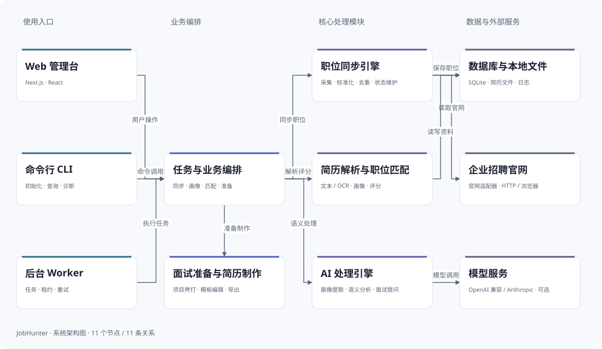

# JobHunter 交互架构图

用两张图理解项目：**系统架构图**展示入口、业务编排、核心处理及数据与外部服务；**求职流程**展示简历与职位如何汇合为匹配判断，以及简历制作和面试准备。



## 1. 打开交互版

在仓库根目录执行：

```shell
pnpm architecture:serve
```

然后访问 [本地交互架构图](http://127.0.0.1:4321/)。无需启动 Web 管理台、数据库或 Worker。

也可以下载 [index.html](index.html) 后用 Edge、Chrome 或 Firefox 打开。页面内嵌图数据、样式、品牌图标和交互脚本，离线也可使用。GitHub 的文件浏览页只展示 HTML 源码，不能直接运行交互；在线展示需要将此目录部署到 GitHub Pages 或其他静态托管服务。当前仓库未在本次变更中发布在线站点。

## 2. 如何读图

| 操作                             | 作用                                         |
| -------------------------------- | -------------------------------------------- |
| 系统架构图 / 求职流程            | 切换运行时架构与业务信息流                   |
| 点击节点，或 Tab 后回车          | 查看职责、仓库路径和直接关联                 |
| 点击详情里的关联节点             | 沿模块关系继续探索                           |
| 取消选择 / Esc                   | 恢复完整关系                                 |
| ＋ / − / 适应画布                | 调整比例；窄屏保持字号并允许横向滚动         |
| 拖动空白处 / 滚动条 / 画布方向键 | 平移视口                                     |
| 切换深色 / 切换浅色              | 切换文档主题                                 |
| 导出 SVG                         | 下载当前视图的完整浅色矢量图，不包含选中状态 |

系统架构图用具体模块解释运行时调用和数据访问，箭头不表示包导入。项目经历由简历解析后的个人资料派生，再由用户选中项目建立面试档案；额外文档和面经属于后续可选补充。详细代码依赖规则以 [总体架构](../overall-arch.md) 为准，招聘覆盖以 [来源支持矩阵](../../../packages/sources/SUPPORT_MATRIX.md) 为准。

## 3. 修改与验证

| 文件                                                       | 用途                                 |
| ---------------------------------------------------------- | ------------------------------------ |
| [jobhunter.architecture.json](jobhunter.architecture.json) | 唯一图数据源：节点、说明、坐标与连线 |
| [index.html](index.html)                                   | 生成的自包含交互网页                 |
| [jobhunter-system.svg](jobhunter-system.svg)               | 生成的系统架构图预览                 |
| [jobhunter-flow.svg](jobhunter-flow.svg)                   | 生成的业务流程预览                   |
| [生成器](../../../scripts/architecture/build.ts)           | 校验数据并生成上述产物               |

只修改 JSON 或生成器源文件，不手动编辑生成产物：

```shell
pnpm architecture:build
pnpm architecture:check
pnpm architecture:test
pnpm architecture:test:browser
```

浏览器测试使用现有 Playwright 依赖与 Chromium；可通过 `PLAYWRIGHT_EXECUTABLE_PATH` 指定本机 Edge/Chrome。测试直接打开本地 HTML，不需要 SQLite 夹具。

本实现借鉴 Archify 的“JSON → 静态预览 / 交互网页”组织方式，图数据、布局和渲染代码均针对 JobHunter 独立实现；源 JSON 是本项目格式，不宣称兼容 Archify。
