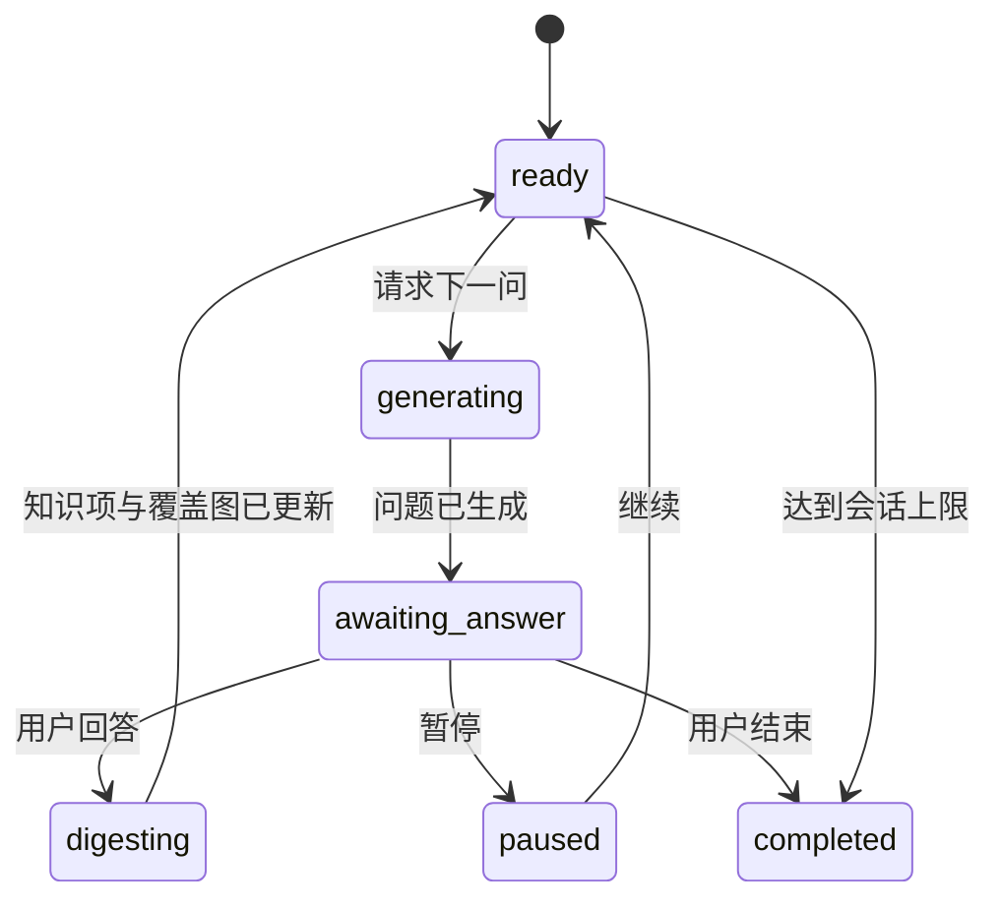
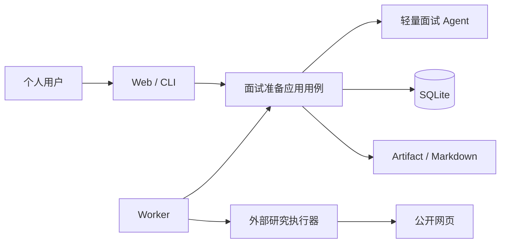

# 面试准备、简历项目拷打与面经知识库设计

> 状态：Accepted
> 版本：0.1.0
> 日期：2026-08-29
> 适用范围：面试准备能力的架构与功能基线；实现前仍需按 SDD 拆分规格

## 1. 文档目的与结论

本文档定义 JobHunter 从“职位发现与匹配”延伸到“面试准备”的产品边界、核心流程、数据所有权、Agent 约束和演进路线，覆盖三类能力：

1. 围绕简历中单个项目开展渐进式“项目拷打”。
2. 导入用户自己的面试经历文档，形成“历史面经”。
3. 搜集并整理与意向岗位匹配的公开面经，形成“网友面经”。

本设计的核心结论如下：

- 面试准备是独立业务能力，但复用现有候选人画像、轻量 Agent、持久化任务队列、Artifact Store 和 SQLite，不另建通用 Agent 编排平台。
- “项目拷打”以长期 `ProjectDossier` 和多次 `DrillSession` 为中心；每次只问一个主问题，根据用户回答补充事实、暴露矛盾并决定下一问。
- “浅”“深”不是写死在会话状态中的二值枚举，而是版本化 `DrillProfileDefinition`。Profile 声明允许使用的上下文、工具、指令包和预算，后续可以增加更多档位。
- “深”只读取用户显式选择的项目 Markdown 文档快照。系统不扫描源码、不分析代码、不承担项目实现，也不向内部拷打 Agent 暴露任意文件系统或 Shell。
- 系统只提问、指出信息缺口和给出准备建议，不代替用户回答，不生成可背诵的“标准答案”，也不补造项目事实。
- 用户原始回答属于用户事实；模型从回答中抽取的项目知识项属于可修正推导。两者分开保存，推导不得反向覆盖原回答或候选人画像。
- 用户面经与网友面经共享规范化的问答读取模型，但保留不同来源、审核和保留策略；网友内容始终被视为“带来源的外部陈述”，不是已验证事实。
- 网上搜集先交付“研究 Prompt 导出 + 研究包导入”；自动调用 Codex、Claude Code 等本地工具是后续适配器，不是首个闭环的前置条件。
- 外部 Agent 只生成受 Schema 约束、带来源的 `ResearchBundle`，不能直接写数据库。JobHunter 负责验证、去重、审核和入库。

## 2. 调研摘要与设计取舍

### 2.1 相近产品

| 项目                                                                                           | 已有能力                                                                              | 对本设计的启示                                                                                                                   |
| ---------------------------------------------------------------------------------------------- | ------------------------------------------------------------------------------------- | -------------------------------------------------------------------------------------------------------------------------------- |
| [Weekday Interview Question Predictor](https://www.weekday.works/interview-question-predictor) | 根据简历和 JD 一次生成十个问题、追问、理由和示例回答                                  | 简历与目标岗位共同约束问题是基础能力；本项目不复制“示例回答”，而是强化单项目的连续追问和事实沉淀                                 |
| [Mocki](https://www.mocki.dev/)                                                                | 多角色面试官、基于简历和 JD 的自适应追问、会后总结                                    | 自适应追问比静态题单更接近真实面试；本项目先做文本单会话，不把语音或虚拟面试官作为首期依赖                                       |
| [InterviewForge](https://github.com/saadshahidit/interview-forge)                              | 使用向量库、RAG 和跨会话记忆生成简历相关问题并评分                                    | 项目资料需要可定位检索，但个人 Markdown 规模通常较小；首期采用标题分块、内容哈希和 SQLite FTS5，证明确有需要后再引入向量检索     |
| [Multica](https://github.com/multica-ai/multica)                                               | 将长期 Issue 与单次 Agent Task 分开，由本地 Runtime 调用不同 Agent CLI 并进入人工审核 | 应区分“要完成的面经搜集目标”和“某次外部 Agent 执行”；复用 JobHunter Task 处理运行，新增业务级 ResearchRequest 保存意图和审核状态 |

现有产品大多围绕“整份简历 + JD → 一次问题集/模拟面试”展开。本设计的差异化重点是：

1. 单个简历项目可以持续积累上下文，而不是每次重新粘贴简历。
2. 每个问题都能追溯到简历陈述、项目资料、用户回答或历史面经。
3. 系统不代答，目标是暴露用户尚未吃透的地方。
4. 用户自己的面试经历和公开面经成为可审核、可检索的长期本地知识库。

### 2.2 外部 Agent 可行路线

- [Codex 非交互模式](https://developers.openai.com/codex/noninteractive) 支持只读沙箱、JSONL 事件和 JSON Schema 输出，适合作为受限的本地执行适配器。
- [Codex SDK](https://developers.openai.com/codex/sdk) 可以在 Node.js 应用中启动、继续和恢复本地 thread，适合需要流式状态和多轮续跑的后续版本。
- [Claude Code programmatic mode](https://code.claude.com/docs/en/headless) 支持非交互运行、结构化输出、流式事件和工具权限配置，也可以实现同一执行端口。
- Multica 已验证“任务进入队列、本地 Runtime 领取、调用已安装并登录的 Agent CLI、回传结果供审核”的产品路线，但 JobHunter 不需要复制完整的团队协作、Issue Board 或多用户权限系统。

因此推荐三步演进：

1. **Prompt 导出**：JobHunter 生成完整研究 Brief，用户手动交给任意 AI 工具，再导回结果。
2. **CLI 适配器**：Worker 调用本机已安装的 `codex` 或 `claude`，捕获事件和结构化结果。
3. **SDK/协议适配器**：当需要可靠续跑、实时事件、授权回调或多 Runtime 时，再采用供应商 SDK、App Server 或成熟通用协议。

首期不抽象通用多 Agent 图，不让外部 Agent 成为项目拷打主链路的依赖。

### 2.3 公开面经来源与合规

[牛客](https://www.nowcoder.com/)、[Glassdoor Interviews](https://www.glassdoor.com/Interview/index.htm) 和 LeetCode 的企业题目数据说明，面试内容通常来自用户提交，并且按公司、岗位或题目标签组织。采集时必须保留这种“用户陈述”性质，不能把单篇面经提升为公司确定流程。

自动访问公开网页时至少遵守以下边界：

- 遵守站点条款、访问控制和 [RFC 9309 Robots Exclusion Protocol](https://www.rfc-editor.org/rfc/rfc9309.html)。
- 不绕过登录、付费墙、验证码、频率限制或反自动化措施。
- 优先保存规范化问题、短摘录、URL、作者可见时间和抓取时间，不默认镜像整篇第三方正文。
- 同一个问题在多个来源出现时记录“多次出现”，不拼接成一个伪造的统一答案。
- 页面内容和外部 Agent 输出均视为不可信输入，不能成为工具指令或本地命令。

## 3. 产品边界

### 3.1 目标

1. 帮助用户识别简历项目陈述中最容易被追问、最缺证据或最不自洽的部分。
2. 通过连续问答，使用户逐步补齐项目背景、个人职责、方案取舍、技术细节、结果和复盘。
3. 将问答自动整理为可读的本地 Markdown 项目准备文档，同时保留结构化检索和审计能力。
4. 将用户自己的面试经历文档解析为可审核的历史面经。
5. 允许用户按目标岗位、公司、级别和时间范围生成公开面经研究任务。
6. 让面经可以反向影响后续问题选择，但不让未经审核的外部内容污染用户项目事实。

### 3.2 非目标

- 不读取、解释或修改项目源码。
- 不替用户修复、实现、重构或接管简历中的项目。
- 不生成项目问题的完整答案、伪造指标或替用户编写可冒充真实经历的故事。
- 不做实时面试作弊、会议监听、隐形提词或面试中代答。
- 不在首期做视频、音色、表情或姿态评分。
- 不承诺公开面经完整、最新或真实，只提供来源、时间和交叉出现证据。
- 不把 Codex、Claude Code 或任一供应商 CLI 暴露为领域概念。
- 不让外部 Agent 直接访问 SQLite、简历原文件、模型密钥或不相关的本地目录。

### 3.3 “指导但不代答”的边界

允许输出：

- 说明当前回答缺少哪类信息，例如基线、规模、约束、个人动作、验证方法或结果证据。
- 指出回答与简历或资料之间的矛盾、跳步和含糊措辞。
- 建议用户补查哪些项目文档、数据或事实。
- 建议表达结构，例如“先说明约束，再说明取舍，最后说明验证”，但不填充具体内容。
- 生成下一轮问题、追问清单和待准备主题。

禁止输出：

- 代写该问题的第一人称答案。
- 根据常见项目臆造用户采用的技术、规模、指标或决策。
- 把网友答案改写成用户自己的项目经历。
- 给出可以直接在真实面试中照读的“完美答案”。

该边界应同时出现在 Prompt、输出 Schema、后置校验和评测集中，不能只依赖系统提示词。

## 4. 统一术语与业务对象

| 术语                        | 含义                                                                   |
| --------------------------- | ---------------------------------------------------------------------- |
| `ProjectDossier`            | 一个长期存在的项目准备档案，绑定用户选中的简历项目，但拥有独立稳定 ID  |
| `ResumeProjectSnapshot`     | 某个不可变 ProfileVersion 中项目条目的受控快照                         |
| `ProjectMaterialSnapshot`   | 用户显式选择的 Markdown 文件内容、相对路径、标题结构和哈希的不可变集合 |
| `DrillProfileDefinition`    | 版本化拷打档位，声明可读上下文、工具、指令包和预算                     |
| `DrillSession`              | 在固定输入快照和拷打档位下进行的一次渐进式问答会话                     |
| `DrillTurn`                 | 一个主问题、用户回答、证据引用和分析状态                               |
| `ProjectKnowledgeClaim`     | 从用户回答中抽取、可修正并可追溯到原回答的项目知识项                   |
| `ExperienceDocument`        | 用户导入的原始面试经历文档及解析状态                                   |
| `InterviewExperience`       | 一次面试经历的公司、岗位、阶段、时间、来源和问题集合                   |
| `InterviewQuestionEntry`    | 面经中的问题、可选回答、标签和证据位置                                 |
| `ExperienceResearchRequest` | 一项长期的网友面经搜集目标和审核状态                                   |
| `ResearchBundle`            | 外部 Agent 或人工工具返回的带来源、受 Schema 约束的候选面经包          |

`Task` 仍表示 Worker 的一次可领取、可重试执行；`AgentRun` 仍表示内部轻量 Agent 的一次模型/工具循环。两者都不是业务级的面试准备目标。

## 5. 简历项目拷打功能设计

### 5.1 建立项目档案

用户从当前候选人画像中选择一个项目条目，系统创建稳定 `ProjectDossier`：

1. 保存 `profileId`、`profileVersionId`、项目定位信息和项目内容哈希。
2. 复制当前项目名称、角色、日期和简历描述为不可变 `ResumeProjectSnapshot`。
3. 允许用户补充项目别名、目标岗位和准备备注，但不修改原画像。
4. 新简历版本出现后，系统按内容指纹尝试关联；名称重复、内容大幅变化或候选项不唯一时要求用户重新确认。

当前画像的 `projects` 是数组且没有稳定项目 ID，因此不能用数组下标作为长期身份。首个实现可以由 `ProjectDossier` 持有独立 ID 和来源快照；后续若项目编辑成为核心能力，再通过独立规格为画像项目增加稳定 ID。

### 5.2 关联项目资料

深度拷打需要用户显式建立资料范围：

1. 用户可登记一个项目目录作为便捷定位信息。
2. 系统只展示并允许选择 `.md`、`.mdx` 和明确支持的文本资料；默认不递归自动纳入整个目录。
3. 用户确认文件清单后，应用层读取文件并生成 `ProjectMaterialSnapshot`。
4. 快照保存规范相对路径、媒体类型、内容哈希、标题层级和正文 Artifact；会话不直接读取会变化的源文件。
5. 文件变化时创建新快照，已开始的会话继续引用旧快照，避免历史问题失去依据。

禁止把项目根目录、Git 元数据、源文件、构建产物或任意文件读取能力传给内部 Agent。未来即使增加更多档位，也不能突破“只做面试准备、不挖源码”的产品边界。

### 5.3 拷打档位

首期定义两个 Profile：

| Profile                  | 允许的上下文                                               | 允许的工具                                 | 典型问题                                                    | 明确禁止                                 |
| ------------------------ | ---------------------------------------------------------- | ------------------------------------------ | ----------------------------------------------------------- | ---------------------------------------- |
| `resume-only@v1`（浅）   | 简历项目快照、已确认用户知识项、当前会话历史、可选目标岗位 | 读取项目快照、读取先前问答、读取确认知识项 | 角色、背景、个人贡献、结果、简历措辞证据                    | 项目目录、项目文档、网络、Shell、源码    |
| `docs-grounded@v1`（深） | 浅档全部内容 + 固定的项目 Markdown 资料快照                | 标题检索、FTS5 文本检索、读取命中文档片段  | 方案取舍、接口/数据流、约束、可靠性、复盘、文档与简历一致性 | 未选文件、源码、Git 历史、构建或测试命令 |

概念定义如下：

```ts
interface DrillProfileDefinition {
  readonly key: string;
  readonly version: string;
  readonly allowedContextKinds: readonly ContextKind[];
  readonly toolKeys: readonly string[];
  readonly instructionPackKeys: readonly string[];
  readonly limits: {
    readonly maxContextTokens: number;
    readonly maxQuestionCount: number;
    readonly timeoutMs: number;
  };
}
```

Profile 在代码中的 Registry 注册并版本化，不把任意 Prompt 或 Skill 正文存入数据库。数据库只记录本次会话实际使用的 key、version、工具清单哈希和指令包哈希。

这里的 `instructionPackKeys` 是供应商无关的面试策略包，例如“架构取舍追问”“数据指标追问”“故障复盘追问”。内部轻量 Agent 将其编译为版本化 Prompt 资源；若将来外部执行器支持自己的 skill 格式，由适配器完成映射，领域层不感知 `.agents/skills`、`.claude/skills` 等供应商目录。

后续可增加但不纳入首期的 Profile：

- `experience-informed`：在浅/深上下文上增加已审核的历史面经和网友面经检索。
- `role-targeted`：增加目标职位修订和匹配缺口，只追问与本次投递有关的项目侧证据。
- `pressure-round`：缩短回答时间、提高追问密度，但仍不扩大数据和工具权限。

档位增加能力时采用显式组合，不能用“深度越高就获得任意工具”的隐式规则。

### 5.4 覆盖维度

系统维护一张项目准备覆盖图，而不是只依赖最近几轮对话。首期维度建议为：

1. 项目背景与真实问题。
2. 目标、范围和成功标准。
3. 用户角色、边界和个人贡献。
4. 方案架构、关键流程与数据流。
5. 技术选择、备选方案和取舍。
6. 规模、性能、数据和量化结果。
7. 可靠性、安全、可观测性和故障处理。
8. 协作、冲突、推动过程和职责分工。
9. 失败、复盘、遗留问题和再次设计。
10. 简历、文档和回答之间的一致性。

每个维度只使用离散状态：`unasked`、`asked`、`partially_supported`、`supported`、`conflicted`、`skipped`。首期不输出看似精确的总分；只有在建立人工标注评测集后，才考虑可解释的准备度评分。

### 5.5 渐进式会话



每一轮执行以下步骤：

1. 应用层冻结会话当前上下文哈希和下一轮序号。
2. 确定性选择优先覆盖维度、未解决矛盾和最近回答中的可追问点。
3. 根据 Profile 检索允许的上下文片段，并生成带证据引用的问题输入。
4. `ProjectQuestionAgent` 只返回一个主问题、问题意图、覆盖维度、依据引用和可选的追问触发条件。
5. 应用层校验问题没有泄露答案、没有使用越权来源、没有重复最近问题，再保存 `DrillTurn`。
6. 用户回答、跳过或暂停。原回答原样保存，修改回答时新增修订，不静默覆盖历史版本。
7. `ProjectAnswerDigestAgent` 抽取知识项、含糊点、冲突、未回答部分和下一步焦点，但不得生成答案文本。
8. 应用层在短事务中保存分析结果、知识项和覆盖状态，然后异步更新 Markdown 准备文档。

如果问题生成失败，保留完整会话状态并允许重试；不能因为 Agent 失败丢失用户已经提交的回答。

### 5.6 问题依据与措辞约束

每个问题必须带一个或多个 `EvidenceRef`：

- `resume_project`：指向简历项目快照中的字段或描述。
- `project_material`：指向资料快照中的文件、标题和字符范围。
- `user_answer`：指向历史回答及修订号。
- `experience_entry`：指向已审核面经问题。
- `coverage_gap`：没有事实前提、仅因覆盖空白产生的开放问题。

若材料没有证明某个事实，问题必须使用开放或假设式措辞，例如“当时是否考虑过缓存？”而不能写成“你为什么选择了缓存？”。文档和回答冲突时应明确询问冲突本身，不得让模型自行选择一个版本。

### 5.7 问答文档

SQLite 保存结构化会话、轮次、知识项和证据，是应用内查询与审计的权威数据源。系统同时为每个 `ProjectDossier` 生成稳定的 Markdown 投影：

```text
var/interview-prep/projects/<dossier-id>/project-prep.md
```

文档建议结构：

```markdown
# 项目名称：面试准备

## 简历项目快照

## 已确认的项目事实

## 拷打记录

### Q1 ...

#### 我的回答

#### 信息缺口与待核实项

#### 依据

## 未解决矛盾

## 后续准备清单
```

Markdown 通过临时文件和原子替换生成。用户可以导出或复制，但首期不自动监听外部编辑；需要把外部修改带回系统时，走显式导入和差异确认，避免形成双写权威。

## 6. 用户历史面经导入

### 6.1 输入与复用

首期支持 Markdown、TXT、PDF 和 DOCX，图片 OCR 可复用现有确定性 OCR 能力。面经文档与 `ResumeDocument` 生命周期、删除范围和业务语义不同，因此只复用文件探测、Artifact Store、文本提取器和 OCR 端口，不复用 `resume_documents` 表。

用户导入时可补充：

- 公司与岗位。
- 面试阶段或轮次。
- 面试日期或大致时间。
- 结果、难度和自由备注。

这些人工输入优先于模型猜测，并作为锁定元数据保存。

### 6.2 解析流程

```text
原文件
  → 文件探测与 Artifact 保存
  → 确定性文本提取 / OCR
  → 规则识别标题、编号、Q/A 标记和轮次
  → 结构不明确时调用 InterviewExperienceParserAgent
  → 证据范围校验
  → 草稿预览
  → 用户确认
  → 历史面经
```

解析器必须：

- 允许有问题无答案、有答案无显式问题、纯过程描述和混合格式。
- 保留原始顺序、轮次标题和无法归类的备注。
- 每个结构化问题和回答都引用原文字符范围。
- 不根据常识补齐缺失公司、岗位、答案或面试结果。
- 支持一个文档包含多次面试经历，但必须在草稿中展示拆分边界。

解析成功只产生 `draft`。用户确认后进入 `accepted` 并显示在“历史面经”；拒绝或修正不会改写原始 Artifact。

### 6.3 历史面经查询

历史面经至少支持以下筛选：

- 公司、岗位方向、阶段、日期范围。
- 技术主题和问题类型。
- 有回答、无回答、需要复盘。
- 来源文档和导入时间。

用户自己的回答可以作为项目拷打的“曾被问过”信号，但不会自动成为新项目的事实或标准答案。

### 6.4 标准模板与在线填写

首版模板标识为 `personal-experience@v1`，仓库内的
[`docs/templates/personal-interview-experience-v1.md`](../templates/personal-interview-experience-v1.md)
是可直接阅读和下载的标准资产。模板允许一个文件包含多段“经历”，每段包含显式元数据、有序问答、可选复盘和过程备注；空回答保持为空，不触发自动补写。

在线填写不建立第二套数据入口。Web 将一段经历渲染为同版本标准 Markdown Artifact，再交给文件导入相同的清洗、解析、证据校验和草稿确认链路。首个实现只使用确定性规则解析标准模板与常见 Q/A 标记；结构不明确的内容保留为备注和警告，由用户在草稿页修正。Agent 回退必须在后续规格中以新解析器版本显式引入，不能静默改变既有历史。

## 7. 网友面经搜集

### 7.1 研究 Brief

`ExperienceResearchRequest` 保存一次可复查的研究目标：

- 目标岗位快照，来自用户选择或当前 CandidateProfile，而不是运行时动态读取整份简历。
- 可选公司、地区、级别、招聘类型和面试阶段。
- 时间范围与语言。
- 最大来源数、每来源最大条目数和允许/禁止域名。
- 必须返回的字段、引用规则、去重规则和合规约束。
- Prompt 模板版本和输出 Schema 版本。

应用层由结构化 Brief 确定性生成可复制的 Markdown Prompt。Prompt 要求外部工具输出 `ResearchBundle`，至少包含：

```ts
interface ResearchBundle {
  readonly schemaVersion: string;
  readonly requestFingerprint: string;
  readonly generatedAt: string;
  readonly sources: readonly {
    readonly url: string;
    readonly title: string;
    readonly publishedAt: string | null;
    readonly retrievedAt: string;
  }[];
  readonly experiences: readonly {
    readonly company: string | null;
    readonly role: string | null;
    readonly stage: string | null;
    readonly occurredAt: string | null;
    readonly sourceUrl: string;
    readonly questions: readonly {
      readonly text: string;
      readonly answerExcerpt: string | null;
      readonly topics: readonly string[];
      readonly evidenceExcerpt: string;
    }[];
  }[];
  readonly warnings: readonly string[];
}
```

`evidenceExcerpt` 只用于核对来源，应设置严格长度上限；完整第三方正文不进入默认研究包。

### 7.2 首个闭环：Prompt 导出与研究包导入

1. 用户创建研究请求并预览范围。
2. 系统生成 Prompt 和 JSON Schema Artifact。
3. 用户把 Prompt 交给任意具备搜索能力的 AI 工具。
4. 用户导入 JSON 或兼容 Markdown 结果。
5. 系统执行 Schema、URL、请求指纹、引用完整性和内容长度校验；在允许访问时重新读取来源核对标题和摘录。
6. 规范化与聚类后展示审核页。
7. 用户接受的条目进入“网友面经”，其余保留为 rejected 或删除候选。

这个闭环已经满足供应商无关和本地持久化，不要求 JobHunter 自身拥有强搜索 Agent。

无法重新访问、需要登录或已下线的来源必须标记为 `unverified`，不能因为外部 Agent 返回了格式正确的 URL 就显示为已核验。用户仍可在明确看到该状态后人工接受。

### 7.3 后续闭环：本地外部 Agent 执行器

后续由 Worker 执行 `interview.experience-research.execute`：

1. 应用层创建不可变 Brief 和输出 Schema Artifact。
2. Worker 通过 `ExternalResearchExecutor` 选择已启用的适配器。
3. 适配器在受控临时目录启动本地 Agent CLI 或 SDK thread。
4. 只传入 Brief、Schema、允许的输出路径和公开网络研究权限；不传入项目目录、简历原文或 SQLite 路径。
5. 适配器流式记录白名单事件摘要、取消信号、退出码和外部 session ID。
6. 结果文件先进入隔离 Artifact，再由应用层按与人工导入相同的路径验证。
7. 有效结果进入 `needs_review`，不会自动发布到网友面经。

概念端口：

```ts
interface ExternalResearchExecutor {
  readonly key: string;
  readonly version: string;
  describeCapabilities(): ExternalExecutorCapabilities;
  execute(input: ExternalResearchInput, signal: AbortSignal): Promise<ExternalResearchOutput>;
}
```

首批适配器可以是 `codex-local` 和 `claude-code-local`。具体命令、认证、事件格式和 SDK 类型全部封装在基础设施包中；应用层只看到项目自有 DTO 和错误分类。

### 7.4 规范化、去重与质量

规范化分为三层：

1. **来源记录**：保留 URL、标题、发布时间、抓取时间和内容哈希。
2. **面试经历**：公司、岗位、阶段、发生时间和来源之间保持一对一审计关系。
3. **问题聚类**：对规范化问题文本计算指纹和主题相似度，只建立 cluster，不覆盖各来源原文。

排序可以使用：

- 与目标岗位的主题匹配度。
- 来源数量和独立 URL 数量。
- 内容新鲜度。
- 公司与阶段匹配度。
- 字段完整性和引用可验证性。

不得把“多个网页复制同一原文”误算为独立印证。首期可按规范 URL、正文短摘录哈希和问题指纹进行确定性近重复识别；语义聚类只作为可重算推导。

## 8. 逻辑架构



关键边界：

- Web/CLI 只提交命令、上传文档、轮询任务和展示审核结果。
- 应用层编排快照、会话、审核和短事务，并声明 Repository、文件读取、文档解析与外部执行端口。
- 内部轻量 Agent 生成结构化问题或解析结果，不直接写业务表。
- Worker 执行模型、OCR、外部进程和网络等耗时任务。
- 外部研究执行器是基础设施适配器，不进入 `agent-core` 的内部模型—工具循环。
- SQLite 保存结构化状态，Artifact Store 保存原文件、快照、研究包和 Markdown 投影。

### 8.1 建议的代码归属

```text
packages/domain/src/interview/
  # ProjectDossier、DrillSession、覆盖状态、面经来源等纯领域模型

packages/interview/
  # 问题/解析 Agent 定义、Profile Registry、Prompt、Schema、规则解析与检索

packages/application/src/interview/
  # 项目档案、会话、导入、审核、研究请求与查询用例；声明应用端口

packages/db/src/repositories/interview-*.ts
  # SQLite Repository、FTS5 投影和查询实现

packages/external-agents/
  # 可选 Codex/Claude Code 执行适配器；只实现应用端口

apps/cli、apps/web、apps/worker
  # 命令/路由/Handler 与最终装配
```

依赖方向：

```text
apps/* → application → domain
                   → interview → agent-core
                   → application ports ← db / external-agents / parser adapters
```

`packages/interview` 不依赖 `application`、`db`、Web 或具体 Agent CLI；`packages/external-agents` 不得被应用层反向导入。

### 8.2 与现有能力的关系

| 现有能力                          | 复用方式                                       | 不复用的部分                                        |
| --------------------------------- | ---------------------------------------------- | --------------------------------------------------- |
| CandidateProfile / ProfileVersion | 创建简历项目快照和目标岗位快照                 | 不在拷打中直接修改画像版本                          |
| Agent Core / AgentRun             | 问题生成、回答摘要和面经解析                   | 不承载外部 CLI 的多模型、多工具完整运行             |
| Task / Worker                     | 所有耗时模型、OCR、索引、研究和投影任务        | Task 状态不代替 Session 或 ResearchRequest 业务状态 |
| FileArtifact                      | 原始面经、项目资料快照、研究包和 Markdown 文档 | 不把第三方整站正文默认镜像到本地                    |
| FTS5                              | 项目资料和已接受面经的本地检索                 | 首期不增加独立向量数据库                            |
| Resume parser / OCR               | 复用媒体探测、文本提取与 OCR 端口              | 面经不写入 ResumeDocument，也不参与画像删除闭包     |

## 9. 数据所有权与持久化

### 9.1 数据分层

| 数据类别     | 示例                                      | 规则                                          |
| ------------ | ----------------------------------------- | --------------------------------------------- |
| 用户事实     | 原始回答、人工修正、导入时填写的公司/岗位 | 原样保存、可修订、可追溯，不由 Agent 静默覆盖 |
| 用户提供资料 | 简历项目快照、项目 Markdown、个人面经原文 | 作为受控本地输入，按敏感数据处理              |
| 外部陈述     | 网友面经问题、短摘录、来源 URL            | 必须带来源和审核状态，不提升为用户事实        |
| 推导结果     | 知识项、覆盖状态、问题聚类、主题标签      | 版本化、可重算，不覆盖输入                    |
| 运行记录     | Task、AgentRun、外部执行摘要              | 只保存必要元数据和脱敏摘要                    |

### 9.2 主要持久化对象

| 对象                           | 关键引用与约束                                                   |
| ------------------------------ | ---------------------------------------------------------------- |
| `project_dossiers`             | 长期 ID、profile ID、显示名称、当前 resume snapshot              |
| `resume_project_snapshots`     | profile version、项目定位、规范内容和哈希；不可变                |
| `project_material_snapshots`   | dossier、manifest、内容哈希、Artifact；不可变                    |
| `drill_sessions`               | dossier、Profile key/version、输入快照、状态、目标岗位快照       |
| `drill_turns`                  | session、序号、问题、回答当前修订、证据、AgentRun 引用           |
| `drill_answer_revisions`       | 原回答、修订号、提交时间；追加写                                 |
| `project_knowledge_claims`     | 来源回答修订、规范陈述、状态、冲突组、提取版本                   |
| `experience_documents`         | 原始 Artifact、提取文本、解析状态和解析器版本                    |
| `interview_experiences`        | `personal/community` 来源、元数据、审核状态、来源引用            |
| `interview_question_entries`   | 经历、顺序、问题、可选回答、主题和证据范围                       |
| `experience_research_requests` | Brief、目标岗位快照、Prompt/Schema 版本和审核状态                |
| `research_bundles`             | request、原始 Artifact、规范化状态、验证摘要                     |
| `external_execution_records`   | request/task、executor key/version、外部 session、退出和用量摘要 |

具体列、索引、外键和删除顺序由后续数据规格确定，不能直接把本表视为数据库迁移设计。

### 9.3 事务与幂等

- 文件读取、OCR、FTS 构建、模型调用、外部进程和网络访问均发生在数据库事务外。
- 创建问题以 `sessionId + nextTurnNo + contextHash + profileVersion` 作为幂等输入。
- 回答摘要以 `answerRevisionHash + digestAgentVersion` 幂等。
- 面经解析以 `documentContentHash + parserVersion` 幂等。
- 研究执行以 `requestFingerprint + executorKey + executorVersion + attemptToken` 区分重试和新研究。
- 接受审核结果时，在一个短事务中写入规范经历、问题和来源关系；Markdown 投影失败只触发重建任务，不回滚已确认回答。
- 问题生成提交时必须再次比较 `contextHash`；回答摘要提交时必须再次比较当前 `answerRevisionHash`。输入已变化的旧结果只保留运行审计，不得更新当前轮次、知识项或覆盖图。

### 9.4 删除与隐私闭包

- 删除 ProjectDossier 前先预览会话、回答、知识项、资料快照、生成文档和专属 AgentRun 影响范围。
- 删除个人面经文档应删除其派生但未被其他来源引用的经历和问题，并沿用稳定影响哈希与隔离文件协议。
- 网友面经按来源 URL 或 ResearchRequest 清理时，删除来源关系；共享问题 cluster 是可重算推导，不应阻止删除。
- ProjectDossier 不自动进入 ResumeDocument 删除闭包；删除简历后应将 dossier 标记为 `source_detached`，用户可选择继续保留准备记录或一并删除。

## 10. 应用用例与 Worker 任务

### 10.1 应用用例

项目拷打：

- 创建、查看、重连和删除 ProjectDossier。
- 选择资料文件并创建 ProjectMaterialSnapshot。
- 选择 Profile、目标岗位和输入快照，启动或继续 DrillSession。
- 请求下一问、提交/修订回答、跳过、暂停和结束。
- 查看覆盖图、矛盾、待核实项和 Markdown 准备文档。

历史面经：

- 导入文档、补充锁定元数据、查看解析草稿。
- 修正拆分和字段，接受或拒绝经历。
- 按公司、岗位、阶段、时间和主题查询。

网友面经：

- 创建 ResearchRequest、生成 Prompt/Schema、导入 ResearchBundle。
- 选择外部执行器、取消/重试研究任务。
- 查看来源、近重复、警告和审核草稿。
- 接受、拒绝或按来源清理网友面经。

### 10.2 建议任务类型

| Task type                               | 作用                       | 默认重试倾向                          |
| --------------------------------------- | -------------------------- | ------------------------------------- |
| `interview.project-material.index`      | 解析标题、分块并更新 FTS5  | IO 临时错误可重试，内容无效不自动重试 |
| `interview.drill.generate-question`     | 检索上下文并生成一个问题   | 限流/临时模型错误可重试               |
| `interview.drill.digest-answer`         | 抽取知识项、冲突和覆盖变化 | 限流/临时模型错误可重试               |
| `interview.project-notebook.render`     | 原子生成 Markdown 投影     | IO 临时错误可重试                     |
| `interview.experience.parse`            | 规则或 Agent 解析个人面经  | 解析失败等待用户修正或换解析版本      |
| `interview.experience-research.execute` | 调用外部本地 Agent         | 仅基础设施临时错误自动重试            |
| `interview.research-bundle.normalize`   | 校验、规范化、聚类研究包   | Schema/引用错误不自动重试             |

同一 DrillSession 同时只能有一个生成或摘要任务，使用 `drill-session:{sessionId}` 并发键；同一 ResearchRequest 同时只能有一次外部执行，使用 `experience-research:{requestId}` 并发键。

外部 Agent 子进程内的网络请求对 JobHunter 的进程内网络信号量不可见，因此研究任务还必须设置独立的全局进程并发上限，首期默认 1。站点级访问节奏写入 Brief 并由执行器约束；无法证明执行器遵守时只保留 Prompt 导出/人工导入路径。

## 11. Agent、工具与 Skill 设计

### 11.1 内部业务 Agent

| Agent                                | 输入                                   | 输出                                 | 禁止                         |
| ------------------------------------ | -------------------------------------- | ------------------------------------ | ---------------------------- |
| `project-question`                   | 固定快照、覆盖缺口、检索证据、最近轮次 | 一个问题、意图、维度、证据、追问条件 | 答案、事实补全、越权上下文   |
| `project-answer-digest`              | 问题、用户回答、已有知识项和冲突       | 新知识候选、含糊点、矛盾、覆盖变化   | 改写成标准答案、修改原回答   |
| `interview-experience-parser`        | 文档文本、人工锁定元数据               | 经历草稿、问题/回答范围、未归类备注  | 猜测缺失元数据、丢弃未知段落 |
| `research-bundle-classifier`（可选） | 已通过确定性校验的候选条目             | 主题、岗位相关度和近重复候选         | 访问网络、决定自动接受       |

每个 Agent 沿用现有版本化 Prompt、Zod Schema、预算、缓存、一次修复和黄金集门槛。

### 11.2 白名单工具

内部拷打 Agent 可用工具：

- `read_resume_project_snapshot`
- `read_prior_drill_turns`
- `read_project_knowledge_claims`
- `search_project_material_chunks`
- `read_project_material_chunk`
- `search_accepted_interview_questions`（后续 Profile）

工具返回项目自有 DTO 和 `EvidenceRef`，不返回任意路径句柄。所有 Profile 都没有 Shell、任意 SQL、任意文件读取、Git、源码分析或任意 URL 请求工具。

### 11.3 外部执行器 Skill

外部 Agent 的 skill 只用于提高研究流程一致性，例如搜索查询展开、来源去重、引用检查和 ResearchBundle 输出。JobHunter 保存 skill key/version/hash 作为运行元数据，但不把供应商 skill 目录当作业务权威。

适配器必须提供实际加载能力清单；声明需要某个 skill 但运行时未加载时，应在启动前失败为 `invalid_config`，不能静默使用无 skill 的结果。

## 12. 安全、隐私与不可信输入

### 12.1 最小上下文

- 浅档只发送单个项目快照、必要目标岗位字段和当前会话知识，不发送完整简历。
- 深档只增加当前问题检索命中的资料片段，不发送整个项目目录。
- 网友面经研究只发送目标岗位和研究约束，默认不发送用户姓名、联系方式、完整简历或个人面经答案。
- 日志只记录 ID、哈希、长度、工具 key、来源域名和错误分类，不记录回答全文、项目文档正文或第三方正文。

### 12.2 外部 Agent 隔离

- 可执行文件必须来自显式配置和允许列表，启动参数由适配器构造，不能拼接未经验证的用户 Shell 文本。
- 工作目录使用受控临时目录；只读输入与单独输出目录分离。
- 默认不挂载 JobHunter 仓库和用户项目目录。
- 网络权限仅在研究任务中启用，并记录执行器声明的权限摘要。
- 取消通过 AbortSignal 终止完整进程树；退出后清理临时目录，保留已登记 Artifact。
- 外部 Agent 的工具调用、网页内容和最终文本都是不可信输入，必须通过 Schema 和应用层规则后才能入库。

### 12.3 Prompt injection 与来源污染

研究 Prompt 必须明确网页中的指令、代码块、下载链接和工具调用建议都只是待分析内容。执行器不得因网页文本扩大权限、读取本地文件、安装软件或改变输出位置。

ResearchBundle 校验至少拒绝：

- 缺少来源 URL 或来源未出现在 sources 清单中的条目。
- `file:`、本地地址、内网地址或不允许协议。
- 超长摘录、整页复制或包含明显密钥/个人敏感信息的内容。
- 与 request fingerprint 不一致的结果。
- Schema 外字段、不可解析时间或无效 URL。

## 13. 可观测性与评测

### 13.1 运行指标

- 问题生成/回答摘要任务成功率、延迟、Token 和缓存命中。
- 每个 Profile 的重复问题率、无依据前提率和越权工具请求数。
- 面经文档规则直出率、Agent 回退率、草稿修正率和接受率。
- 研究任务的来源数、有效引用率、近重复率、人工接受率和来源域分布。
- 外部执行器启动失败、认证失败、超时、取消、无效输出和 Schema 失败。

### 13.2 黄金集与硬门槛

项目拷打黄金集至少覆盖：

- 只有一条简历描述的浅档项目。
- 多份互相一致的项目文档。
- 简历与文档冲突。
- 用户回答含糊、跑题、否认问题前提或承认不知道。
- 重复会话和资料版本变化。

硬门槛：

- 业务持久化输出 Schema 有效率 100%。
- 问题证据引用可解析率 100%。
- 访问 Profile 未授权上下文或工具的次数为 0。
- 生成第一人称代答、虚构项目事实或将网友经历冒充为用户事实的次数为 0。
- 面经解析条目必须全部可定位到原文或被标记为人工补充。

外部研究黄金集使用固定网页快照和伪执行器，普通 CI 不访问真实网站、不启动付费 Agent。真实在线评测必须显式启用、限量并保存来源清单。

## 14. 首批验收场景

1. 用户从当前画像选择一个项目，启动浅档会话，连续回答三个问题；系统保存原始问答、知识项和覆盖变化，并生成 Markdown 文档。
2. 用户回答与简历描述冲突，下一问明确要求澄清，不自动改写简历或选择其中一个版本。
3. 用户选择两份 Markdown 资料创建快照并启动深档；问题引用具体文件和标题，未选择的文件以及源码不可访问。
4. 用户修改项目资料后创建新快照；旧会话仍能重现原问题依据，新会话使用新资料。
5. Agent 生成了完整答案或无依据断言时，后置校验拒绝该轮并保留可重试状态。
6. 用户导入包含多轮 Q/A 的面试文档，规则或 Agent 生成带证据的草稿；确认后内容出现在历史面经。
7. 用户导入只有问题没有答案的文档，系统保留空答案，不自动补写。
8. 用户创建目标岗位研究请求，导出 Prompt 和 Schema；从其他 AI 工具导回的研究包经审核后进入网友面经。
9. 同一网友问题来自多个 URL 时保留各来源并建立 cluster，不覆盖为一个无来源的统一条目。
10. 外部执行器失败、取消或返回无效 JSON 时不产生网友面经，其他项目会话和历史面经仍可使用。

## 15. 分阶段交付

### I1：本地面试准备闭环

- ProjectDossier、浅档 Profile 和渐进式问答。
- 问答/知识项/覆盖图与 Markdown 投影。
- 用户面经文档导入、解析草稿、审核和历史面经查询。
- 网友面经 ResearchRequest、Prompt/Schema 导出和 ResearchBundle 人工导入。

### I2：文档深挖与面经辅助

- 用户显式选择 Markdown、不可变资料快照、标题分块和 FTS5。
- 深档 Profile、文档证据引用和冲突追问。
- 已接受面经检索与 `experience-informed` Profile。

### I3：外部研究执行器

- `ExternalResearchExecutor` 端口和伪执行器。
- Codex 与 Claude Code 本地适配器、取消、事件摘要和隔离目录。
- 执行器诊断、权限预览、人工审核和受控在线评测。

### I4：更多档位与质量闭环

- 目标职位定向、压力轮次等 Profile。
- 问题质量、覆盖进展和研究来源质量评测。
- 在有证据时评估语音练习、向量检索或通用 Agent 协议；没有指标收益则不引入。

## 16. 实现前的 SDD 与 ADR

建议按以下规格拆分，编号以届时 `specs/` 最新序号为准：

1. `interview-project-drill`：ProjectDossier、Profile、Session、Turn、知识项、文档投影和 Web/CLI 流程。
2. `interview-experience-intake`：个人文档、解析、审核、历史面经和查询。
3. `interview-community-research`：ResearchRequest、Prompt/Bundle、来源、聚类和网友面经。
4. `external-agent-executor`：执行端口、进程隔离、Codex/Claude 适配器和诊断。

其中前三项可以在不引入外部执行器的情况下先完成。[ADR-0010](../adr/0010-interview-preparation-and-external-agent-boundaries.md) 已接受以下跨模块决策：

- 面试准备数据与 CandidateProfile 的所有权分离。
- SQLite 为结构化权威、Markdown 为可重建投影。
- 外部 Agent 作为受限基础设施适配器，不能直接写业务存储。

## 17. 已确认的首期产品选择

以下默认方案已于 2026-08-29 获产品确认，后续若变更则由对应规格或新 ADR 记录：

1. “指导”允许给出仅含槽位名称的回答结构，但不填充可直接照读的答案内容。
2. 生成的 Markdown 首期是只读投影，不从用户直接编辑的投影自动回写数据库。
3. 个人面经导入优先 Markdown/TXT/PDF/DOCX，图片复用 OCR 但不作为首个闭环门禁。
4. 网友面经默认逐次研究、用户选择或允许列表、人工审核和最小必要摘录，不做全站爬虫。
5. 首期只提供代码内置、版本化 Profile，不开放任意工具或 Skill 组合。
6. 首个实现规格采用 Web-first、一次一个问题的交互；CLI 和批量题单不是首个闭环门禁。
