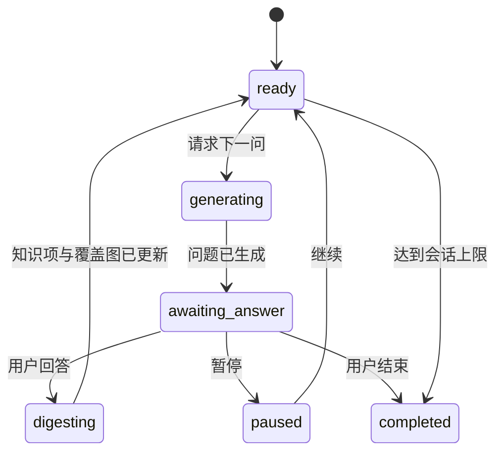
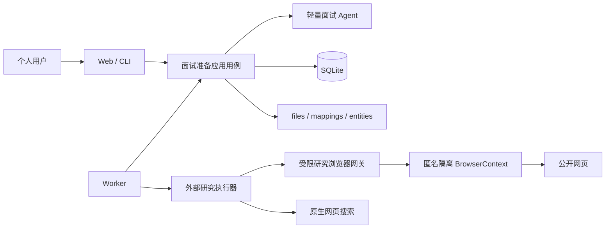

# 面试准备、简历项目拷打与面经知识库设计

> 状态：Accepted
> 版本：0.3.0
> 日期：2026-08-30
> 适用范围：面试准备能力的架构与功能基线；当前实现以规格 020、021、023、024 为准

## 1. 文档目的与结论

本文档定义 JobHunter 从“职位发现与匹配”延伸到“面试准备”的产品边界、核心流程、数据所有权、Agent 约束和演进路线，覆盖三类能力：

1. 围绕简历中单个项目开展渐进式“项目拷打”。
2. 导入用户自己的面试经历文档，形成“历史面经”。
3. 搜集并整理与意向岗位匹配的公开面经，形成“网友面经”。

本设计的核心结论如下：

- 面试准备是独立业务能力，但复用现有候选人画像、轻量 Agent、持久化任务队列、Artifact Store 和 SQLite，不另建通用 Agent 编排平台。
- “项目拷打”以长期 `ProjectDossier` 和多次 `DrillSession` 为中心；每次只问一个主问题，根据用户回答补充事实、暴露矛盾并决定下一问。
- “浅”“深”不是写死在会话状态中的二值枚举，而是版本化 `DrillProfileDefinition`。Profile 声明允许使用的上下文、证据种类和 Agent 定义，后续可以增加更多档位。
- “深”只读取用户在项目档案页显式上传并绑定到会话的 Markdown/MDX 文件版本。系统不接收或扫描项目目录，不分析代码、不承担项目实现，也不向内部拷打 Agent 暴露工具、任意文件系统或 Shell。
- 系统只提问、指出信息缺口和给出准备建议，不代替用户回答，不生成可背诵的“标准答案”，也不补造项目事实。
- 用户原始回答属于用户事实；模型从回答中抽取的项目知识项属于可修正推导。两者分开保存，推导不得反向覆盖原回答或候选人画像。
- 用户面经与网友面经共享规范化的问答读取模型，但保留不同来源、审核和保留策略；网友内容始终被视为“带来源的外部陈述”，不是已验证事实。
- 网友面经研究同时支持“Prompt/Schema 导出 + JSON 研究包人工导入”、本机 `codex-local@v1` 和 `browser-assisted-codex@v2`。浏览器增强路径由 JobHunter Worker 持有匿名隔离浏览器并确定性完成 `search → open → readPage`，关闭浏览器后才把有界证据从 stdin 交给无网络、无 MCP、无浏览器与无 Shell 的 Codex。任一自动路径不可用时，人工路径仍能独立完成闭环。
- 外部 Agent 只生成受 Schema 约束、带来源的 `ResearchBundle`，不能直接写数据库。JobHunter 负责验证、去重、审核和入库。
- 项目资料、研究 Prompt、Schema 和 Bundle 都复用 `files → file_entity_mappings → entities`；业务表只保存稳定文件及精确版本引用，不为不同文档类型建立专用版本表。

## 2. 调研摘要与设计取舍

### 2.1 相近产品

| 项目                                                                                           | 已有能力                                                                              | 对本设计的启示                                                                                                                   |
| ---------------------------------------------------------------------------------------------- | ------------------------------------------------------------------------------------- | -------------------------------------------------------------------------------------------------------------------------------- |
| [Weekday Interview Question Predictor](https://www.weekday.works/interview-question-predictor) | 根据简历和 JD 一次生成十个问题、追问、理由和示例回答                                  | 简历与目标岗位共同约束问题是基础能力；本项目不复制“示例回答”，而是强化单项目的连续追问和事实沉淀                                 |
| [Mocki](https://www.mocki.dev/)                                                                | 多角色面试官、基于简历和 JD 的自适应追问、会后总结                                    | 自适应追问比静态题单更接近真实面试；本项目先做文本单会话，不把语音或虚拟面试官作为首期依赖                                       |
| [InterviewForge](https://github.com/saadshahidit/interview-forge)                              | 使用向量库、RAG 和跨会话记忆生成简历相关问题并评分                                    | 个人 Markdown 规模较小；当前实现把分块元数据保存在文件映射中，并在应用内执行有界、确定性的关键词排序，不引入专用检索基础设施     |
| [Multica](https://github.com/multica-ai/multica)                                               | 将长期 Issue 与单次 Agent Task 分开，由本地 Runtime 调用不同 Agent CLI 并进入人工审核 | 应区分“要完成的面经搜集目标”和“某次外部 Agent 执行”；复用 JobHunter Task 处理运行，新增业务级 ResearchRequest 保存意图和审核状态 |

现有产品大多围绕“整份简历 + JD → 一次问题集/模拟面试”展开。本设计的差异化重点是：

1. 单个简历项目可以持续积累上下文，而不是每次重新粘贴简历。
2. 每个问题都能追溯到简历陈述、项目资料、用户回答或历史面经。
3. 系统不代答，目标是暴露用户尚未吃透的地方。
4. 用户自己的面试经历和公开面经成为可审核、可检索的长期本地知识库。

### 2.2 外部 Agent 可行路线

- [Codex 非交互模式](https://developers.openai.com/codex/noninteractive) 支持非交互执行和 JSON Schema 输出；[Codex 沙箱说明](https://learn.chatgpt.com/docs/sandboxing) 同时明确 read-only 仍允许读取文件，因此本地研究适配器还必须显式关闭全部本地读取与可扩展工具。
- [Codex SDK](https://developers.openai.com/codex/sdk) 可以在 Node.js 应用中启动、继续和恢复本地 thread，适合需要流式状态和多轮续跑的后续版本。
- [Claude Code programmatic mode](https://code.claude.com/docs/en/headless) 支持非交互运行、结构化输出、流式事件和工具权限配置，也可以实现同一执行端口。
- Multica 已验证“任务进入队列、本地 Runtime 领取、调用已安装并登录的 Agent CLI、回传结果供审核”的产品路线，但 JobHunter 不需要复制完整的团队协作、Issue Board 或多用户权限系统。

当前路线分为三个已实现入口和一个未来演进项：

1. **Prompt/Schema 导出与人工导包**：JobHunter 生成冻结研究 Brief，用户手动交给任意 AI 工具，再导回 JSON `ResearchBundle`。
2. **Codex 本机适配器**：Worker 调用本机已安装并登录的 `codex`，在隔离临时目录中获得结构化结果，再走与人工导包相同的校验和审核路径。
3. **受限浏览器增强适配器**：Worker 在无登录态临时 BrowserContext 中按固定搜索提供方和确定性 QueryPlan 采集公开页面，通过相关性与安全门槛后关闭浏览器；Codex 只处理 stdin 中的有界 EvidencePack，不获得用户浏览器、MCP、网络或通用自动化能力。
4. **其他 SDK/协议适配器（未来）**：只有在需要可靠续跑、实时事件、授权回调或多 Runtime 时，才评估 Claude Code、供应商 SDK、App Server 或成熟通用协议。

首期不抽象通用多 Agent 图，不让外部 Agent 成为项目拷打主链路的依赖。

### 2.3 公开面经来源与合规

[牛客](https://www.nowcoder.com/)、[Glassdoor Interviews](https://www.glassdoor.com/Interview/index.htm) 和 LeetCode 的企业题目数据说明，面试内容通常来自用户提交，并且按公司、岗位或题目标签组织。采集时必须保留这种“用户陈述”性质，不能把单篇面经提升为公司确定流程。

自动访问公开网页时至少遵守以下边界：

- 遵守站点条款、访问控制和 [RFC 9309 Robots Exclusion Protocol](https://www.rfc-editor.org/rfc/rfc9309.html)。
- 不绕过登录、付费墙、验证码、频率限制或反自动化措施。
- 优先保存规范化问题、短摘录、URL、作者可见时间和抓取时间，不默认镜像整篇第三方正文。
- 同一个问题在多个来源出现时记录“多次出现”，不拼接成一个伪造的统一答案。
- 页面内容和外部 Agent 输出均视为不可信输入，不能成为工具指令或本地命令。

## 3. 产品边界

### 3.1 目标

1. 帮助用户识别简历项目陈述中最容易被追问、最缺证据或最不自洽的部分。
2. 通过连续问答，使用户逐步补齐项目背景、个人职责、方案取舍、技术细节、结果和复盘。
3. 将问答自动整理为可读的本地 Markdown 项目准备文档，同时保留结构化检索和审计能力。
4. 将用户自己的面试经历文档解析为可审核的历史面经。
5. 允许用户按目标岗位、公司、级别和时间范围生成公开面经研究任务。
6. 为未来让已审核面经影响问题选择保留证据边界；当前 `resume-only@v1` 和 `docs-grounded@v1` 都不读取面经。

### 3.2 非目标

- 不读取、解释或修改项目源码。
- 不替用户修复、实现、重构或接管简历中的项目。
- 不生成项目问题的完整答案、伪造指标或替用户编写可冒充真实经历的故事。
- 不做实时面试作弊、会议监听、隐形提词或面试中代答。
- 不在首期做视频、音色、表情或姿态评分。
- 不承诺公开面经完整、最新或真实，只提供来源、时间和交叉出现证据。
- 不把 Codex、Claude Code 或任一供应商 CLI 暴露为领域概念。
- 不让外部 Agent 直接访问 SQLite、简历原文件、模型密钥或不相关的本地目录。
- 不让外部 Agent 连接用户日常浏览器、登录态或通用浏览器自动化，也不提供登录、表单提交、下载或任意脚本执行。

### 3.3 “指导但不代答”的边界

允许输出：

- 说明当前回答缺少哪类信息，例如基线、规模、约束、个人动作、验证方法或结果证据。
- 指出回答与简历或资料之间的矛盾、跳步和含糊措辞。
- 建议用户补查哪些项目文档、数据或事实。
- 建议表达结构，例如“先说明约束，再说明取舍，最后说明验证”，但不填充具体内容。
- 生成下一轮问题、追问清单和待准备主题。

禁止输出：

- 代写该问题的第一人称答案。
- 根据常见项目臆造用户采用的技术、规模、指标或决策。
- 把网友答案改写成用户自己的项目经历。
- 给出可以直接在真实面试中照读的“完美答案”。

该边界应同时出现在 Prompt、输出 Schema、后置校验和评测集中，不能只依赖系统提示词。

## 4. 统一术语与业务对象

| 术语                        | 含义                                                                  |
| --------------------------- | --------------------------------------------------------------------- |
| `ProjectDossier`            | 一个长期存在的项目准备档案，绑定用户选中的简历项目，但拥有独立稳定 ID |
| `ResumeProjectSnapshot`     | 某个不可变 ProfileVersion 中项目条目的受控快照                        |
| `ProjectMaterialBinding`    | 会话冻结的项目资料 `fileId/versionNo/entityId`、安全文件名和内容哈希  |
| `DrillProfileDefinition`    | 版本化拷打档位，声明可读上下文、证据种类和 Agent 定义                 |
| `DrillSession`              | 在固定输入快照和拷打档位下进行的一次渐进式问答会话                    |
| `DrillTurn`                 | 一个主问题、用户回答、证据引用和分析状态                              |
| `ProjectKnowledgeClaim`     | 从用户回答中抽取、可修正并可追溯到原回答的项目知识项                  |
| `ExperienceDocument`        | 由通用 `files` 表示的用户面经逻辑文件及其当前解析状态                 |
| `InterviewExperience`       | 一次面试经历的公司、岗位、阶段、时间、来源和问题集合                  |
| `InterviewQuestionEntry`    | 面经中的问题、可选回答、标签和证据位置                                |
| `ExperienceResearchRequest` | 一项长期的网友面经搜集目标和审核状态                                  |
| `ResearchBundle`            | 外部 Agent 或人工工具返回的带来源、受 Schema 约束的候选面经包         |

`Task` 仍表示 Worker 的一次可领取、可重试执行；`AgentRun` 仍表示内部轻量 Agent 的一次模型/工具循环。两者都不是业务级的面试准备目标。

## 5. 简历项目拷打功能设计

### 5.1 建立项目档案

用户从当前候选人画像中选择一个项目条目，系统创建稳定 `ProjectDossier`：

1. 保存 `profileId`、`profileVersionId`、项目定位信息和项目内容哈希。
2. 复制当前项目名称、角色、日期和简历描述为不可变 `ResumeProjectSnapshot`。
3. 允许用户补充项目别名、目标岗位和准备备注，但不修改原画像。
4. 新简历版本出现后，系统按内容指纹尝试关联；名称重复、内容大幅变化或候选项不唯一时要求用户重新确认。

当前画像的 `projects` 是数组且没有稳定项目 ID，因此不能用数组下标作为长期身份。首个实现可以由 `ProjectDossier` 持有独立 ID 和来源快照；后续若项目编辑成为核心能力，再通过独立规格为画像项目增加稳定 ID。

### 5.2 关联项目资料

深度拷打需要用户显式建立资料范围：

1. 用户只能在项目档案页主动上传非空 UTF-8 `.md` 或 `.mdx`；服务端只接受安全文件名，不把文件名解释成本地路径，单文件上限为 512 KiB。
2. 每个项目资料是 `files.kind = project_material` 的逻辑文件；`files.properties_json` 保存 `dossierId` 和安全文件名，物理内容由 `entities` 按 SHA-256 去重。
3. 新内容为同一逻辑文件追加一条 `file_entity_mappings`，最多保留 5 个版本。映射保存解析器版本、规范化文本和 `metadata_json` 分块元数据；分块只记录稳定 ID、标题路径、`[start,end)` 字符范围和内容哈希，不复制第二份正文。
4. Markdown 清洗与标题分块在应用服务的导入路径中同步完成，不另发布后台任务。相同内容重复上传幂等返回当前版本。
5. 深档启动时选择 1–8 个逻辑文件，并在 `drill_sessions.material_bindings_json` 中冻结精确的 file/version/entity/hash 绑定；后续上传新版本不会改变已开始会话。

系统不提供“登记项目目录”、递归发现或从目录批量导入的入口。禁止把项目根目录、Git 元数据、源码、构建产物或任意文件读取能力传给内部 Agent。未来即使增加更多档位，也不能突破“只做面试准备、不挖源码”的产品边界。

### 5.3 拷打档位

首期定义两个 Profile：

| Profile                  | 允许的上下文                                                    | Agent 工具 | 典型问题                                                    | 明确禁止                                 |
| ------------------------ | --------------------------------------------------------------- | ---------- | ----------------------------------------------------------- | ---------------------------------------- |
| `resume-only@v1`（浅）   | 简历项目快照、已确认用户知识项、当前会话历史、可选目标岗位      | `[]`       | 角色、背景、个人贡献、结果、简历措辞证据                    | 项目目录、项目文档、网络、Shell、源码    |
| `docs-grounded@v1`（深） | 浅档全部内容 + 应用层从冻结 Markdown 版本中选出的有限纯文本片段 | `[]`       | 方案取舍、接口/数据流、约束、可靠性、复盘、文档与简历一致性 | 未选文件、源码、Git 历史、构建或测试命令 |

概念定义如下：

```ts
interface DrillProfileDefinition {
  readonly key: string;
  readonly version: string;
  readonly evidenceKinds: readonly DrillEvidenceKind[];
  readonly questionAgent: string;
  readonly answerDigestAgent: string;
}
```

Profile 在代码中的 Registry 注册并版本化，不把任意 Prompt 或 Skill 正文存入数据库。数据库记录本次会话实际使用的 key、version、定义哈希、能力摘要和资料绑定。

资料清洗、精确版本读取和片段排序属于应用层上下文构建，不是 Agent tool call。当前实现依据覆盖缺口、简历 highlights 和最近问答生成词项，再按命中数、文件顺序、字符位置稳定排序，最多选择 12 个片段、合计 12,000 字符；不增加检索基础设施或后台预处理任务。浅档与深档的 `AgentDefinition.tools` 都为空。

后续可增加但不纳入首期的 Profile：

- `experience-informed`：在浅/深上下文上增加已审核的历史面经和网友面经。该档位尚未实现，启用前必须新增规格、Profile 版本和证据边界。
- `role-targeted`：增加目标职位修订和匹配缺口，只追问与本次投递有关的项目侧证据。
- `pressure-round`：缩短回答时间、提高追问密度，但仍不扩大数据和工具权限。

档位增加能力时采用显式组合，不能用“深度越高就获得任意工具”的隐式规则。

### 5.4 覆盖维度

系统维护一张项目准备覆盖图，而不是只依赖最近几轮对话。首期维度建议为：

1. 项目背景与真实问题。
2. 目标、范围和成功标准。
3. 用户角色、边界和个人贡献。
4. 方案架构、关键流程与数据流。
5. 技术选择、备选方案和取舍。
6. 规模、性能、数据和量化结果。
7. 可靠性、安全、可观测性和故障处理。
8. 协作、冲突、推动过程和职责分工。
9. 失败、复盘、遗留问题和再次设计。
10. 简历、文档和回答之间的一致性。

每个维度只使用离散状态：`unasked`、`asked`、`partially_supported`、`supported`、`conflicted`、`skipped`。首期不输出看似精确的总分；只有在建立人工标注评测集后，才考虑可解释的准备度评分。

### 5.5 渐进式会话



每一轮执行以下步骤：

1. 应用层冻结会话当前上下文哈希和下一轮序号。
2. 确定性选择优先覆盖维度、未解决矛盾和最近回答中的可追问点。
3. 根据 Profile 检索允许的上下文片段，并生成带证据引用的问题输入。
4. `ProjectQuestionAgent` 只返回一个主问题、问题意图、覆盖维度、依据引用和可选的追问触发条件。
5. 应用层校验问题没有泄露答案、没有使用越权来源、没有重复最近问题，再保存 `DrillTurn`。
6. 用户回答、跳过或暂停。原回答原样保存，修改回答时新增修订，不静默覆盖历史版本。
7. `ProjectAnswerDigestAgent` 抽取知识项、含糊点、冲突、未回答部分和下一步焦点，但不得生成答案文本。
8. 应用层在短事务中保存分析结果、知识项和覆盖状态，然后异步更新 Markdown 准备文档。

如果问题生成失败，保留完整会话状态并允许重试；不能因为 Agent 失败丢失用户已经提交的回答。

### 5.6 问题依据与措辞约束

每个问题必须带一个或多个 `EvidenceRef`：

- `resume_project`：指向简历项目快照中的字段或描述。
- `project_material`：指向会话冻结资料版本中的分块、标题和字符范围。
- `user_answer`：指向历史回答及修订号。
- `derived_claim`：指向由历史回答抽取且仍可追溯的知识项。

若材料没有证明某个事实，问题必须使用开放或假设式措辞，例如“当时是否考虑过缓存？”而不能写成“你为什么选择了缓存？”。文档和回答冲突时应明确询问冲突本身，不得让模型自行选择一个版本。

### 5.7 问答文档

SQLite 保存结构化会话、轮次、知识项和证据，是应用内查询与审计的权威数据源。系统同时为每个 `ProjectDossier` 生成稳定的 Markdown 投影：

```text
var/interview-prep/projects/<dossier-id>/project-prep.md
```

文档建议结构：

```markdown
# 项目名称：面试准备

## 简历项目快照

## 已确认的项目事实

## 拷打记录

### Q1 ...

#### 我的回答

#### 信息缺口与待核实项

#### 依据

## 未解决矛盾

## 后续准备清单
```

Markdown 通过临时文件和原子替换生成。用户可以导出或复制，但首期不自动监听外部编辑；需要把外部修改带回系统时，走显式导入和差异确认，避免形成双写权威。

## 6. 用户历史面经导入

### 6.1 输入与复用

首期支持 Markdown、TXT、PDF 和 DOCX，图片 OCR 可复用现有确定性 OCR 能力。面经文档与 `ResumeDocument` 生命周期、删除范围和业务语义不同，因此只复用文件探测、Artifact Store、文本提取器和 OCR 端口，不复用 `resume_documents` 表。

用户导入时可补充：

- 公司与岗位。
- 面试阶段或轮次。
- 面试日期或大致时间。
- 结果、难度和自由备注。

这些人工输入优先于模型猜测，并作为锁定元数据保存。

### 6.2 解析流程

```text
原文件
  → 文件探测与 Artifact 保存
  → 确定性文本提取 / OCR
  → 规则识别标题、编号、Q/A 标记和轮次
  → 结构不明确时调用 InterviewExperienceParserAgent
  → 证据范围校验
  → 草稿预览
  → 用户确认
  → 历史面经
```

解析器必须：

- 允许有问题无答案、有答案无显式问题、纯过程描述和混合格式。
- 保留原始顺序、轮次标题和无法归类的备注。
- 每个结构化问题和回答都引用原文字符范围。
- 不根据常识补齐缺失公司、岗位、答案或面试结果。
- 支持一个文档包含多次面试经历，但必须在草稿中展示拆分边界。

解析成功只产生 `draft`。用户确认后进入 `accepted` 并显示在“历史面经”；拒绝或修正不会改写原始 Artifact。

### 6.3 历史面经查询

历史面经至少支持以下筛选：

- 公司、岗位方向、阶段、日期范围。
- 技术主题和问题类型。
- 有回答、无回答、需要复盘。
- 来源文档和导入时间。

用户自己的回答可以作为项目拷打的“曾被问过”信号，但不会自动成为新项目的事实或标准答案。

### 6.4 标准模板与在线填写

首版模板标识为 `personal-experience@v1`，仓库内的
[`docs/templates/personal-interview-experience-v1.md`](../templates/personal-interview-experience-v1.md)
是可直接阅读和下载的标准资产。模板允许一个文件包含多段“经历”，每段包含显式元数据、有序问答、可选复盘和过程备注；空回答保持为空，不触发自动补写。

在线填写不建立第二套数据入口。Web 将一段经历渲染为同版本标准 Markdown Artifact，再交给文件导入相同的清洗、解析、证据校验和草稿确认链路。首个实现只使用确定性规则解析标准模板与常见 Q/A 标记；结构不明确的内容保留为备注和警告，由用户在草稿页修正。Agent 回退必须在后续规格中以新解析器版本显式引入，不能静默改变既有历史。

## 7. 网友面经搜集

### 7.1 研究 Brief

`ExperienceResearchRequest` 保存一次可复查的研究目标：

- 目标岗位快照，来自用户选择或当前 CandidateProfile，而不是运行时动态读取整份简历。
- 可选公司、地区、级别、招聘类型和面试阶段。
- 时间范围与语言。
- 最大来源数、每来源最大条目数和允许/禁止域名；允许域名既是导航硬边界，也在受限浏览器路径中驱动优先的 `site:<domain>` 定向查询。
- 必须返回的字段、引用规则、去重规则和合规约束。
- Prompt 模板版本和输出 Schema 版本。

创建请求采用 generation 语义：同一规范 Brief 在当前请求尚无 accepted 候选且有效 Bundle 未满 5 版时幂等复用；一旦已有 accepted 候选或达到 5 版上限，就创建具有不同实例指纹的新 generation，旧请求及其审核结果保持不变。

应用层由结构化 Brief 确定性生成可复制的 Markdown Prompt。Prompt 要求外部工具输出 `ResearchBundle`，至少包含：

```ts
interface ResearchBundle {
  readonly schemaVersion: string;
  readonly requestFingerprint: string;
  readonly generatedAt: string;
  readonly sources: readonly {
    readonly url: string;
    readonly title: string;
    readonly publishedAt: string | null;
    readonly retrievedAt: string;
  }[];
  readonly experiences: readonly {
    readonly company: string | null;
    readonly role: string | null;
    readonly stage: string | null;
    readonly occurredAt: string | null;
    readonly sourceUrl: string;
    readonly questions: readonly {
      readonly text: string;
      readonly answerExcerpt: string | null;
      readonly topics: readonly string[];
      readonly evidenceExcerpt: string;
    }[];
  }[];
  readonly warnings: readonly string[];
}
```

`evidenceExcerpt` 只用于核对来源，应设置严格长度上限；完整第三方正文不进入默认研究包。

### 7.2 首个闭环：Prompt 导出与研究包导入

1. 用户创建研究请求并预览范围。
2. 系统把版本化 Markdown Prompt 和 JSON Schema 分别保存为 `files.kind = interview_research` 的通用逻辑文件，并在 `ExperienceResearchRequest` 中引用精确版本。
3. 用户把 Prompt 交给任意具备搜索能力的 AI 工具。
4. 用户导入最大 2 MiB 的 UTF-8 JSON `ResearchBundle`。
5. 系统执行 Schema、URL、请求指纹、引用完整性、日期和内容长度校验；当前版本不重新抓取来源页面，所有来源保持 `unverified`。
6. 系统规范化 URL 和问题文本，在同一经历内做确定性去重，然后展示审核页。
7. 用户接受的条目进入“网友面经”，其余保留为 rejected 或删除候选。

这个闭环已经满足供应商无关和本地持久化，不要求 JobHunter 自身拥有强搜索 Agent。

无法重新访问、需要登录或已下线的来源必须标记为 `unverified`，不能因为外部 Agent 返回了格式正确的 URL 就显示为已核验。用户仍可在明确看到该状态后人工接受。

### 7.3 当前自动闭环：本地 Codex 执行器

Worker 已通过 `interview.experience-research.execute` 任务执行 `codex-local@v1` 和 `browser-assisted-codex@v2` 两种本地适配器；两者共享以下业务闭环：

1. 应用层冻结 Brief、请求指纹以及 Prompt/Schema 文件版本，并创建持久化 `Task`；预览、下载和 Worker 执行都从 Artifact Store 读取请求绑定的精确版本，不按当前代码重新渲染。
2. Worker 通过应用端口 `ExternalResearchExecutor` 调用与冻结 Prompt 版本兼容的执行器；同一 ResearchRequest 使用并发键串行化，同一 Worker 进程全局最多运行一个 Codex 研究子进程。
3. 适配器用参数数组启动非交互 Codex，在 `mkdtemp` 隔离目录中只放 Schema 和结果文件，Prompt 从 stdin 传入。
4. 子进程使用最小环境、非交互只读沙箱和固定输出 Schema；`codex-local@v1` 只保留原生实时网页搜索，`browser-assisted-codex@v2` 关闭全部联网能力，两者都禁用 Shell、统一执行、本地/外部浏览器自动化、Computer Use、多 Agent/Goal、授权请求、插件、App、Skill、本地图片和工作区依赖工具；不把项目目录、简历原文、个人回答、SQLite 路径或模型密钥放入 Prompt、参数或日志。
5. stdout、stderr 和结果都有大小上限；取消或 15 分钟超时会对进程组执行 TERM→KILL，结束后清理临时目录。
6. 自动结果调用与人工上传完全相同的 Bundle Importer：先用短事务取得带 5 分钟租约的 import claim，再在事务外写独占 staging 文件，最后用短事务把 entity mapping 原子提升为正式 Bundle 版本并以请求 revision CAS 替换待审核候选；失败或过期 claim 会回收 staging 数据。
7. 有效结果进入 `needs_review`，不会自动发布到网友面经。

当前适配器使用参数数组执行以下非交互命令，末尾 `-` 表示从 stdin 读取 Prompt：

```text
codex --search --strict-config --ask-for-approval never
  --config shell_environment_policy.inherit=none
  --disable <each local-or-extensible feature>
  exec --ephemeral --skip-git-repo-check --ignore-rules --ignore-user-config
  --sandbox read-only --output-schema <temp/schema.json>
  --output-last-message <temp/result.json> -C <temp> -
```

概念端口：

```ts
interface ExternalResearchExecutor {
  readonly key: string;
  readonly version: string;
  readonly capabilitySummary: Readonly<{
    liveWebSearch: boolean;
    browserTools: readonly ('search' | 'open' | 'readPage')[];
    sandbox: 'web-search-only-local-process' | 'isolated-evidence-local-process';
  }>;
  execute(input: ExternalResearchInput, signal: AbortSignal): Promise<ExternalResearchOutput>;
}
```

`codex-local@v1` 通过重复的 `--disable` 关闭 `shell_tool`、`unified_exec`、`browser_use*`、`in_app_browser`、`computer_use`、`multi_agent`、Goal、授权请求、`plugins`、`apps`、`skill_*`、`view_image`、`workspace_dependencies` 等本地或扩展能力，只保留原生搜索。`browser-assisted-codex@v2` 进一步关闭原生搜索与全部网络、MCP 和浏览器工具。`--strict-config` 确保运行中的 Codex 版本不认识任何必要限制时直接失败，而不是降级为更宽权限。本机未安装、未登录、不支持限制、非零退出或无有效结果会映射为安全的 Task 诊断，不能绕过人工导包路径。这仍是可信本机上的受限进程，不宣称提供容器或 OS 级根目录隔离。

### 7.4 受限浏览器增强闭环

`browser-assisted-codex@v2` 只接受冻结的 `community-research-prompt@v3`，并由 Worker 持有 `ResearchBrowserGateway` 和匿名浏览器进程。旧 `@v1`/`@v2` 请求不能静默切换到该语义：

1. 每次任务创建无登录态、无扩展、无持久化存储的临时 BrowserContext，不连接用户日常浏览器。
2. 应用层从冻结 Brief 生成有限 QueryPlan；`allowedDomains` 非空时，先按稳定的域名 × 岗位顺序生成 `site:<domain>` 定向查询，并冻结优先查询数量。Worker 先搜索、轮询并耗尽优先组候选；仅在来源目标未满足且页面预算未耗尽时才搜索通用组。
3. 每个查询按固定搜索提供方顺序尝试。搜索跳转解包、公网 URL 和允许/禁止域名过滤之后仍有非空结果，当前提供方才算成功；原始页面有链接但全部越界或无效时继续回退下一提供方。
4. 请求 URL 与最终 URL 分别生成版本化 canonical source identity：保留 HTTP/HTTPS 协议语义，只折叠 fragment、默认端口、主机大小写和版本化已知跟踪参数，保留内容主键、分页等业务参数。identity 只用于采集去重，实际成功读取的最终 URL 原样进入 EvidencePack、trace 和 Bundle。
5. 候选页面必须同时命中从目标岗位提取的相关词和“面试/面经/interview”等面试词，并通过 `interview-page-quality@v1`：正文至少 200 字符，至少有 3 个问题候选和 2 个技术问题候选；少于 5 个问题候选时须占有效正文行至少 4%，纯登录/验证码/脚本空壳和评论/列表页提前拒绝。不相关或低质量页面不会进入 EvidencePack，全部候选未通过时不启动 Codex。
6. `open` 在导航及每次重定向后重做协议、凭据、主机、DNS/IP 和 Brief 域名策略校验；固定公网 IP 的 loopback 代理只允许 GET/HEAD，并限制网络目标、连接、搜索、页面、单响应、总字节与时间。若系统 DNS 非空且全部返回 `198.18.0.0/15` 透明转译地址，网关必须先通过有界受信任 DNS 查询并验证真实公网地址；只有显式启用转译且系统答案仍全属于该网段时，连接层才能使用转译地址，安全 pin 和审计仍以公网地址为准。混合答案、字面 IP、查询失败或非公网答案不能启用转译。
7. `readPage` 只返回标题、最终 URL、抓取时间和清洗限长正文；网关不提供登录、输入、点击、表单提交、上传、下载、任意脚本、本地文件或剪贴板能力，页面中的指令不能扩大权限。
8. Worker 完成采集后关闭 BrowserContext、网关与临时 Profile，再从 stdin 传入有硬上限、明确标记为不可信的 EvidencePack；Codex 不获得 MCP URL/token、Browser/Page 句柄、网络凭据、浏览器、Shell 或其他本机工具。
9. 本地 finalizer 以有界 trace 校验每个来源确实完成 `open + readPage`，并强制来源 URL 等于本次最终 URL、问题及非空答案摘录逐字来自同页正文；无证据内容被裁剪，裁剪后无问题则整包失败。
10. 有效结果经统一 Bundle Importer 进入 `needs_review`，仍标记为 `unverified`，只有人工接受后才进入网友面经。

浏览器、网络、Codex 和文件写入全部在数据库事务外执行。普通 CI 使用伪网关和固定页面样本；无登录真实公开网页的显式 smoke test 已证明至少一个页面被读取，实际产品任务也已产生非空、可逐字回溯的问题并进入 `needs_review`。定向来源覆盖增强正在实现：完成前必须以 `allowedDomains = ["nowcoder.com"]`、目标岗位“大模型算法 / 大模型应用开发”显式联网验证至少 4 个 canonical identity 不同的公开页面，且两个方向各至少 2 个，不能把跟踪参数变体或固定夹具计入真实覆盖。

### 7.5 规范化、去重与质量

规范化分为三层：

1. **来源记录**：保留实际成功读取的最终 URL、标题、发布时间和抓取时间；另在单次采集内用版本化 canonical source identity 折叠已知跟踪参数变体，但不改写审计 URL。
2. **面试经历**：公司、岗位、阶段、发生时间和来源之间保持一对一审计关系。
3. **问题读取投影**：对规范化问题文本计算稳定指纹；同一经历内的完全重复只保留首项，不同来源始终保留独立记录，并按指纹计算独立出处出现次数。

当前审核页保留 Bundle 中的经历/问题顺序；已接受列表按面试日期降序和稳定 ID 排序。问题指纹只用于去重和计算独立出处出现次数，不隐式改变顺序。相关度或可信度排序仍是未来能力。

不得把“多个网页复制同一原文”或“同一页面的多个跟踪参数变体”误算为独立印证。canonical source identity 只解决 URL 级重复，问题指纹只处理完全相同问题；系统仍不建立聚类表、不执行本地语义聚类或可信度评分。

## 8. 逻辑架构



关键边界：

- Web/CLI 只提交命令、上传文档、轮询任务和展示审核结果。
- 应用层编排快照、会话、审核和短事务，并声明 Repository、文件读取、文档解析与外部执行端口。
- 内部轻量 Agent 生成结构化问题或解析结果，不直接写业务表。
- Worker 执行模型、OCR、外部进程和网络等耗时任务。
- 外部研究执行器是基础设施适配器，不进入 `agent-core` 的内部模型—工具循环。
- 浏览器网关只是 Worker 持有的受信任基础设施，Codex 不能绕过网关获得浏览器或网络句柄。
- SQLite 保存结构化状态；Artifact Store 通过 `files → file_entity_mappings → entities` 保存原文件、项目资料版本、研究 Prompt/Schema/Bundle 和 Markdown 投影。

### 8.1 当前代码归属

```text
packages/domain/src/interview/
  # ProjectDossier、DrillSession、资料证据、个人/网友面经 Schema 等纯领域模型

packages/application/src/interview/
  # Profile、Markdown 清洗/分块、上下文排序、Agent 定义、项目/面经/研究用例

packages/application/src/ports/
  # Interview Repository、ArtifactStore 与 ExternalResearchExecutor 应用端口

packages/db/src/repositories/interview-*.ts、packages/db/src/artifact-store.ts
  # SQLite Repository 与通用文件实体实现

apps/worker/src/codex-research-executor.ts
  # 当前 Codex 本机研究执行适配器；只实现应用端口

apps/cli、apps/web、apps/worker
  # 命令/路由/Handler 与最终装配
```

依赖方向：

```text
apps/* → application → domain
                   → agent-core
                   → application ports ← db / parser adapters
                   ↖ apps/worker 中的 Codex 执行适配器
```

应用层不依赖 SQLite 或 Codex CLI 具体实现；数据库仓储和 Worker 内的 Codex 适配器分别实现应用端口。若未来提取独立外部执行器包，也必须保持同一依赖方向。

### 8.2 与现有能力的关系

| 现有能力                          | 复用方式                                                    | 不复用的部分                                        |
| --------------------------------- | ----------------------------------------------------------- | --------------------------------------------------- |
| CandidateProfile / ProfileVersion | 创建简历项目快照和目标岗位快照                              | 不在拷打中直接修改画像版本                          |
| Agent Core / AgentRun             | 问题生成和回答摘要                                          | 外部 Codex 研究不进入内部模型—工具循环              |
| Task / Worker                     | 问题、摘要、投影和外部研究等耗时工作                        | Task 状态不代替 Session 或 ResearchRequest 业务状态 |
| 通用文件实体                      | 原始面经、项目资料、Prompt、Schema、Bundle 和 Markdown 投影 | 不为文档类型增加专用版本表，不镜像第三方整站正文    |
| Resume parser / OCR               | 复用媒体探测、文本提取与 OCR 端口                           | 面经不写入 ResumeDocument，也不参与画像删除闭包     |

## 9. 数据所有权与持久化

### 9.1 数据分层

| 数据类别     | 示例                                      | 规则                                          |
| ------------ | ----------------------------------------- | --------------------------------------------- |
| 用户事实     | 原始回答、人工修正、导入时填写的公司/岗位 | 原样保存、可修订、可追溯，不由 Agent 静默覆盖 |
| 用户提供资料 | 简历项目快照、项目 Markdown、个人面经原文 | 作为受控本地输入，按敏感数据处理              |
| 外部陈述     | 网友面经问题、短摘录、来源 URL            | 必须带来源和审核状态，不提升为用户事实        |
| 推导结果     | 知识项、覆盖状态、问题指纹和出现次数      | 版本化、可重算，不覆盖输入                    |
| 运行记录     | Task、AgentRun、外部执行摘要              | 只保存必要元数据和脱敏摘要                    |

### 9.2 主要持久化对象

| 对象                           | 关键引用与约束                                                                 |
| ------------------------------ | ------------------------------------------------------------------------------ |
| `files`                        | 所有逻辑文件的 kind、名称、状态和业务属性；项目资料与研究文件均复用            |
| `file_entity_mappings`         | 每个逻辑文件最多 5 个版本；保存实体引用、解析状态、规范化文本和分块元数据      |
| `entities`                     | 按 SHA-256 去重的不可变物理文件、媒体类型、字节数和相对路径                    |
| `project_dossiers`             | 长期 ID、简历项目快照和当前 Markdown 准备文档引用                              |
| `resume_project_snapshots`     | profile version、项目定位、规范内容和哈希；不可变                              |
| `drill_sessions`               | dossier、Profile key/version、定义哈希、能力摘要和冻结资料绑定                 |
| `drill_turns`                  | session、序号、问题、证据、问题/摘要 Task 和 AgentRun 引用                     |
| `drill_answer_revisions`       | 原回答、修订号、提交时间；追加写                                               |
| `project_knowledge_items`      | 来源回答修订、知识类型、原文范围、状态和提取版本                               |
| `interview_experiences`        | `personal/community` 来源、元数据、审核状态、研究请求和来源引用                |
| `interview_question_entries`   | 经历、顺序、问题、个人回答或网友有限摘录、主题、证据范围与问题指纹             |
| `experience_research_requests` | Brief、请求指纹、Prompt/Schema/Bundle 精确文件版本、当前 Task、状态和 revision |
| `tasks`                        | 问题生成、回答摘要、文档投影和外部研究的可恢复运行记录                         |

Prompt、Schema 和 Bundle 通过 `files.kind = interview_research` 及 `properties_json.assetType` 区分；项目资料通过 `files.kind = project_material` 及 dossier 属性区分。它们都不是独立文档表。

### 9.3 事务与幂等

- 文件读取、Markdown 清洗/分块、OCR、模型调用、外部进程和网络访问均发生在数据库事务外。
- Artifact 写入与解析完成后，项目资料只在短事务内登记 mapping 元数据；研究包先在短事务内 claim，再在事务外写 staging 文件，最后在短事务内提升 mapping 并以 request revision CAS 替换未审核候选。Markdown 投影写入后若丢失最终 revision CAS，必须注销未被 dossier 引用的逻辑文件、mapping 与非共享 entity，使物理文件进入通用 orphan cleanup，不能留下永久登记的个人问答投影。
- 问题、回答摘要和外部研究 Task 的首次发布在同一 SQLite 短事务中完成 Task 入队与业务对象关联；通用手工重试同样原子切换 `question_task_id`、`digest_task_id` 或 `current_task_id`，页面不会继续观察旧失败任务。幂等或并发返回只有在精确 `taskType + canonical payload` 一致且聚合当前引用可复核时才能复用，不能把同一并发键下另一阶段的 Task 当作成功重试。
- 创建问题以 `sessionId + nextTurnNo + contextHash + profileVersion` 作为幂等输入。
- 回答摘要以 `answerRevisionHash + digestAgentVersion` 幂等。
- 面经解析以 `documentContentHash + parserVersion` 幂等。
- 研究任务以 `requestId + executorKey + idempotencyToken` 幂等入队，执行前再次比较请求指纹和 revision；新 generation 使用新的请求实例与指纹。
- Bundle Importer 在短事务内替换未审核候选；人工接受/拒绝在另一个短事务中以 request revision CAS 更新单个经历并重算请求状态。Markdown 投影失败只触发重建任务，不回滚已确认回答。
- 自动 Bundle claim/finalize、问题生成提交、回答摘要提交和 Markdown 投影提交都必须核验当前 Task ID、`running` 状态与未取消条件；投影还核验任务类型、冻结 payload 与有效租约，问题还要比较 `contextHash`，摘要还要比较当前 answer revision。输入已变化、已取消或已被重试替代的旧结果只保留运行审计，不得更新业务状态；已先通过门控完成业务提交的结果不再被晚到取消改写为 cancelled。
- 回答 revision 已保存但摘要 Task 尚未发布时，相同回答与幂等 token 复用该 revision 并恢复发布；不能因进程中断要求用户丢弃回答或取消整轮。

### 9.4 删除与隐私闭包

- 删除 ProjectDossier 前先预览会话、回答、知识项、资料逻辑文件及其版本、生成文档和专属 AgentRun 影响范围。
- 删除个人面经文档应删除其派生但未被其他来源引用的经历和问题，并沿用稳定影响哈希与隔离文件协议。
- 网友面经按来源 URL 或 ResearchRequest 清理时删除对应外部陈述；问题出现次数由保留记录按指纹重算，不需要共享聚类实体。
- ProjectDossier 不自动进入 ResumeDocument 删除闭包；删除简历后应将 dossier 标记为 `source_detached`，用户可选择继续保留准备记录或一并删除。

## 10. 应用用例与 Worker 任务

### 10.1 应用用例

项目拷打：

- 创建、查看、重连和删除 ProjectDossier。
- 显式上传 Markdown/MDX，为项目资料逻辑文件创建或复用版本。
- 选择 Profile 和资料文件，冻结精确版本绑定后启动或继续 DrillSession。
- 请求下一问、提交/修订回答、跳过、暂停和结束。
- 查看覆盖图、矛盾、待核实项和 Markdown 准备文档。

历史面经：

- 导入文档、补充锁定元数据、查看解析草稿。
- 修正拆分和字段，接受或拒绝经历。
- 按公司、岗位、阶段、时间和主题查询。

网友面经：

- 创建 ResearchRequest、生成 Prompt/Schema、导入 ResearchBundle。
- 发布已装配的 `codex-local` 或 `browser-assisted-codex` 研究任务，并通过通用 Task 能力取消或重试。
- 查看来源、问题出现次数、警告和审核草稿。
- 接受、拒绝或按来源清理网友面经。

### 10.2 当前任务类型

| Task type                               | 作用                         | 默认重试倾向               |
| --------------------------------------- | ---------------------------- | -------------------------- |
| `interview.project-question`            | 构建受限上下文并生成一个问题 | 临时模型错误可重试         |
| `interview.project-answer-digest`       | 抽取知识项、冲突和覆盖变化   | 临时模型错误可重试         |
| `interview.project-notebook.render`     | 原子生成 Markdown 投影       | IO 临时错误可重试          |
| `interview.experience-research.execute` | 调用已选研究执行器并统一导包 | 仅基础设施临时错误自动重试 |

项目资料清洗/分块在上传应用用例内完成；研究包校验、规范化和确定性去重在统一 Bundle Importer 内完成。二者都不建立专用后台任务。

同一 DrillSession 同时只能有一个生成或摘要任务，使用 `interview-session:{sessionId}` 并发键；文档投影使用 `interview-dossier:{dossierId}:revision:{sourceRevision}` 并发键，使每个 revision 都有持久化任务，生产 Worker 对该任务类型固定单消费者串行执行，旧 revision 以 CAS 失效；同一 ResearchRequest 同时只能有一次外部执行，使用 `experience-research:{requestId}` 并发键。

外部 Agent 子进程内的原生网络请求对 JobHunter 的进程内网络信号量不可见；浏览器增强执行器虽由网关限流，仍与其他研究执行共用独立的全局进程并发上限，默认 1。站点级访问节奏写入 Brief 并由执行器/网关约束；无法证明执行器遵守时只保留 Prompt 导出/人工导入路径。

## 11. Agent、工具与 Skill 设计

### 11.1 内部业务 Agent

| Agent                   | 输入                                   | 输出                                 | 禁止                       |
| ----------------------- | -------------------------------------- | ------------------------------------ | -------------------------- |
| `project-question`      | 固定快照、覆盖缺口、已选证据、最近轮次 | 一个问题、意图、维度、证据、追问条件 | 答案、事实补全、越权上下文 |
| `project-answer-digest` | 问题、用户回答、已有知识项和冲突       | 新知识候选、含糊点、矛盾、覆盖变化   | 改写成标准答案、修改原回答 |

每个 Agent 沿用现有版本化 Prompt、Zod Schema、预算、缓存、一次修复和黄金集门槛。

个人面经当前使用确定性模板/规则解析，ResearchBundle 当前使用确定性 Schema 与规范化；面经解析 Agent 和研究分类 Agent 都尚未实现。

### 11.2 内部 Agent 工具边界

当前浅档与深档 Agent 的工具集均为 `[]`。Repository 精确版本读取、Markdown 分块校验和有界确定性排序在应用层构建 Agent 输入之前完成；Agent 只接收项目自有 DTO、纯文本摘录和 `allowedEvidenceRefs`，没有第二次读取能力。

所有 Profile 都没有 Shell、任意 SQL、任意文件读取、Git、源码分析或任意 URL 请求工具。未来的 `experience-informed` 也不能通过复用现有 Profile 名称静默增加工具，必须新增规格和版本。

### 11.3 外部执行器 Prompt 边界

当前 `codex-local@v1` 使用 JobHunter 生成的 Prompt 和 JSON Schema，不加载项目规则、用户配置或供应商 Skill。`browser-assisted-codex@v2` 使用 `community-research-prompt@v3`，页面采集发生在 Codex 启动前；Codex 只接收 stdin 中有界、分区标记为不可信的 EvidencePack，不加载原生搜索、MCP、Browser、Computer Use 或其他工具。外部研究的一致性来自冻结 Brief、版本化 Prompt/Schema、确定性采集、相关性硬门槛、严格证据校验和人工审核。

未来若某个适配器需要供应商 Skill，必须新增显式能力声明和版本哈希；Skill 目录不能成为业务权威，也不能扩大本地文件权限。

## 12. 安全、隐私与不可信输入

### 12.1 最小上下文

- 浅档只发送单个项目快照、必要目标岗位字段和当前会话知识，不发送完整简历。
- 深档只增加当前问题检索命中的资料片段，不发送整个项目目录。
- 网友面经研究只发送目标岗位和研究约束，默认不发送用户姓名、联系方式、完整简历或个人面经答案。
- 日志只记录 ID、哈希、长度、工具 key、来源域名和错误分类，不记录回答全文、项目文档正文或第三方正文。

### 12.2 外部 Agent 隔离

- 可执行命令由适配器默认值或受信任的进程装配显式提供，启动参数使用数组构造，不能拼接未经验证的用户 Shell 文本。
- 工作目录使用受控临时目录，只包含输出 Schema 和结果文件；Prompt 通过 stdin 传入，Prompt/Schema 均读取 ResearchRequest 冻结的精确文件版本。
- 默认不挂载 JobHunter 仓库和用户项目目录。
- 网络权限按执行器收敛：`codex-local@v1` 的 Codex 进程只保留原生实时网页搜索并记录 `web-search-only-local-process` 权限摘要；`browser-assisted-codex@v2` 仅在 Worker 预采集阶段联网，其 Codex 进程禁用全部网络、MCP 与浏览器能力并记录 `isolated-evidence-local-process` 权限摘要。
- 浏览器增强路径只能由 JobHunter Worker 使用无登录态、无扩展、无持久化存储的临时 BrowserContext；不得连接用户日常浏览器，也不提供登录、输入、点击、表单、上传、下载、任意脚本或本地文件能力。Worker 必须在启动 Codex 前关闭浏览器及网关，不把 MCP token、网络凭据或浏览器句柄传入 Codex。
- 取消或超时通过 AbortSignal 对 Codex、工具服务和浏览器的完整进程树执行 TERM→KILL；退出后关闭 BrowserContext 并清理临时目录/Profile，只有通过统一导入的 Bundle 才登记为文件版本。
- 外部 Agent 的工具调用、网页内容和最终文本都是不可信输入，必须通过 Schema 和应用层规则后才能入库。

### 12.3 Prompt injection 与来源污染

研究 Prompt 必须明确网页中的指令、代码块、下载链接和工具调用建议都只是待分析内容。工具响应必须把受信任的来源元数据和不可信页面正文分区；执行器不得因网页文本扩大权限、访问新域名、读取本地文件、安装软件或改变输出位置。

ResearchBundle 校验至少拒绝：

- 缺少来源 URL 或来源未出现在 sources 清单中的条目。
- `file:`、本地地址、内网地址或不允许协议。
- 超长摘录、整页复制或包含明显密钥/个人敏感信息的内容。
- 与 request fingerprint 不一致的结果。
- Schema 外字段、不可解析时间或无效 URL。

## 13. 可观测性与评测

### 13.1 运行指标

- 问题生成/回答摘要任务成功率、延迟、Token 和缓存命中。
- 每个 Profile 的重复问题率、无依据前提率和越权工具请求数。
- 面经文档规则直出率、Agent 回退率、草稿修正率和接受率。
- 研究任务的来源数、有效引用率、同经历重复折叠数、人工接受率和来源域分布。
- 外部执行器启动失败、认证失败、超时、取消、无效输出和 Schema 失败。
- 浏览器网关的搜索/打开/读取计数、域名拒绝、重定向拒绝、文本裁剪、资源回收失败和来源证据完整率。

### 13.2 黄金集与硬门槛

项目拷打黄金集至少覆盖：

- 只有一条简历描述的浅档项目。
- 多份互相一致的项目文档。
- 简历与文档冲突。
- 用户回答含糊、跑题、否认问题前提或承认不知道。
- 重复会话和资料版本变化。

硬门槛：

- 业务持久化输出 Schema 有效率 100%。
- 问题证据引用可解析率 100%。
- 访问 Profile 未授权上下文或工具的次数为 0。
- 生成第一人称代答、虚构项目事实或将网友经历冒充为用户事实的次数为 0。
- 面经解析条目必须全部可定位到原文或被标记为人工补充。

外部研究黄金集使用固定网页快照和伪执行器，普通 CI 不访问真实网站、不启动付费 Agent。真实在线评测必须显式启用、限量并保存来源清单。

## 14. 首批验收场景

1. 用户从当前画像选择一个项目，启动浅档会话，连续回答三个问题；系统保存原始问答、知识项和覆盖变化，并生成 Markdown 文档。
2. 用户回答与简历描述冲突，下一问明确要求澄清，不自动改写简历或选择其中一个版本。
3. 用户显式上传并选择两份 Markdown 资料启动深档；问题引用具体文件和标题，未选择的文件以及源码不可访问。
4. 用户上传项目资料新版本；旧会话仍绑定原 file/version/entity，新会话可以选择最新版本。
5. Agent 生成了完整答案或无依据断言时，后置校验拒绝该轮并保留可重试状态。
6. 用户导入包含多轮 Q/A 的面试文档，规则或 Agent 生成带证据的草稿；确认后内容出现在历史面经。
7. 用户导入只有问题没有答案的文档，系统保留空答案，不自动补写。
8. 用户创建目标岗位研究请求，导出 Prompt 和 Schema；从其他 AI 工具导回的研究包经审核后进入网友面经。
9. 同一网友问题来自多个 URL 时保留各来源，并按问题指纹展示独立出处出现次数，不覆盖为一个无来源的统一条目。
10. 外部执行器失败、取消或返回无效 JSON 时不产生网友面经，其他项目会话和历史面经仍可使用。
11. 浏览器执行器只允许 Worker 确定性调用 `search/open/readPage`，对登录、表单、下载、任意脚本、内网和越界重定向的请求全部失败；页面伪指令不改变采集范围，Codex 本身没有网络、MCP、浏览器或 Shell 工具。
12. 浏览器执行器的成功、失败、取消和超时路径都回收 BrowserContext、子进程与临时 Profile，每个问题均可回溯到实际打开的最终 URL 和有限证据摘录。

## 15. 当前实现与后续演进

### I1：本地面试准备闭环（已实现）

- ProjectDossier、浅档 Profile 和渐进式问答。
- 问答/知识项/覆盖图与 Markdown 投影。
- 用户面经文档导入、解析草稿、审核和历史面经查询。
- 网友面经 ResearchRequest、Prompt/Schema 导出和 ResearchBundle 人工导入。

### I2：深档项目文档拷打（规格 023，已实现）

- 用户显式上传 Markdown/MDX，复用通用文件实体的最多 5 个版本。
- 会话冻结资料映射，应用内执行有界确定性片段排序。
- `docs-grounded@v1`、文档证据引用、空 Agent 工具集和越权输出拒绝。

### I3：外部 Agent 网友面经研究（规格 024，已实现）

- `ResearchRequest`、通用 Prompt/Schema/Bundle 文件、人工 JSON 导包和逐条审核。
- `ExternalResearchExecutor` 端口、`codex-local@v1`、Task Handler、隔离目录、限长、取消与超时。
- 已接受网友面经的独立读取页、来源未核验提示和问题出现次数。
- `community-research-prompt@v3`、`browser-assisted-codex@v2`、固定提供方 QueryPlan、岗位与面试相关性硬门槛、匿名隔离 BrowserContext、`search/open/readPage` 受限采集、无网络 Codex、来源证据和全路径清理。
- 无登录真实公开网页 smoke test 和实际产品任务 `needs_review` 验收均已完成，候选包含非空且可逐字回溯的问题。
- 定向来源覆盖增强进行中：允许域名优先查询、跟踪 URL identity 去重、页面质量门槛和牛客双岗位多来源验收尚未标记完成。

### I4：更多档位与质量闭环（未来）

- `experience-informed`、目标职位定向、压力轮次等新 Profile；当前不得显示为可用档位。
- Claude Code 或其他本地研究适配器，以及确有需求时的续跑协议。
- 问题质量、覆盖进展和研究来源质量评测。
- 在有证据时评估语音练习、向量检索或通用 Agent 协议；没有指标收益则不引入。

## 16. SDD、ADR 与当前代码路径

面试准备按以下规格推进：

1. `020-interview-project-drill`：ProjectDossier、浅档 Profile、Session、Turn、知识项和文档投影。
2. `021-interview-experience-intake`：个人文档、解析、审核、历史面经和查询。
3. [`023-deep-project-drill`](../../specs/023-deep-project-drill/spec.md)：已落地显式 Markdown、文件实体版本、深档上下文和 Web 闭环。
4. [`024-community-experience-research`](../../specs/024-community-experience-research/spec.md)：已落地 ResearchRequest、Prompt/Schema/Bundle、原生搜索 Codex 任务、人工导包、审核读取和 `browser-assisted-codex@v2` 安全闭环。

当前实现路径如下：

- 深档领域与应用：`packages/domain/src/interview/project-drill.ts`，以及 `packages/application/src/interview/` 下的 `material.ts`、`profile.ts`、`context.ts`、`agents.ts`、`service.ts` 和 `task-handlers.ts`。
- 深档持久化与 Web：`packages/db/src/repositories/interview-project-repository.ts`、`apps/web/app/api/interview/projects/[id]/materials/route.ts`、`apps/web/app/api/interview/projects/[id]/sessions/route.ts` 和 `apps/web/app/interview/projects/[id]/workbench.tsx`。
- 网友面经领域与应用：`packages/domain/src/interview/community-research.ts`，以及 `packages/application/src/interview/` 下的 `research-prompt.ts`、`research-collection-plan.ts`、`research-normalization.ts`、`research-service.ts`、`research-task-handler.ts`。
- 网友面经端口与基础设施：`packages/application/src/ports/interview-research.ts`、`packages/application/src/ports/external-research.ts`、`packages/db/src/repositories/interview-research-repository.ts`、`apps/worker/src/codex-research-executor.ts`、`apps/worker/src/research-browser-gateway.ts` 和 Worker 装配 `apps/worker/src/index.ts`。
- 网友面经 Web：`apps/web/app/api/interview/research/` 与 `apps/web/app/interview/research/`。

[ADR-0010](../adr/0010-interview-preparation-and-external-agent-boundaries.md) 已接受以下跨模块决策：

- 面试准备数据与 CandidateProfile 的所有权分离。
- SQLite 为结构化权威、Markdown 为可重建投影。
- 外部 Agent 作为受限基础设施适配器，不能直接写业务存储。

[ADR-0014](../adr/0014-isolated-browser-research-boundary.md) 确定浏览器增强研究的匿名临时 Profile、`search/open/readPage` 工具白名单、URL/SSRF 防护和全路径清理边界；[ADR-0015](../adr/0015-worker-collected-research-evidence.md) 部分取代其模型主动浏览语义，确定生产路径由 Worker 预采集证据并在关闭浏览器后启动无网络 Codex。

## 17. 已确认的首期产品选择

以下默认方案已于 2026-08-29 获产品确认，后续若变更则由对应规格或新 ADR 记录：

1. “指导”允许给出仅含槽位名称的回答结构，但不填充可直接照读的答案内容。
2. 生成的 Markdown 首期是只读投影，不从用户直接编辑的投影自动回写数据库。
3. 个人面经导入优先 Markdown/TXT/PDF/DOCX，图片复用 OCR 但不作为首个闭环门禁。
4. 网友面经默认逐次研究、用户选择或允许列表、人工审核和最小必要摘录，不做全站爬虫。
5. 首期只提供代码内置、版本化 Profile，不开放任意工具或 Skill 组合。
6. 首个实现规格采用 Web-first、一次一个问题的交互；CLI 和批量题单不是首个闭环门禁。
