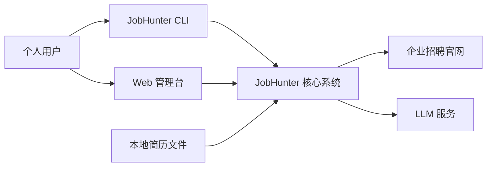
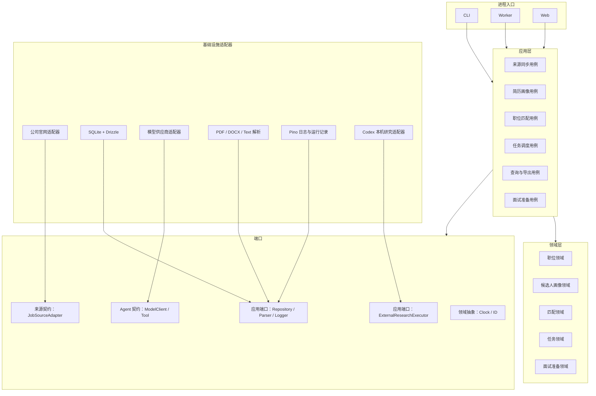
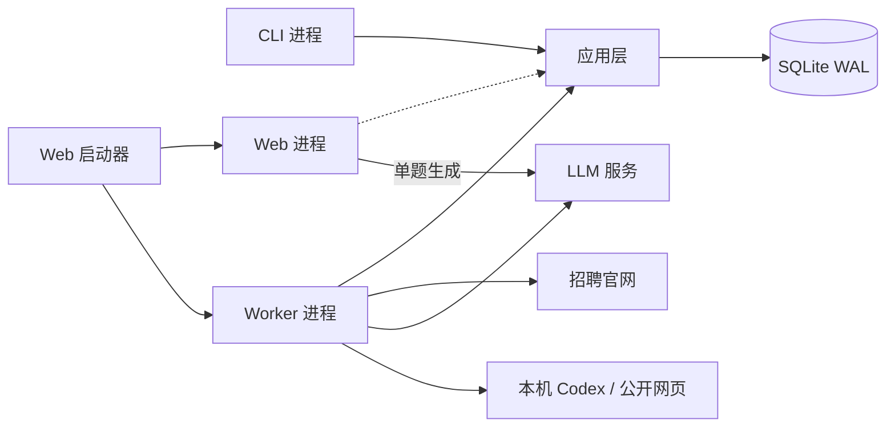
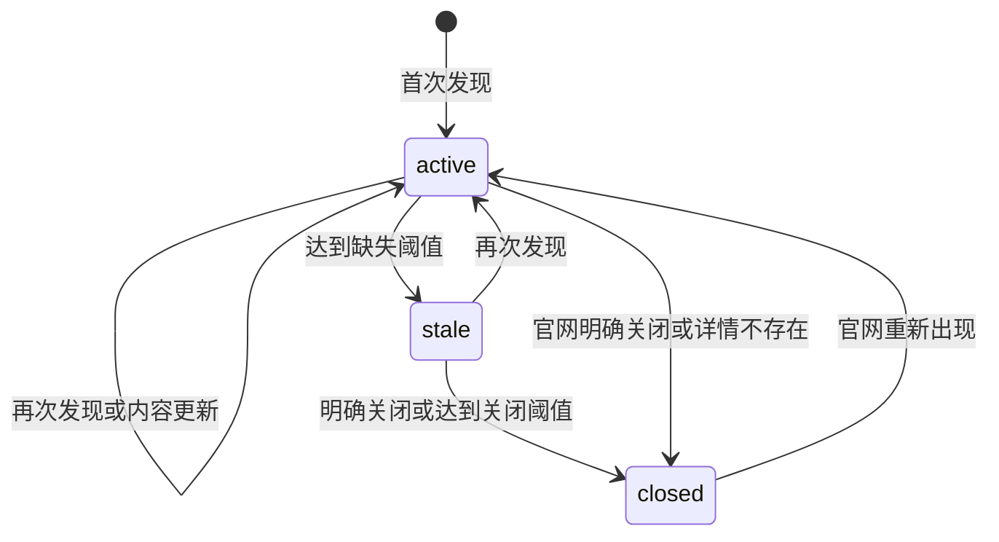
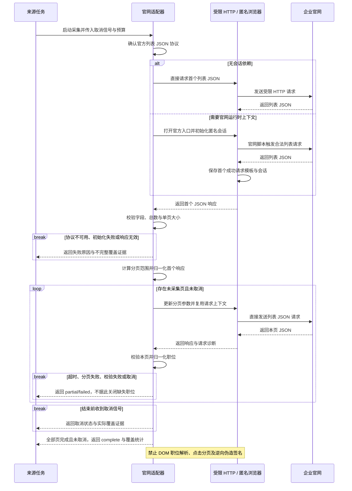
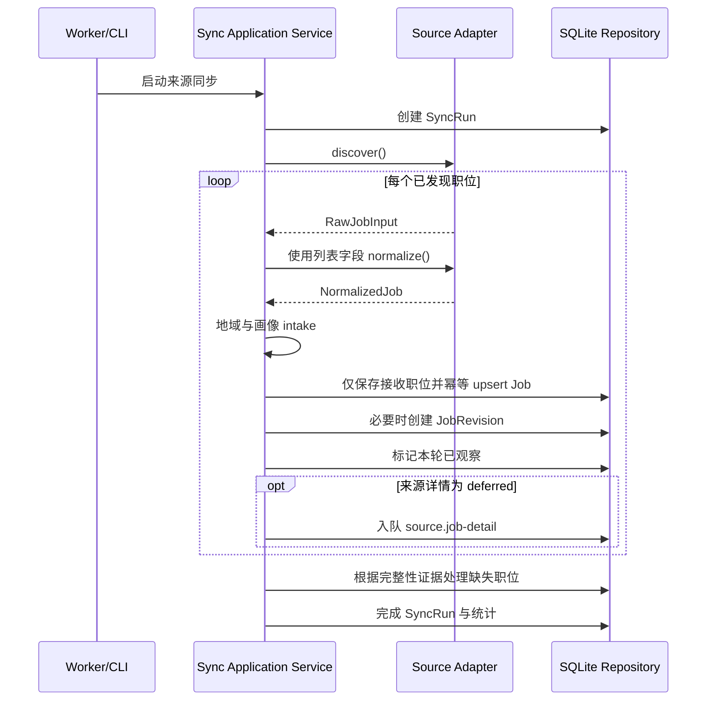
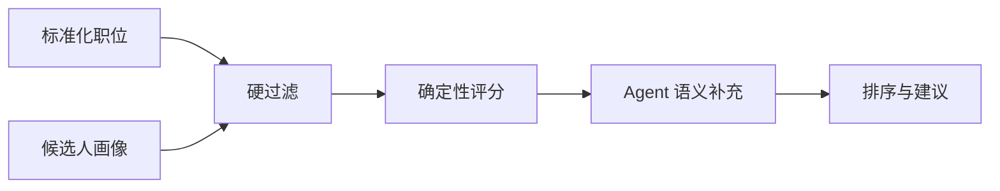
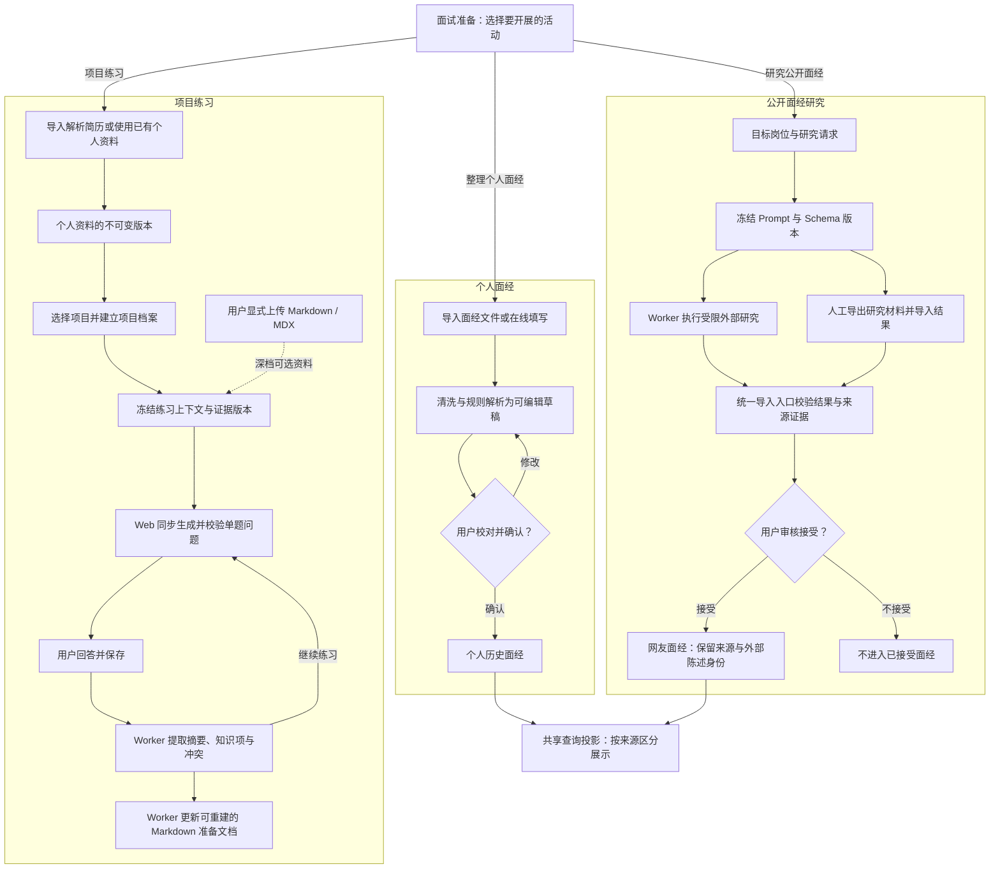

# JobHunter 总体架构

> 状态：Accepted

> 版本：1.5.2
> 更新日期：2026-09-10
> 适用范围：数据内核、Web 管理台、来源同步、简历与面试准备

## 1. 概述

### 1.1 文档目的

本文档定义 JobHunter 的总体架构、系统边界、核心模块、运行方式、数据流和关键技术约束，作为 SDD（Specification-Driven Development）规格设计、实现与验收的共同依据。

本文档维护系统结构与长期约束，不记录发布排期、实施进度或阶段性路线。具体功能行为、设计与实现任务由 `specs/` 下的 `spec.md`、`design.md` 和 `tasks.md` 维护。

### 1.2 产品目标与范围

JobHunter 是一个面向个人使用的求职辅助系统。系统读取已有简历，持续聚合企业招聘官网中的有效职位，对职位进行标准化、维护和匹配，并输出可解释的候选职位列表与官网投递入口；同时在同一本地数据和 Agent 内核上提供项目拷打、历史面经和网友面经等面试准备能力。

系统还把在线画像中的公开投递字段派生为按内置模板隔离的简历草稿。Web 负责编辑与生成不可变 HTML 快照，Worker 使用共享版本化模板和 Playwright 生成 PDF；投递草稿不反向修改画像，导出中转文件只短期保留。

#### 1.2.1 核心能力

| 能力           | 架构职责                                                   |
| -------------- | ---------------------------------------------------------- |
| 官网职位同步   | 接入企业官方招聘渠道，维护职位的新增、变更、缺失与关闭状态 |
| 数据标准化     | 将不同来源的职位映射为统一模型，保存原始记录与修订依据     |
| 简历与个人资料 | 从简历建立可修正、可锁定、可追溯的候选人画像               |
| 匹配与建议     | 结合确定性规则和 LLM 生成匹配分数、证据、风险与准备建议    |
| 简历制作       | 从画像派生独立模板草稿，由 Worker 生成投递文件             |
| 面试准备       | 基于简历项目建立档案，整理问答、个人面经与公开面经         |
| 操作与运行     | Web、CLI 复用应用用例，Worker 执行持久化后台任务           |

#### 1.2.2 来源范围

职位来自企业官方招聘页面或接口；具体企业、招聘渠道、支持状态与限制以 [来源支持矩阵](../../packages/sources/SUPPORT_MATRIX.md) 为准。

公司规模标签仅用于筛选和个人偏好，不作为适配器或领域模型的结构边界。

#### 1.2.3 系统边界

| 维度     | 边界                                                                                           |
| -------- | ---------------------------------------------------------------------------------------------- |
| 职位来源 | 仅接入企业官网，不接入 BOSS 直聘、猎聘等聚合招聘平台；只维护系统可观察到的职位，不保证历史全量 |
| 职位申请 | 用户在官网核对并提交，系统不自动填写或提交申请                                                 |
| 访问控制 | 不绕过登录、验证码、限流或其他反自动化措施                                                     |
| 使用方式 | 面向个人本地使用，不建设多用户、组织、权限和计费体系                                           |
| 系统形态 | 采用模块化单体，不拆分微服务，不引入 Redis、Kafka 等额外基础设施                               |
| 模型能力 | 不训练或部署自有模型，不引入 LangChain 等通用 Agent 编排框架                                   |

#### 1.2.4 面试准备范围

面试准备复用个人资料、Agent 与本地存储：

| 能力         | 输入                             | 输出与责任边界                                 |
| ------------ | -------------------------------- | ---------------------------------------------- |
| 项目拷打     | 简历项目、用户回答、显式项目资料 | 渐进式问题、事实缺口与准备建议，不代替用户回答 |
| 个人面经     | 用户自己的面试经历文档或在线填写 | 可校对草稿，经确认后形成历史面经               |
| 公开面经研究 | 目标岗位与带来源的研究包         | 可审核的网友面经，内容始终视为外部陈述         |
| 准备资料整理 | 问答、冲突与已确认事实           | 结构化记录和可重建的本地 Markdown 准备文档     |

深档只接受用户在项目档案页显式上传的 Markdown/MDX，由应用层选取有限片段；不接收或扫描项目目录，内部 Agent 工具集为空。

公开面经研究通过应用端口接入外部执行器，研究结果经结构校验和人工审核后入库。浏览器辅助研究由 Worker 在匿名隔离环境中采集公开证据，关闭浏览器后再将有界证据交给受限模型进程；采集与推理的权限、数据和生命周期分开管理。人工 Prompt/Schema 导出与 JSON Bundle 导入复用同一审核入口。

该能力只负责提问、指出缺口和给出准备建议，不代替用户回答，不修改或接管简历中的实际项目，也不提供真实面试中的实时提词或代答。详细设计见 [面试准备、简历项目拷打与面经知识库设计](./interview-preparation.md)。

## 2. 架构目标与原则

### 2.1 架构驱动因素

| 质量属性     | 架构要求                                               |
| ------------ | ------------------------------------------------------ |
| 可维护性     | 来源差异封装在适配器中，业务规则不散落到采集实现       |
| 可扩展性     | 新增公司、ATS、模型供应商或展示端，不修改核心领域逻辑  |
| 可追溯性     | 职位来源、内容变化、关闭判断与匹配结果均有证据         |
| 可恢复性     | 单个来源、职位或模型调用失败，不破坏其他任务和同步批次 |
| 可测试性     | 采集、标准化、状态转换、评分和 Agent 输出可独立验证    |
| 个人部署友好 | 本地运行，以 Node.js、SQLite 和可选 LLM API 为基础     |
| 成本可控     | 优先采用确定性逻辑；LLM 结果按输入与版本缓存           |

### 2.2 核心架构原则

#### 2.2.1 确定性数据管道优先

官网发现、字段提取、去重、状态转换和基础评分必须由普通程序完成。LLM 只处理确实需要语义理解的步骤，不能成为数据同步正确性的前提。

#### 2.2.2 端口与适配器

领域层只声明纯领域规则及 Clock/ID 等领域级抽象。Repository、事务、日志等应用端口由应用层声明；来源与 Agent 的通用协议放在独立契约包。SQLite、招聘官网、LLM、文件解析和各进程入口实现或装配这些端口，领域层不得感知它们。

#### 2.2.3 模块化单体

代码在一个仓库中开发和版本化，但按业务能力设置明确模块边界。Web、CLI 与 Worker 按进程职责运行，共享应用用例、领域包与 SQLite 数据库。

#### 2.2.4 原始事实与推导结果分离

| 数据层次   | 内容                     | 定位                       |
| ---------- | ------------------------ | -------------------------- |
| 来源事实   | 原始职位响应及其来源     | 外部输入证据               |
| 标准化事实 | 统一字段与职位修订       | 系统对来源事实的表达       |
| 推导结果   | 匹配分数、语义标签和建议 | 可按输入及规则版本重新计算 |

三者分别存储，避免模型或规则升级后无法回溯和重算。

#### 2.2.5 数据不物理删除

职位从官网消失时转为 `stale` 或 `closed`，保留职位记录、原始快照和变更历史。物理清理由显式维护命令处理，不属于日常同步流程。

#### 2.2.6 幂等与可重放

同一批原始输入重复处理，不应创建重复职位或无意义历史版本。标准化、状态转换和匹配计算应能针对已有数据安全重放。

## 3. 系统架构

### 3.1 系统上下文



1. **用户通过入口操作系统。** Web 提供可视化管理，CLI 提供命令行操作；两者调用同一套应用用例，不各自维护业务规则。
2. **本地简历建立个人资料。** 用户显式导入文件，系统提取文本并构建可人工修正的画像；简历不是招聘官网提供的数据。
3. **企业官网提供职位事实。** 核心系统通过来源适配器获取官方职位，保留来源链接与变化依据；实际申请仍由用户到官网完成。
4. **LLM 提供语义补充。** 系统只提交任务必需的有限上下文，模型用于画像提取、匹配解释和面试准备，不决定采集事实或职位生命周期。
5. **外部依赖按边界隔离。** 图中的连线表示系统交互，不表示所有操作在同一进程或事务内完成；外部故障按下表降级处理。

| 故障边界    | 处理原则                                   |
| ----------- | ------------------------------------------ |
| 招聘官网    | 记录来源运行失败并退避重试，不影响其他来源 |
| LLM         | 保留确定性结果，语义结果进入待重试状态     |
| 简历解析    | 保留导入记录与错误，不产生不完整的活动画像 |
| SQLite 写入 | 回滚当前短事务，不提交部分领域状态         |

### 3.2 逻辑架构



1. **从进程入口向内阅读。** CLI、Worker 和 Web 负责请求接入、生命周期管理及依赖装配，然后调用应用层；本图表达模块关系，不是执行时序。
2. **应用层编排用例。** 来源同步、画像、匹配、任务、查询和面试准备协调领域规则与端口，定义事务边界，不导入具体基础设施。
3. **领域层维护纯业务规则。** 职位、画像、匹配、任务和面试准备模型只处理业务状态与不变量，不感知数据库、浏览器或模型 SDK。
4. **端口隔离实现差异。** 应用端口由应用层声明，来源与 Agent 协议由契约包维护，Clock/ID 等纯领域抽象归领域层；实现细节不穿透这些边界。
5. **基础设施实现端口。** SQLite、官网适配器、模型、文件解析、日志和本机研究适配器由入口装配后供用例调用；运行时可以调用实现，但代码依赖不能反向进入基础设施。

依赖方向必须保持为：

```text
进程入口 → 应用层 → 领域层
                  → 应用端口 ← 基础设施适配器
                  → 来源/Agent 契约 ← 对应适配器
```

领域层禁止依赖 CLI、Worker、Drizzle、Playwright、具体模型 SDK 或具体公司适配器。

## 4. 代码组织与运行时

### 4.1 代码与模块布局

```text
JobHunter/
├─ apps/
│  ├─ cli/                    # 面向用户的命令行入口
│  ├─ worker/                 # 调度、同步、重试、后台计算与 Codex 研究适配器
│  └─ web/                    # 管理台与面试准备交互
├─ packages/
│  ├─ domain/                 # 纯领域实体、值对象、面试 Schema、Clock/ID 抽象
│  ├─ application/            # 用例编排、面试上下文构建、应用端口和事务边界
│  ├─ db/                     # Drizzle schema、通用文件实体、迁移和仓储实现
│  ├─ source-core/            # 来源协议、同步引擎、限流和标准化
│  ├─ sources/                # 企业官网或通用 ATS 适配器
│  ├─ resume/                 # 文件解析、画像提取和人工修正规则
│  ├─ matching/               # 硬过滤、评分、排序和解释数据
│  ├─ resume-template/        # 版本化简历模板与共享渲染
│  ├─ agent-core/             # 轻量 Agent 运行时
│  ├─ llm/                    # 模型供应商、结构化输出和缓存
│  ├─ observability/          # 日志、事件、指标和脱敏
│  └─ testkit/                # 固定样本、伪时钟、假模型和测试工厂
├─ docs/
│  ├─ arch/                   # 总体架构与专题架构
│  └─ adr/                    # 架构决策记录
├─ specs/                     # SDD 功能规格
├─ fixtures/                  # 脱敏后的采集与简历测试样本
└─ var/                       # 默认本地运行数据，不提交版本库
   ├─ jobhunter.sqlite
   ├─ raw/
   ├─ resumes/
   ├─ interview-prep/
   └─ exports/
```

使用 `pnpm workspace` 管理包，所有跨模块调用只能通过包的公开入口，不允许从其他包的内部路径导入。

`packages/sources` 是一个 workspace 包，各公司目录是包内模块并在启动时通过编译期 Registry 注册；“插件式”指遵循统一契约和可独立启停，不表示加载任意第三方代码。

内部包依赖必须符合：

| 包                    | 允许依赖的内部包                                       |
| --------------------- | ------------------------------------------------------ |
| `domain`              | 无                                                     |
| `source-core`         | `domain`                                               |
| `agent-core`          | 无业务包                                               |
| `resume`、`matching`  | `domain`、`agent-core` 的公开协议                      |
| `application`         | `domain`、`source-core`、`agent-core`、业务能力包      |
| `sources`             | `domain`、`source-core`                                |
| `llm`                 | `agent-core`                                           |
| `db`、`observability` | `domain`、`application`、`agent-core` 中需要实现的端口 |
| `apps/*`              | 仅用于装配，可依赖所需包                               |

任何内部包都不得依赖 `apps/*`；`application` 不得依赖 `db`、`sources`、`llm`、`observability` 或 Codex CLI 的具体实现。Codex 研究适配器位于 Worker 进程入口并实现 application 端口。

### 4.2 技术基线

| 能力         | 技术选择                                              |
| ------------ | ----------------------------------------------------- |
| 运行时与语言 | Node.js 24 LTS、TypeScript strict                     |
| Workspace    | pnpm workspace                                        |
| Schema       | Zod                                                   |
| SQLite       | better-sqlite3、Drizzle ORM                           |
| CLI          | Commander.js                                          |
| 采集         | fetch 获取官网 JSON；必要时 Playwright 初始化匿名会话 |
| 日志         | Pino，经 SafeLogger 脱敏包装                          |
| 测试         | Vitest、真实临时 SQLite、Playwright E2E               |
| Web          | Next.js App Router、React                             |

依赖的精确版本由 `pnpm-lock.yaml` 锁定；重大替换需要 ADR，补丁升级由锁文件和自动化测试约束。

### 4.3 运行时架构

系统包含 CLI、Worker 和 Web 启动器三个进程入口；Web 启动器会编排独立的 Web 与 Worker 子进程。

#### 4.3.1 CLI 进程

| 操作类别     | 职责                                               |
| ------------ | -------------------------------------------------- |
| 初始化与诊断 | 初始化数据库、配置，查看任务、来源健康度和失败原因 |
| 数据摄取     | 导入简历，手动触发单个或全部来源同步               |
| 查询与输出   | 查看画像，查询、筛选、导出职位                     |
| 匹配判断     | 运行匹配，查看评分和解释                           |

CLI 调用应用层用例，不复制 Worker 中的业务逻辑。

#### 4.3.2 Worker 进程

| 任务类别   | 职责与执行边界                                                         |
| ---------- | ---------------------------------------------------------------------- |
| 调度与恢复 | 轮询到期任务，领取租约，执行退避重试，恢复超时任务                     |
| 来源同步   | 按调度策略同步官网，维护游标与来源健康状态                             |
| 画像与匹配 | 执行后台画像任务、语义增强和匹配重算                                   |
| 简历导出   | 使用共享模板生成投递文件                                               |
| 面试准备   | 执行回答摘要、Markdown 投影和外部面经研究；单题问题生成由 Web 请求处理 |

Worker 可以并发读取网络，但数据库写入必须使用短事务并限制写并发。外部 Codex 研究除研究请求级并发键外，还施加 Worker 进程内全局单并发，限制同时运行的外部研究进程。

#### 4.3.3 Web 启动器与 Web 进程

| 组成         | 职责                                           | 执行边界                                   |
| ------------ | ---------------------------------------------- | ------------------------------------------ |
| Web 启动器   | 启动独立的 Web 与 Worker 子进程                | 任一子进程退出时联动关闭另一个             |
| Web 管理台   | 提供查询、筛选、配置、个人资料与面试准备界面   | 复用应用用例和仓储端口                     |
| 项目单题生成 | 在 HTTP 请求内调用模型，以 SSE 报告执行阶段    | 不在事务内调用模型；阶段事件不携带问题正文 |
| 显式资料上传 | 清洗、分块并登记有大小上限的 Markdown 文件版本 | 不创建专用后台预处理任务                   |
| 后台操作入口 | 发布摘要、投影、研究和导出等任务               | 耗时执行交给 Worker                        |



1. **启动器管理子进程。** Web 启动器同时启动独立的 Web 与 Worker，并联动处理退出，避免界面正常但后台进程已失效而无人感知。
2. **各入口复用应用层。** Web 接收页面请求，CLI 接收命令，Worker 消费后台任务；图中箭头表示运行时调用或进程管理，不等同于包导入关系。
3. **持久化由仓储端口承接。** 应用层通过仓储实现访问共享 SQLite，使用 WAL 与短写事务；应用层不直接依赖 SQLite 驱动。
4. **耗时外部工作由 Worker 执行。** 官网同步、后台模型计算与公开面经研究在任务上下文中运行，网络和模型调用始终位于数据库事务之外。
5. **单题生成保留同步例外。** 项目拷打的单题问题生成由 Web 请求调用模型，并通过 SSE 报告阶段；它复用应用用例，不借此把批量计算移入 Web。
6. **重启后从持久化状态恢复。** 任务状态、租约与业务记录保存在 SQLite，Worker 根据租约恢复执行，不依赖 Web 或 CLI 进程中的临时内存。

## 5. 核心领域模型

### 5.1 主要聚合与实体

| 模型                        | 职责                                           |
| --------------------------- | ---------------------------------------------- |
| `Company`                   | 公司标准名称、别名、行业、规模标签和启用状态   |
| `SourceChannel`             | 公司下稳定的实习、校招或社招逻辑渠道与总开关   |
| `JobSource`                 | 物理官网入口、适配器、配置、同步策略和健康状态 |
| `Job`                       | 标准化职位、当前状态、来源标识和最新可见时间   |
| `JobRevision`               | 职位有效字段发生变化时生成的历史版本           |
| `RawJobRecord`              | 原始响应或经过脱敏的原始内容及其内容哈希       |
| `SyncRun`                   | 一次来源同步的生命周期和统计信息               |
| `CandidateProfile`          | 从简历产生并允许人工修正的结构化候选人画像     |
| `MatchResult`               | 指定画像与职位在指定规则版本下的匹配结果       |
| `ProjectDossier`            | 绑定简历项目快照的长期面试准备档案             |
| `DrillSession`              | 在固定拷打档位和输入快照下的一次渐进式问答     |
| `InterviewExperience`       | 带个人或网友来源、审核状态和问题集合的面试经历 |
| `ExperienceResearchRequest` | 一项目标岗位网友面经搜集目标及其审核生命周期   |
| `AgentRun`                  | 一次模型或工具运行的输入引用、版本、状态和成本 |
| `Task`                      | Worker 可领取、重试和恢复的持久化任务          |

### 5.2 职位生命周期



1. **首次发现建立有效职位。** 经过校验并被接收的新职位进入 `active`，同时保存来源身份与可追溯记录。
2. **再次发现更新可见证据。** 已有职位保持 `active` 并更新最近可见时间；有效内容变化时生成修订，无变化时不制造新版本。
3. **完整同步后才判断缺失。** 仅当来源覆盖完整时，未出现职位才累计缺失；达到配置阈值后进入 `stale`。分页中断、取消或部分失败不能作为缺失依据。
4. **充分证据支持关闭。** 官网明确关闭、详情确定不存在，或连续缺失达到关闭阈值时才转为 `closed`；单次列表缺失不足以关闭职位。
5. **重新出现可恢复有效。** `stale` 或 `closed` 职位在官网再次被有效观察后恢复为 `active`；状态变更保留时间、策略版本和来源证据，不删除历史。

| 状态     | 含义与判定依据                                       |
| -------- | ---------------------------------------------------- |
| `active` | 最近同步中仍可见，或有明确有效证据                   |
| `stale`  | 暂时未观察到，但证据不足以判定关闭                   |
| `closed` | 官网明确关闭、详情确定不存在，或连续缺失达到配置阈值 |

不得因单次列表缺失直接关闭职位。状态阈值属于同步策略，应记录策略版本并支持按来源调整。

### 5.3 身份与去重

来源内稳定身份优先使用：

```text
(source_id, external_job_id)
```

其中 `source_id` 始终指向物理 `JobSource`，不是逻辑 `SourceChannel`。同一逻辑渠道下的兄弟来源仍保留各自的来源身份和审计链。

若来源没有稳定 ID，则使用适配器生成的来源指纹。系统不执行跨来源自动合并或“疑似重复”业务流程；同一职位在不同来源中可以分别存在。可保留以下辅助指纹字段，用于核对来源事实：

- 公司标准 ID
- 规范化职位名称
- 城市集合
- 部门或细分职位类别
- 职位描述内容哈希

## 6. 数据来源与同步

### 6.1 官网来源子系统

#### 6.1.1 适配器职责

| 边界       | 适配器负责                             | 由公共内核负责                       |
| ---------- | -------------------------------------- | ------------------------------------ |
| 官网访问   | 构造列表与详情请求，处理分页和来源会话 | 超时、取消、限速、重试与并发策略     |
| 数据转换   | 映射来源字段，提供稳定身份与官网链接   | 领域校验、职位状态判断和匹配评分     |
| 存储与诊断 | 返回来源能力、覆盖证据和可分类错误     | 写入数据库、保存游标、审计与任务恢复 |

具体接口、字段、能力声明与契约测试见 [来源适配器规格](../../specs/004-source-adapter-contract/spec.md) 和 [契约设计](../../specs/004-source-adapter-contract/design.md)。本文只规定职责与依赖边界。

#### 6.1.2 官网数据获取标准流程

官网采集遵循“JSON 优先、按需初始化匿名会话、直接 JSON 分页”。下图展示来源任务、适配器、采集客户端和企业官网之间的交互；客户端的浏览器状态不暴露给应用层。



1. **确认来源协议与访问预算。** 适配器先确认可验证的官方 JSON 列表协议、稳定职位 ID、详情链接、分页字段和总数边界，并遵循公共取消、超时与限速策略。无法合法完成采集时停止，不转用违规路径。
2. **优先直接请求。** 不依赖浏览器会话或运行时参数的来源，通过受限 HTTP 客户端请求列表 JSON，不加载 DOM 或解析职位页面文本。
3. **按需初始化匿名会话。** 需要会话、CSRF 或签名上下文的来源，在受控匿名浏览器中打开官方入口，等待官网脚本产生首个成功列表请求；只保存必要的 URL、方法、请求头、请求体及会话上下文。
4. **校验首个响应并计算范围。** 使用来源 Schema 检查状态码、记录数组和分页字段；总数与单页大小来自 JSON。总数为零时页数为零，否则按总数除以有效单页大小向上取整，不从 DOM 推断页数。首个响应也必须参与校验与归一化。
5. **直接请求其余 JSON 页。** 无会话依赖的来源继续使用受限 HTTP；浏览器来源在同一页面上下文复用请求模板与会话，只更新分页参数。签名只由官网脚本在初始化时生成，不点击分页控件，不逆向或逐页伪造签名。
6. **逐页校验与归一化。** 每页检查状态、分页范围、总数、记录数组与字段类型，再转换为统一职位输入；标题、描述、地点等字段只能来自 JSON，缺失信息不得臆造。
7. **按真实覆盖结果结束。** 只有所有计算页均完成且未取消时返回 `complete`。初始化失败、超时、解析变化、分页错误或取消时停止，按运行结果记录 `partial/failed`，保留诊断；不完整同步不得用于批量关闭未出现职位。
8. **回收资源并隔离失败。** 客户端关闭会话并释放资源。无法在合法 JSON 路径下完成的来源保持 `experimental` 或 `blocked`，不阻塞其他来源、画像、匹配与查询。

| 约束维度   | 要求                                                                             |
| ---------- | -------------------------------------------------------------------------------- |
| 数据来源   | 只从校验后的官网 JSON 提取职位，不通过 DOM 文本取数或点击分页                    |
| 会话所有权 | 浏览器、Cookie、签名与页面实现细节留在来源基础设施内                             |
| 访问控制   | 不绕过登录、验证码或限流，不复用未授权 Cookie，不隐藏自动化身份规避访问控制      |
| 资源与熔断 | 浏览器设置独立超时、低并发、资源回收与失败熔断；复杂且不稳定的来源应保持降级状态 |

#### 6.1.3 ATS 复用策略

首次接入允许按公司实现适配器。在识别出多个公司共享同一 ATS 且协议稳定后，将公共逻辑提取为 ATS 适配器，公司差异下沉为配置。不能仅凭页面外观提前建立错误抽象。

来源支持状态必须诚实标记为 `experimental`、`supported` 或 `blocked`；是否启用由独立 `enabled` 配置表示，运行健康使用 `unknown/healthy/degraded/unhealthy`，三者不得混用。每个来源只有通过契约测试和覆盖验证后才能标记为 `supported`；复杂或受外部条件阻断的来源应保留调查依据并标记相应支持状态。具体覆盖以 [来源支持矩阵](../../packages/sources/SUPPORT_MATRIX.md) 为准，单个来源失败不得阻塞其他业务链路。

来源目录分为两层：每家公司固定拥有实习、校招、社招三个逻辑 `SourceChannel`，每个逻辑渠道映射零个、一个或多个物理 `JobSource`。逻辑渠道提供稳定的用户入口、筛选与总开关；物理来源拥有 adapter key、配置、同步策略、支持状态和运行健康。渠道级同步只编排扇出独立的来源级任务，不共享游标、事务或健康状态；具体约束见 `specs/018-logical-source-mapping/` 与 ADR-0009。

### 6.2 同步流水线

用户按逻辑渠道触发同步时，应用层先解析公司、渠道和物理来源三层开关，再为每个有效物理来源分别创建 `source.sync` 任务。下述流水线始终运行于单个物理来源；兄弟来源失败相互隔离，完整覆盖、seen set 和职位关闭判定不得跨来源合并。



1. **按物理来源建立运行记录。** Worker 或 CLI 调用同步用例，先创建 `SyncRun`，把本次输入、状态与统计关联到一个物理来源。
2. **发现并标准化列表记录。** 适配器获取来源输入并按列表字段归一化；外部请求不在写事务内执行，非法响应进入可诊断的失败路径。
3. **执行接收规则。** 应用层按地域与画像条件进行 intake；只有被接收的职位进入保存流程，但列表覆盖判断仍以真实采集证据为准。
4. **幂等更新事实与修订。** 通过仓储写入或更新职位，有效内容变化时才创建 `JobRevision`，并维护本轮观察记录；重复同步不能生成重复职位或无意义版本。
5. **按能力拆分详情补全。** 对被接收且详情策略为 `deferred` 的职位登记独立详情任务；详情失败不否定已经完成的列表覆盖，也不混入来源列表健康判断。
6. **依据完整性处理缺失。** 只有完整发现才能增加未出现职位的缺失计数并执行状态规则；部分失败的运行保留已确认事实，不据此批量关闭职位。
7. **完成审计并触发派生计算。** 用例记录运行结果与统计，根据新增、字段变化和关闭事件产生下表所列任务或结果更新；兄弟来源不共享关闭判定或事务。

| 触发条件                      | 后续动作                   | 边界                                         |
| ----------------------------- | -------------------------- | -------------------------------------------- |
| 已接收且详情策略为 `deferred` | 独立详情补全任务           | 可在接收时入队，失败不影响列表覆盖与来源健康 |
| 新职位或 JD 变化              | 语义增强任务               | 推导结果与来源事实分开保存                   |
| 影响过滤或评分的字段变化      | 匹配重算任务               | 关联输入与规则版本                           |
| 职位关闭                      | 更新活动匹配结果的可投递性 | 保留历史结果                                 |

只有确认本次发现覆盖完整范围时，才允许根据“本轮未出现”更新缺失计数。分页中断或部分失败的同步运行不得据此批量标记职位失效。

## 7. 简历、匹配与 Agent

### 7.1 简历与候选人画像

简历处理分为四层：

1. 文件存档和内容哈希。
2. PDF、DOCX 或文本的确定性文字提取。
3. Agent 将文本映射为结构化画像。
4. 用户对画像字段进行人工修正和锁定。

| 画像维度 | 内容                                 |
| -------- | ------------------------------------ |
| 求职偏好 | 地点、岗位方向、公司偏好与可接受条件 |
| 经历     | 教育、工作与项目经历                 |
| 专业能力 | 技能、熟练度证据、行业和业务领域经验 |
| 职业背景 | 年限、职级与管理经验                 |
| 人工控制 | 修正字段及锁定状态                   |

重新解析简历时不得静默覆盖已锁定字段。每个候选人画像只保留最新 5 个不可变版本，版本号持续递增；超额旧版本及其可重算匹配推导在新版本提交事务中清理。原始简历属于敏感数据，日志和 Agent 运行记录不得保存无必要的完整正文。

### 7.2 匹配架构

职位匹配采用分层流水线：



1. **固定本次输入版本。** 标准化职位与候选人画像共同进入匹配流水线，保留职位修订、画像版本和规则版本，避免结果无法追溯。
2. **先排除确定冲突。** 硬过滤只处理有明确证据的不可接受条件，每次排除记录规则与证据；信息不足的职位不直接淘汰。
3. **计算基础分数。** 确定性规则综合技能、经历、岗位方向、地点偏好与风险，形成无需模型即可使用的评分。
4. **按需补充语义信息。** Agent 解释隐含要求、加分项和准备建议，不覆盖职位事实、不绕过硬过滤；模型失败时保留基础分数并记录待重试状态。
5. **输出排序与可解释建议。** 展示层使用基础评分及可用的语义结果形成候选列表，用户可核对证据并通过原始官网链接查看和投递。

#### 7.2.1 硬过滤

用于排除明确不满足的条件，例如：

- 用户明确排除的地点或岗位类型。
- 明确不可接受的工作性质。
- 必须条件与候选人情况存在确定冲突。

每条过滤结果必须包含规则 ID 和证据。证据不足时不进行硬排除。

#### 7.2.2 确定性评分

评分可包含：

- 核心技能覆盖。
- 相关经历与年限。
- 岗位方向与职级。
- 行业或业务背景。
- 地点和个人偏好。
- 明确风险或缺口。

评分结果必须记录 `profile_version`、`job_revision` 和 `ruleset_version`，使历史结果可解释、可比较和可重算。

#### 7.2.3 Agent 语义补充

Agent 用于提取隐含要求、识别加分项、解释匹配依据以及生成准备建议。Agent 不拥有最终职位状态，不绕过硬规则，也不直接修改标准化职位事实。

### 7.3 轻量 Agent 运行时

#### 7.3.1 组件

| 组件              | 职责                                        |
| ----------------- | ------------------------------------------- |
| `ModelClient`     | 屏蔽模型供应商差异，支持结构化输出和取消    |
| `ToolDefinition`  | 使用 Zod 声明工具输入、输出和执行函数       |
| `AgentDefinition` | 声明系统提示、可用工具、输出 Schema 和预算  |
| `AgentRunner`     | 执行模型—工具循环并施加步数、时间和成本限制 |
| `RunContext`      | 提供任务、画像、职位和权限上下文            |
| `AgentRunStore`   | 保存版本、状态、耗时、Token、错误和结果引用 |
| `PromptRegistry`  | 管理提示词 ID、版本和兼容性                 |

#### 7.3.2 业务 Agent

| Agent                                                                  | 职责                                                         |
| ---------------------------------------------------------------------- | ------------------------------------------------------------ |
| `ResumeProfileAgent`                                                   | 将简历文本映射为结构化候选人画像                             |
| `JobUnderstandingAgent`                                                | 提取规则难以稳定获得的 JD 语义信息                           |
| `JobAdviceAgent`                                                       | 结合职位、画像与确定性评分，生成解释和建议                   |
| `interview.project-question@v1` / `interview.project-question-docs@v1` | 基于浅档快照或已选 Markdown 片段生成可追溯问题，工具集均为空 |
| `interview.project-answer-digest@v1`                                   | 从用户回答中提取知识项、歧义、冲突和覆盖变化，不生成代答     |

#### 7.3.3 运行约束

| 维度     | 约束                                                              |
| -------- | ----------------------------------------------------------------- |
| 输出校验 | 所有业务输出通过 Zod Schema；失败仅允许有限修复，随后保存失败状态 |
| 执行预算 | 每种 Agent 配置步数、超时与 Token 上限                            |
| 工具权限 | 最小权限、默认只读；业务写入由应用用例负责                        |
| 结果缓存 | 键包含输入哈希、Agent、Prompt 和模型配置版本                      |
| 日志隐私 | 记录摘要与引用，不保存完整简历、密钥或无必要的原始 JD             |
| 模型降级 | LLM 不可用时，确定性同步与基础评分仍可运行                        |

### 7.4 面试准备子系统

面试准备复用候选人画像、Artifact Store、轻量 Agent 和 Worker，但拥有独立的数据生命周期。下图从统一的“面试准备”入口展开三条业务路径；分组表示职责边界，不是彼此断开的子系统。



1. **从统一入口选择活动。** 用户在面试准备中选择项目练习、整理个人面经或研究公开面经，三条路径按需使用，不要求依次完成。项目练习使用简历导入解析形成的个人资料，已有资料时无需重复导入；用户从不可变版本中选择项目建立长期档案，档案身份不依赖项目数组下标。
2. **准备有界且可追溯的上下文。** 会话冻结画像快照和允许的证据版本，深档只补充用户显式上传的 Markdown/MDX 片段；图中的虚线表示可选输入，不表示允许读取项目目录或源码。
3. **逐题练习并整理反馈。** Web 同步生成和校验问题，用户自行回答；回答保存后，Worker 提取摘要、知识项与冲突。继续练习仍使用受限上下文，模型不能代答，也不能把推导覆盖为用户事实。
4. **生成可重建的准备文档。** Worker 根据已保存的结构化记录更新 Markdown 投影；SQLite 始终是权威数据源，投影文件不是另一份需要双向同步的业务状态。
5. **个人面经先校对再确认。** 文件导入与在线填写进入同一清洗管线，规则解析只形成可编辑草稿；用户可以反复修改，确认后才成为个人历史面经。
6. **公开研究先校验再审核。** 研究请求冻结 Prompt/Schema 版本，Worker 外部研究与人工导包汇入同一校验入口。自动研究只返回待审核结果；浏览器辅助模式先由 Worker 采集公开证据并关闭浏览器，再交给无浏览器、网络或 Shell 权限的模型进程处理。不合法的结果不能进入审核，未被用户接受的内容不进入网友面经。
7. **共享查询，不混合事实与权限。** 个人面经与已接受的网友面经共享查询投影，但保留不同来源和审核规则；网友内容始终是外部陈述，不自动加入项目练习上下文。

关键架构约束如下：

1. 用户从不可变 ProfileVersion 中选择项目并创建稳定 `ProjectDossier`，避免用画像项目数组下标作为长期身份。
2. “浅”“深”等档位由版本化 Profile 声明允许的上下文和证据种类；档位升级不隐式获得任意文件或网络权限，浅档与深档 Agent 的工具集都为空。
3. 深档只接受用户在档案页显式上传的 Markdown/MDX。资料版本复用 `files → file_entity_mappings → entities`；映射元数据保存标题分块，应用层按命中数、文件顺序和字符位置执行有界确定性排序，不建立专用资料表或预处理任务。
4. 会话冻结 1–8 个精确 file/version/entity/hash 绑定；内部 Agent 只接收选中片段，不获得项目目录、源码、Git、Shell、任意文件或网络能力。
5. 每轮问题、原始回答、回答修订、知识项、冲突和证据分开保存；模型推导不能覆盖用户回答或候选人画像。
6. 个人面经的标准 Markdown 模板、文件导入和在线填写汇入同一版本化清洗管线；原文件与提取文本不可变，规则解析只生成可编辑草稿，用户确认后才进入历史面经。
7. 个人面经和网友面经共享查询投影，但保留不同来源和审核策略。网友内容必须带 URL、时间和短摘录，并始终视为外部陈述。
8. 网友面经以 `ExperienceResearchRequest` 保存研究意图，Prompt、JSON Schema 和 Bundle 都是通用文件版本；预览和执行读取请求冻结的精确 Prompt/Schema 版本，人工导包、`codex-local@v1` 与只兼容 `community-research-prompt@v4` 的 `browser-assisted-codex@v2` 汇入同一 Bundle Importer，只有人工接受后才出现在网友面经。问题周边证据摘录不进入 Bundle 或数据库，用户通过原始来源链接核对上下文；旧 Prompt 不得静默升级。
9. 外部研究通过持久化 `Task` 执行，只能返回待审核文件。`browser-assisted-codex@v2` 由 Worker 使用固定搜索提供方和确定性 QueryPlan 完成 `search → open → readPage`：允许域名形成优先查询组，耗尽合格候选后才按需进入通用组；搜索提供方的原始链接须先通过跳转解包、公网 URL 和域名策略过滤，过滤后为空才继续回退。请求 URL 与最终 URL 以 canonical source identity 折叠跟踪变体，同时保留实际最终 URL，候选还须通过岗位/面试相关性和有界页面问题质量门槛。公网 URL、DNS/IP、重定向、域名、连接、页面、字节与时间均受限；`198.18/15` 透明转译地址只有在受信任公网 pin 已建立且系统答案全部属于该网段时才可用于连接，不能成为 SSRF 例外。Worker 在启动 Codex 前关闭浏览器，把有界、分区标记为不可信的 EvidencePack 仅通过 stdin 传入；Codex 禁用网络、MCP、浏览器、Shell 和其他可扩展工具。结果必须通过本次 trace、来源最终 URL 和证据逐字回溯校验，再由短租约 claim、事务外 staging 写入和短事务原子提升进入 `needs_review`。已接受面经不自动加入项目拷打上下文。
10. 面试问题由 Web 同步调用内部 Agent，通过 SSE 流报告准备上下文、生成、校验和保存阶段；问题占位与最终提交分别使用短事务并以会话修订和上下文哈希 CAS，请求失败或取消时删除未提交占位。摘要和研究 Task 的首次入队与业务引用仍由 SQLite 协调器在同一短事务完成；手工重试原子重绑当前 Task。Worker 最终业务提交重验 Task 身份、running/未取消状态，回答已保存但摘要任务尚未发布时可按幂等 token 恢复。

SQLite 是结构化状态的权威数据源；每个项目的 Markdown 准备文档是可重建投影，不形成双写权威。完整功能、数据对象、任务类型与安全约束见 [面试准备、简历项目拷打与面经知识库设计](./interview-preparation.md)。

## 8. 存储与配置

### 8.1 SQLite 与持久化策略

完整表、约束、索引、保留和迁移设计见 [数据模型与 SQLite 表设计](./data-model.md)。

#### 8.1.1 数据库约束

| 维度         | 约束                                                  |
| ------------ | ----------------------------------------------------- |
| 连接与一致性 | 使用 WAL、合理的 `busy_timeout`，连接初始化时启用外键 |
| 事务         | 写事务保持短小，不包含网络或模型调用                  |
| 写并发       | Worker 限制并发写入，避免长事务争抢写锁               |
| 时间         | UTC 存储，按展示环境转换时区                          |
| 迁移         | 只通过版本化迁移文件修改数据库结构                    |

#### 8.1.2 任务队列

领取、租约、心跳、重试、调度和关闭算法见 [Worker、任务队列与并发设计](./worker-and-concurrency.md)。

任务队列直接存储在 SQLite：

| 信息类别   | 内容与作用                                           |
| ---------- | ---------------------------------------------------- |
| 执行内容   | 任务类型与序列化参数                                 |
| 生命周期   | `pending / running / succeeded / failed / cancelled` |
| 调度与恢复 | 计划执行时间、尝试次数与最大尝试次数                 |
| 租约       | 锁拥有者与到期时间，支持异常退出后的重新领取         |
| 幂等       | 幂等键防止重复发布或重复业务提交                     |
| 诊断       | 最后错误分类与摘要                                   |

Worker 使用带过期时间的任务租约。进程异常退出后，其他 Worker 或重启后的同一 Worker 可以重新领取超时任务。默认只运行一个 Worker 实例，但数据结构不依赖进程内存状态。

#### 8.1.3 文件存储

简历原文件、项目 Markdown、面经原文件、研究 Prompt/Schema/Bundle、面试准备 Markdown 和导出结果统一使用通用文件实体：

| 存储对象               | 职责                                                |
| ---------------------- | --------------------------------------------------- |
| `files`                | 逻辑文件及业务属性                                  |
| `file_entity_mappings` | 最多 5 个版本、解析状态、规范化文本和类型相关元数据 |
| `entities`             | 按 SHA-256 去重的物理文件路径、媒体类型与大小       |

项目资料的标题、字符范围和分块哈希位于 mapping metadata，不建立专用资料版本表。小型结构化 JSON 可以直接存入 SQLite。

所有文件写入先写临时文件，再原子替换目标文件，避免进程中断留下半文件。

#### 8.1.4 备份与迁移边界

一致性备份覆盖 SQLite 与配置数据目录中的文件，二者必须按同一数据边界恢复。数据库差异由仓储实现、迁移工具和任务领取策略隔离，不进入领域模型与应用用例。

### 8.2 配置与密钥

配置来源按优先级合并：

```text
CLI 临时参数 > 环境变量 > 本地配置文件 > 内置默认值
```

CLI、Web 与 Worker 必须复用应用层唯一的运行时配置加载器，并显式传入工作区根目录。加载器固定读取工作区根目录 `.env` 和 `<dataRoot>/config.json`，进程环境覆盖 `.env` 同名值；不得依赖当前工作目录或 Next、tsx 等运行器隐式加载环境文件。

| 配置类别 | 内容                                           |
| -------- | ---------------------------------------------- |
| 普通配置 | 数据库路径、同步周期、并发、来源开关、关闭阈值 |
| 敏感配置 | 模型 API Key、可能存在的授权信息               |

敏感配置通过环境变量或不纳入版本控制的本地 `.env` 提供，不得写入 SQLite 普通配置表、日志、错误消息或版本库。

## 9. 运维与质量保障

### 9.1 可观测性与审计

系统同时使用结构化日志和持久化运行记录。

#### 9.1.1 日志公共字段

| 类别       | 字段                                       |
| ---------- | ------------------------------------------ |
| 运行关联   | `runId`、`taskId`、`agentRunId`            |
| 业务定位   | `sourceId`、`jobId`                        |
| 操作与诊断 | `operation`、`durationMs`、`errorCategory` |

#### 9.1.2 必须可查询的运行信息

| 对象     | 查询内容                                     |
| -------- | -------------------------------------------- |
| 来源     | 最近成功和失败时间、支持状态与运行健康       |
| 同步运行 | 发现、新增、更新、恢复、缺失、关闭及失败统计 |
| 任务     | 待处理、运行中、失败及恢复信息               |
| Agent    | 模型、Prompt 版本、耗时、Token 与缓存命中    |
| 职位修订 | 状态变化的时间、原因及来源证据               |

日志必须进行字段级脱敏，不能依赖简单字符串替换处理简历和密钥。

### 9.2 可靠性与错误处理

错误按处理策略分类：

| 类型           | 示例                        | 策略                       |
| -------------- | --------------------------- | -------------------------- |
| 临时外部错误   | 超时、限流、服务端错误      | 指数退避并加入随机抖动     |
| 永久外部错误   | 职位详情确定不存在          | 记录证据并进入状态判断     |
| 解析错误       | 官网结构变化、字段类型异常  | 隔离样本，标记来源退化     |
| 配置错误       | 缺少 API Key、非法来源配置  | 不自动重试，等待修正       |
| 数据冲突       | 唯一键、版本不一致          | 回滚短事务并重新读取判断   |
| Agent 输出错误 | Schema 不合法、工具循环超限 | 有限修复，随后保存失败状态 |

来源连续失败达到阈值时进入 `degraded` 或 `unhealthy` 状态，暂停高频自动重试，但保留手动健康检查能力。

### 9.3 安全、隐私与合规边界

| 安全边界           | 约束                                                                                                                                                                                                                                                                                                                                                                                                                        |
| ------------------ | --------------------------------------------------------------------------------------------------------------------------------------------------------------------------------------------------------------------------------------------------------------------------------------------------------------------------------------------------------------------------------------------------------------------------- |
| 官网访问           | 仅访问无需绕过访问控制的官方招聘公开页面或接口。                                                                                                                                                                                                                                                                                                                                                                            |
| 访问频率           | 尊重来源的访问频率和使用约束，适配器必须配置限速。                                                                                                                                                                                                                                                                                                                                                                          |
| 匿名浏览器         | 可在受控浏览器中执行官网公开脚本并读取匿名渲染结果，但不逆向伪造风控参数、不绕过验证码、不复用未经授权的会话，也不通过隐匿手段规避访问控制。                                                                                                                                                                                                                                                                                |
| 职位数据最小化     | 原始页面中与职位无关的个人信息不进入领域数据。                                                                                                                                                                                                                                                                                                                                                                              |
| 简历隐私           | 简历默认仅保存在本地，发送给 LLM 的内容应限于当前任务所需字段。                                                                                                                                                                                                                                                                                                                                                             |
| 简历编辑与预览隔离 | 简历制作的受控编辑 iframe 通过文档 CSP 禁止脚本和外部资源，并允许父页面事件在 WebKit 中执行；只读预览采用禁脚本沙箱。隔离约束见 [ADR-0022](../adr/0022-resume-studio-webkit-event-boundary.md)。                                                                                                                                                                                                                            |
| 项目上下文         | 项目拷打默认只发送单个项目的最小快照；深档只增加当前问题命中的显式 Markdown 资料片段，不读取源码。                                                                                                                                                                                                                                                                                                                          |
| 外部研究隔离       | 外部研究 Agent 默认不接收完整简历、个人面经答案、项目目录或 SQLite 路径；所有 Codex 适配器以 strict config 禁用 Shell、统一执行、Codex 内建浏览器、Computer Use、多 Agent/Goal、授权请求、插件、App、Skill、本地图片和工作区依赖工具。`browser-assisted-codex@v2` 的联网采集完全由 Worker 在 Codex 启动前完成，Codex 不获得 MCP、浏览器、网络凭据或句柄；输出仍须经过本次访问 trace、Schema、来源与证据逐字校验和人工审核。 |
| 公开面经合规       | 公开面经搜集遵守站点条款、robots、访问控制和频率限制，不绕过登录、付费墙或验证码，不默认镜像第三方全文。                                                                                                                                                                                                                                                                                                                    |
| 数据清理           | 提供删除或清理简历、Agent 运行输入和导出文件的显式维护能力。                                                                                                                                                                                                                                                                                                                                                                |
| 投递真实性         | 官网投递链接必须保留原始来源，系统不伪装为招聘方。                                                                                                                                                                                                                                                                                                                                                                          |

### 9.4 测试策略

| 测试层次       | 覆盖重点                                                                   | 验证目的                 |
| -------------- | -------------------------------------------------------------------------- | ------------------------ |
| 单元测试       | 字段规范化、值对象、状态机、关闭规则、过滤评分、输出 Schema 与缓存键       | 领域规则与确定性处理正确 |
| 适配器契约测试 | 稳定 ID/URL、分页终止、缺失字段、规范化稳定性、取消、超时与错误分类        | 所有来源遵守相同边界     |
| 集成测试       | SQLite 迁移与仓储、同步幂等、部分失败、租约恢复及画像字段锁定              | 模块协作和事务边界正确   |
| 端到端测试     | 简历导入、不同技术类型的官网同步、职位列表与官网链接、匹配解释、修订和重算 | 用户关键链路完整可用     |

适配器与常规回归使用脱敏固定样本，不依赖官网在线可用性。端到端验证还应确认重复同步不会产生重复职位或无意义版本，部分分页失败不会错误关闭职位。

### 9.5 关键风险与缓解措施

| 风险                     | 影响                       | 缓解措施                                               |
| ------------------------ | -------------------------- | ------------------------------------------------------ |
| 官网接口或页面频繁变化   | 来源同步失败或字段错误     | 固定样本、健康检查、解析错误隔离、来源级开关           |
| 页面缺失被误判为职位关闭 | 丢失有效候选职位           | 仅完整同步可增加缺失计数，引入 `stale` 过渡状态        |
| SQLite 写锁竞争          | Worker 或 Web 请求超时     | WAL、短事务、单写并发、任务租约、可迁移仓储端口        |
| LLM 输出不稳定           | 画像和建议不一致           | Schema 校验、版本化 Prompt、缓存、评测集、人工修正锁定 |
| Agent 成本失控           | 批量职位分析费用过高       | 内容哈希缓存、先规则过滤、预算限制、只处理变化数据     |
| 适配器重复实现           | 维护成本上升               | 先实现公司适配器，确认共同协议后提取 ATS 公共层        |
| 敏感简历泄露             | 隐私风险                   | 本地存储、最小化发送、结构化脱敏、禁止正文日志         |
| 项目拷打越权读取源码     | 扩大隐私与产品责任边界     | 显式 Markdown 上传、冻结文件版本、空 Agent 工具集      |
| 网友面经失真或来源污染   | 准备方向错误、混淆用户事实 | 来源引用、确定性指纹、人工审核、外部陈述与用户事实分层 |
| 外部 Agent 权限过大      | 本地文件或凭证暴露         | 受控临时目录、最小权限、应用端口、结果隔离后再校验     |

## 10. 架构治理

### 10.1 文档职责与变更规则

架构文档、ADR 和功能规格的职责如下：

| 文档                        | 回答的问题                             |
| --------------------------- | -------------------------------------- |
| `docs/arch/overall-arch.md` | 系统整体如何划分、运行及保持边界       |
| `docs/adr/*.md`             | 为什么选择某个重要且难以逆转的技术决策 |
| `specs/*/spec.md`           | 用户和系统需要表现出什么行为           |
| `specs/*/design.md`         | 当前能力如何在总体架构内实现           |
| `specs/*/tasks.md`          | 以什么可验证顺序完成实现               |

SDD 状态、追踪、Definition of Ready/Done 与变更流程见 [SDD 开发流程](../sdd/README.md)；功能清单、规格依赖与验收要求见 [功能规格索引](../../specs/README.md)。

若功能设计需要违反本文档中的依赖方向、数据所有权、进程职责或安全边界，必须先创建 ADR，说明背景、备选方案、影响和迁移策略，再修改总体架构。

### 10.2 架构决策记录

以下方向已在 `docs/adr/` 固化：

1. TypeScript 模块化单体（ADR-0007 已替代 ADR-0001，并补充 Node 24 LTS 与端口归属）。
2. SQLite 与本地文件存储。
3. 独立 Worker 与 SQLite 持久化队列。
4. 插件式招聘官网适配器。
5. 确定性管道优先与轻量 Agent。
6. 来源事实、标准化事实和推导结果分层。

### 10.3 架构验收标准

实现与变更按以下标准检查架构边界：

| 验收维度       | 标准                                                                                                                                                                                          |
| -------------- | --------------------------------------------------------------------------------------------------------------------------------------------------------------------------------------------- |
| 来源扩展       | 新增官网来源不需要修改职位、画像或匹配领域规则。                                                                                                                                              |
| 官网运行时隔离 | 经独立验证的来源可在 SourcePageClient 隔离会话内调用官网原始公开请求模块；公司协议归属 sources，浏览器生命周期归属 Worker，限制见 [ADR-0023](../adr/0023-official-runtime-source-driver.md)。 |
| 必需详情获取   | 无列表正文的来源使用 `detail=required`，同步在事务外先取得详情再归一化，失败按条目隔离；已有 `inline/deferred` 不变，见 [ADR-0024](../adr/0024-required-job-detail.md)。                      |
| 入口一致性     | CLI 和 Web 复用同一应用层用例。                                                                                                                                                               |
| 外部故障降级   | 官网或 LLM 暂时不可用时，已有数据仍可查询和评分。                                                                                                                                             |
| 幂等           | 重复执行同步和匹配不会生成重复事实或无意义版本。                                                                                                                                              |
| 可追溯性       | 任一职位状态与匹配结果都能追溯到来源、输入版本和规则版本。                                                                                                                                    |
| 任务恢复       | 交由 Worker 执行的耗时任务可持久化、重试并在重启后恢复。                                                                                                                                      |
| 日志隐私       | 简历内容和密钥不会出现在普通日志中。                                                                                                                                                          |
| 面试准备边界   | 项目拷打问题可追溯到允许的输入快照，且不能读取源码、生成代答或把网友陈述写成用户事实。                                                                                                        |
| 外部研究写权限 | 外部 Agent 只能返回待审核 Artifact，不能直接修改业务存储。                                                                                                                                    |
| 持久化隔离     | 领域层不依赖具体数据库，持久化访问通过仓储端口隔离。                                                                                                                                          |
