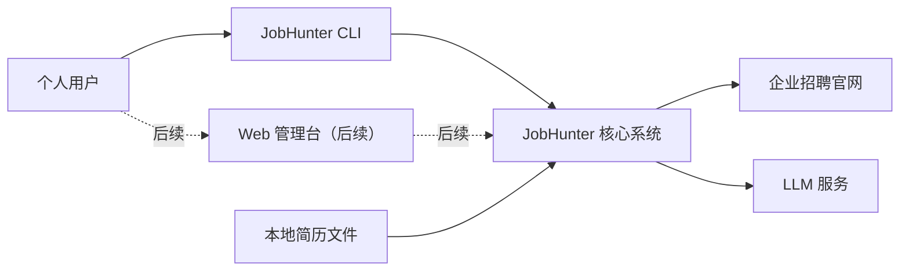
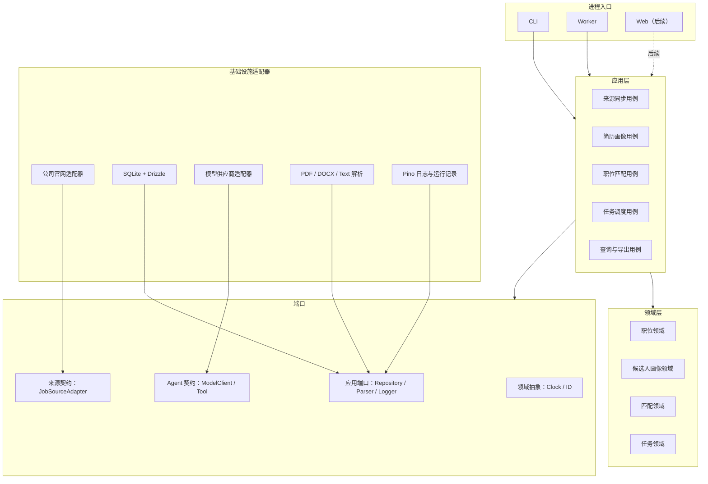
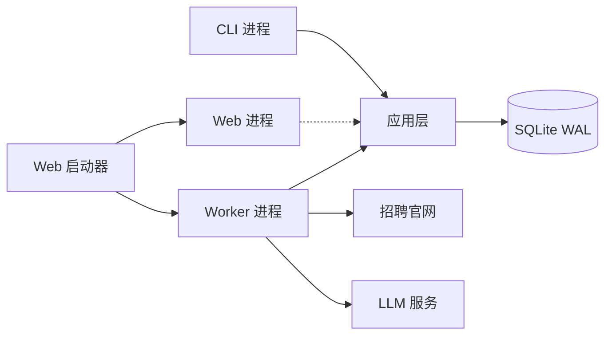
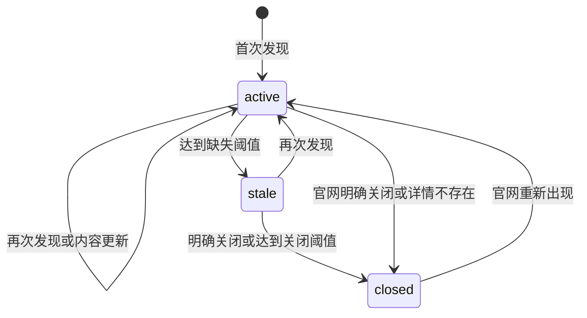
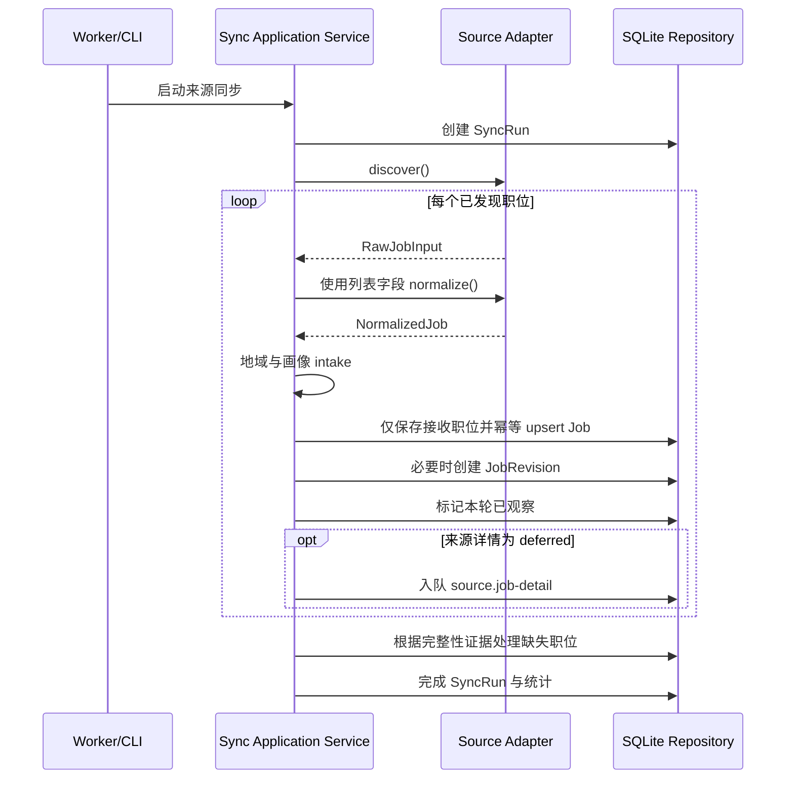
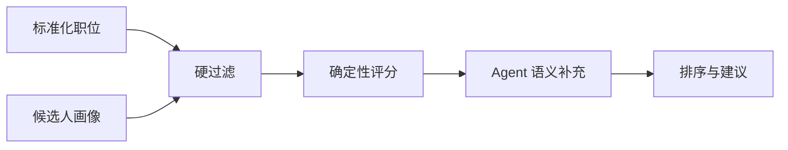

# JobHunter 总体架构

> 状态：Accepted
> 版本：1.3.0
> 更新日期：2026-08-28
> 适用阶段：首期 Agent 与数据内核，以及后续 Web 管理台演进

## 1. 概述

### 1.1 文档目的

本文档定义 JobHunter 的总体架构、系统边界、核心模块、运行方式、数据流和关键技术约束，作为后续 SDD（Specification-Driven Development）规格拆分、技术设计和实现验收的共同基线。

本文档描述架构级决策，不替代具体功能规格。每个业务能力应在 `specs/` 下继续编写独立的 `spec.md`、`design.md` 和 `tasks.md`。

### 1.2 产品目标与范围

JobHunter 是一个面向个人使用的求职辅助系统。系统读取已有简历，持续聚合企业招聘官网中的有效职位，对职位进行标准化、维护和匹配，并输出可解释的候选职位列表与官网投递入口。

#### 1.2.1 首期目标

1. 接入企业官方招聘渠道，定期发现职位并维护新增、更新、失效和关闭状态。
2. 将不同官网的职位数据转换为统一领域模型。
3. 导入并结构化个人简历，形成可修正、可复用的候选人画像。
4. 通过确定性规则和 LLM Agent 生成职位匹配分数、依据、风险与建议。
5. 在没有 Web 管理台的情况下，通过 CLI 完成端到端数据闭环。
6. 为后续 Web 管理台、更多招聘渠道和岗位建议 Agent 保留稳定扩展边界。

#### 1.2.2 首期公司范围

首批目标公司如下，实际接入按官网技术勘察结果分批完成：

- 腾讯
- 阿里巴巴
- 百度
- 字节跳动
- 拼多多
- 美团
- 得物
- 小红书
- 京东
- 华为

公司规模标签仅用于筛选和个人偏好，不作为适配器或领域模型的结构边界。

#### 1.2.3 首期非目标

- 不接入 BOSS 直聘、猎聘等聚合招聘平台。
- 不自动填写或提交职位申请。
- 不绕过验证码、登录控制、访问频率限制或其他反自动化措施。
- 不训练或部署自有大模型。
- 不建设多用户、组织、权限和计费体系。
- 不引入 LangChain 等通用 Agent 编排框架。
- 不在首期拆分微服务，不引入 Redis、Kafka 等额外基础设施。
- 不保证采集所有历史职位，只维护系统开始运行后可观察到的数据。

## 2. 架构目标与原则

### 2.1 架构驱动因素

系统架构优先满足以下质量属性：

1. **可维护性**：来源差异封装在适配器中，业务规则不散落到采集实现。
2. **可扩展性**：新增公司、ATS 类型、模型供应商或展示端时，不修改核心领域逻辑。
3. **可追溯性**：能够解释职位从哪里获得、何时变化、为何被判定关闭，以及匹配分数如何产生。
4. **可恢复性**：单个来源、单个职位或单次模型调用失败，不破坏整个同步批次。
5. **可测试性**：采集、标准化、状态转换、评分和 Agent 输出均可独立验证。
6. **个人部署友好**：本地即可运行，默认只依赖 Node.js、SQLite 和可选的 LLM API。
7. **成本可控**：优先使用确定性逻辑；LLM 结果缓存且仅在输入变化时重新计算。

### 2.2 核心架构原则

#### 2.2.1 确定性数据管道优先

官网发现、字段提取、去重、状态转换和基础评分必须由普通程序完成。LLM 只处理确实需要语义理解的步骤，不能成为数据同步正确性的前提。

#### 2.2.2 端口与适配器

领域层只声明纯领域规则及 Clock/ID 等领域级抽象。Repository、事务、日志等应用端口由应用层声明；来源与 Agent 的通用协议放在独立契约包。SQLite、招聘官网、LLM、文件解析和各进程入口实现或装配这些端口，领域层不得感知它们。

#### 2.2.3 模块化单体

代码在一个仓库中开发和版本化，但按业务能力设置明确模块边界。CLI 与 Worker 是独立进程入口，共享同一组领域包和 SQLite 数据库。

#### 2.2.4 原始事实与推导结果分离

- 原始职位响应是外部事实。
- 标准化职位是系统对事实的统一表达。
- 匹配分数、语义标签和建议是可重新计算的推导结果。

三者分别存储，避免模型或规则升级后无法回溯和重算。

#### 2.2.5 数据不物理删除

职位从官网消失时转为 `stale` 或 `closed`，保留职位记录、原始快照和变更历史。物理清理由显式维护命令处理，不属于日常同步流程。

#### 2.2.6 幂等与可重放

同一批原始输入重复处理，不应创建重复职位或无意义历史版本。标准化、状态转换和匹配计算应能针对已有数据安全重放。

## 3. 系统架构

### 3.1 系统上下文



外部依赖失败时的基本原则：

- 招聘官网失败：记录来源运行失败并退避重试，不影响其他来源。
- LLM 失败：保留确定性处理结果，语义结果进入待重试状态。
- 简历解析失败：保留导入记录和错误，不产生不完整的活动画像。
- SQLite 写入失败：回滚当前短事务，不提交部分领域状态。

### 3.2 逻辑架构



依赖方向必须保持为：

```text
进程入口 → 应用层 → 领域层
                  → 应用端口 ← 基础设施适配器
                  → 来源/Agent 契约 ← 对应适配器
```

领域层禁止依赖 CLI、Worker、Drizzle、Playwright、具体模型 SDK 或具体公司适配器。

## 4. 代码组织与运行时

### 4.1 代码与模块布局

```text
JobHunter/
├─ apps/
│  ├─ cli/                    # 面向用户的命令行入口
│  ├─ worker/                 # 调度、同步、重试和后台计算
│  └─ web/                    # 第二阶段加入
├─ packages/
│  ├─ domain/                 # 纯领域实体、值对象、规则、Clock/ID 抽象
│  ├─ application/            # 用例编排、应用端口和事务边界
│  ├─ db/                     # Drizzle schema、迁移和仓储实现
│  ├─ source-core/            # 来源协议、同步引擎、限流和标准化
│  ├─ sources/                # 企业官网或通用 ATS 适配器
│  ├─ resume/                 # 文件解析、画像提取和人工修正规则
│  ├─ matching/               # 硬过滤、评分、排序和解释数据
│  ├─ agent-core/             # 轻量 Agent 运行时
│  ├─ llm/                    # 模型供应商、结构化输出和缓存
│  ├─ observability/          # 日志、事件、指标和脱敏
│  └─ testkit/                # 固定样本、伪时钟、假模型和测试工厂
├─ docs/
│  ├─ arch/                   # 总体架构与专题架构
│  └─ adr/                    # 架构决策记录
├─ specs/                     # SDD 功能规格
├─ fixtures/                  # 脱敏后的采集与简历测试样本
└─ var/                       # 默认本地运行数据，不提交版本库
   ├─ jobhunter.sqlite
   ├─ raw/
   ├─ resumes/
   └─ exports/
```

建议使用 `pnpm workspace` 管理包，所有跨模块调用只能通过包的公开入口，不允许从其他包的内部路径导入。

首期 `packages/sources` 是一个 workspace 包，各公司目录是包内模块并在启动时通过编译期 Registry 注册；“插件式”指遵循统一契约和可独立启停，不表示加载任意第三方代码。只有出现独立发布需求后才考虑拆成嵌套 workspace 包或运行时插件。

内部包依赖必须符合：

| 包                    | 允许依赖的内部包                                       |
| --------------------- | ------------------------------------------------------ |
| `domain`              | 无                                                     |
| `source-core`         | `domain`                                               |
| `agent-core`          | 无业务包                                               |
| `resume`、`matching`  | `domain`、`agent-core` 的公开协议                      |
| `application`         | `domain`、`source-core`、`agent-core`、业务能力包      |
| `sources`             | `domain`、`source-core`                                |
| `llm`                 | `agent-core`                                           |
| `db`、`observability` | `domain`、`application`、`agent-core` 中需要实现的端口 |
| `apps/*`              | 仅用于装配，可依赖所需包                               |

任何内部包都不得依赖 `apps/*`；`application` 不得依赖 `db`、`sources`、`llm` 或 `observability` 的具体实现。

### 4.2 技术基线

| 能力         | 首期选择                                |
| ------------ | --------------------------------------- |
| 运行时与语言 | Node.js 24 LTS、TypeScript strict       |
| Workspace    | pnpm workspace                          |
| Schema       | Zod                                     |
| SQLite       | better-sqlite3、Drizzle ORM、FTS5       |
| CLI          | Commander.js                            |
| 采集         | fetch、HTML 解析；必要时 Playwright     |
| 日志         | Pino，经 SafeLogger 脱敏包装            |
| 测试         | Vitest、真实临时 SQLite、Playwright E2E |
| Web（R2）    | Next.js App Router、React               |

依赖的精确版本在首个 workspace 任务中锁定；重大替换需要 ADR，补丁升级由锁文件和自动化测试约束。

### 4.3 运行时架构

首期包含 CLI、Worker 和 Web 启动器三个长期稳定的进程入口；Web 启动器会编排独立的 Web 与 Worker 子进程。

#### 4.3.1 CLI 进程

CLI 用于：

- 初始化数据库与配置。
- 导入简历并查看候选人画像。
- 手动触发单个或全部来源同步。
- 查询、筛选和导出职位。
- 运行匹配和查看解释。
- 查看任务、来源健康度和失败信息。

CLI 调用应用层用例，不得复制 Worker 中的业务逻辑。

#### 4.3.2 Worker 进程

Worker 用于：

- 轮询 SQLite 中的到期任务。
- 按计划执行来源同步。
- 执行失败重试、语义增强和匹配重算。
- 恢复进程异常退出时遗留的超时任务。
- 维护来源健康状态和同步游标。

Worker 可以并发执行网络读取，但写入 SQLite 时必须使用短事务并限制写并发。

#### 4.3.3 Web 启动器与 Web 进程

Web 启动器负责启动 Web 进程和独立 Worker 子进程，并在任一子进程退出时联动关闭另一个。Web 管理台复用应用层与仓储端口，主要提供查询、筛选、配置和手动操作。耗时采集或模型任务只入队，不在 HTTP 请求中执行。



## 5. 核心领域模型

### 5.1 主要聚合与实体

| 模型               | 职责                                           |
| ------------------ | ---------------------------------------------- |
| `Company`          | 公司标准名称、别名、行业、规模标签和启用状态   |
| `SourceChannel`    | 公司下稳定的实习、校招或社招逻辑渠道与总开关   |
| `JobSource`        | 物理官网入口、适配器、配置、同步策略和健康状态 |
| `Job`              | 标准化职位、当前状态、来源标识和最新可见时间   |
| `JobRevision`      | 职位有效字段发生变化时生成的历史版本           |
| `RawJobRecord`     | 原始响应或经过脱敏的原始内容及其内容哈希       |
| `SyncRun`          | 一次来源同步的生命周期和统计信息               |
| `CandidateProfile` | 从简历产生并允许人工修正的结构化候选人画像     |
| `MatchResult`      | 指定画像与职位在指定规则版本下的匹配结果       |
| `AgentRun`         | 一次模型或工具运行的输入引用、版本、状态和成本 |
| `Task`             | Worker 可领取、重试和恢复的持久化任务          |

### 5.2 职位生命周期



状态定义：

- `active`：最近同步中仍可见，或有明确有效证据。
- `stale`：暂时未观察到，但证据不足以判定关闭。
- `closed`：官网明确关闭、详情确定不存在，或连续缺失达到配置阈值。

不得因单次列表缺失直接关闭职位。状态阈值属于同步策略，应记录策略版本并支持按来源调整。

### 5.3 身份与去重

来源内稳定身份优先使用：

```text
(source_id, external_job_id)
```

其中 `source_id` 始终指向物理 `JobSource`，不是逻辑 `SourceChannel`。同一逻辑渠道下的兄弟来源仍保留各自的来源身份和审计链。

若来源没有稳定 ID，则使用适配器生成的来源指纹。R1 不执行跨来源自动合并或“疑似重复”业务流程；同一职位在不同来源中可以分别存在。可保留以下辅助指纹字段，为后续独立规格提供证据：

- 公司标准 ID
- 规范化职位名称
- 城市集合
- 部门或细分职位类别
- 职位描述内容哈希

## 6. 数据来源与同步

### 6.1 官网来源子系统

#### 6.1.1 适配器职责

每个官网适配器负责：

- 构造列表和详情请求。
- 处理分页或增量游标。
- 将来源响应映射为统一的原始职位输入。
- 提供稳定外部 ID、官网详情 URL 和投递 URL。
- 报告来源能力、限流要求和健康状态。

适配器不负责：

- 直接写数据库。
- 判断全局职位状态。
- 实现匹配评分。
- 调用 LLM 生成业务结论。
- 自行决定重试和并发策略。

#### 6.1.2 适配器契约

概念接口如下，具体字段由来源适配器规格确定：

```ts
export interface JobSourceAdapter {
  readonly metadata: SourceMetadata;

  discover(context: DiscoverContext): AsyncIterable<DiscoveredJob>;

  fetchDetail?(job: DiscoveredJob, context: FetchContext): Promise<RawJobDetail>;

  normalize(input: RawJobInput): Promise<NormalizedJob>;

  checkHealth(context: HealthCheckContext): Promise<SourceHealth>;
}
```

所有适配器必须支持：

- `AbortSignal` 取消。
- 明确的请求超时。
- 来源级限速。
- 可分类错误：临时失败、永久失败、解析失败、配置失败。
- 使用固定样本离线测试。
- 原始字段缺失时输出显式 `null`，不臆造数据。

#### 6.1.3 官网数据获取标准流程

所有官网来源必须遵循“JSON 优先、会话初始化、同会话 JSON 分页”的统一流程。职位数据不得通过 DOM 文本解析获得，也不得通过点击 DOM 分页控件驱动下一页请求。分页总数必须来自列表 JSON 响应中的 `total/count` 与 `pageSize/limit` 等字段，并按以下规则计算：

```text
pageCount = total == 0 ? 0 : ceil(total / pageSize)
```

标准流程如下：

1. **确认官方 JSON 协议**：优先寻找公开列表 JSON API，确认列表字段、稳定职位 ID、详情 URL、分页字段和总数边界；通过逐来源 Schema 校验外部响应。
2. **优先直接请求**：不需要浏览器会话或运行时参数的来源，使用受限 HTTP JSON 客户端直接请求，不加载 DOM、不解析职位页面文本。
3. **初始化匿名会话**：若列表请求依赖官网公开脚本生成的会话、CSRF 或签名上下文，则在受控匿名浏览器中打开官方入口，仅等待官网脚本产生首个成功的列表 JSON 请求。
4. **保存初始化请求模板**：捕获首个成功请求的 URL、方法、必要请求头、请求体和当前匿名会话上下文；响应必须是已验证的 JSON 列表，并能读出总数和单页大小。签名或会话参数只在初始化阶段由官网脚本生成。
5. **计算分页范围**：使用首个 JSON 响应的总数和单页大小计算页数，不从 DOM 推断页数，不依赖分页控件是否存在。
6. **同会话直接 JSON 分页**：在同一浏览器页面上下文中直接发起后续 JSON 请求，复用初始化请求模板和会话，只更新 `offset`、`pageIndex`、`curPage` 等协议字段；不得点击 DOM，不得重新生成或逆向伪造签名。
7. **逐页校验与归一化**：每页响应都在 JSON 边界进行状态码、分页参数、总数、记录数组和逐来源 Schema 校验，然后映射为 `RawJobInput`；职位标题、描述、地点等字段只能来自 JSON 响应。
8. **记录覆盖证据**：成功完成全部计算页才报告 `complete`；超时、解析变化或分页请求失败报告 `partial/failed`，不得据此批量关闭未出现职位。
9. **安全降级**：若来源必须依赖 DOM 解析、DOM 分页点击、验证码绕过或每页无法通过合法 JSON 请求完成，则标记为 `experimental` 或 `blocked`，不得为了提高覆盖率破坏本流程。

```mermaid
flowchart TD
    START([开始来源采集]) --> DISCOVER{存在可验证的官方 JSON 列表协议?}
    DISCOVER -- 是，无会话依赖 --> DIRECT[受限 HTTP 客户端发送 JSON 请求]
    DISCOVER -- 否，依赖官网运行时上下文 --> SESSION[打开匿名浏览器会话与官方入口]
    SESSION --> INITIAL[等待首个成功的官方列表 JSON 请求]
    INITIAL --> CAPTURE[捕获 URL、必要请求头、请求体、会话和初始化签名]
    DIRECT --> FIRST[校验首个 JSON 响应]
    CAPTURE --> FIRST
    FIRST --> META[读取 total/count 与 pageSize/limit]
    META --> RANGE[计算 ceil(total / pageSize)]
    RANGE --> MORE{还有未采集页?}
    MORE -- 否 --> COMPLETE[报告 complete 与覆盖统计]
    MORE -- 是 --> REPLAY[同会话直接发送 JSON 分页请求\n仅修改 offset/pageIndex/curPage]
    REPLAY --> VALIDATE[校验状态码、分页参数、总数和来源 Schema]
    VALIDATE -- 通过 --> MORE
    VALIDATE -- 失败或超时 --> PARTIAL[报告 partial/failed\n保留失败原因，不关闭缺失职位]
    SESSION -. 禁止 .-> DOM[DOM 职位解析 / DOM 分页点击]
    SESSION -. 禁止 .-> BYPASS[伪造风控 / 绕过验证码 / 复用未授权登录 Cookie]
```

受控浏览器只属于来源基础设施，用于建立合法匿名会话和执行页面上下文内的 JSON 请求；浏览器对象、Cookie、签名和页面实现细节不能泄露到应用层。不得逆向伪造风控参数、绕过验证码、复用未经授权的登录 Cookie 或隐藏自动化身份以规避访问控制。

浏览器降级必须设置独立超时、低并发、资源回收和失败熔断。若来源需要长期维持复杂会话、频繁触发人机验证，或其维护成本明显高于个人使用收益，则保持 `experimental` 或标记 `blocked`；该来源失败不能阻塞其他来源、简历画像、匹配和查询主链路。

#### 6.1.4 ATS 复用策略

首次接入允许按公司实现适配器。在识别出多个公司共享同一 ATS 且协议稳定后，将公共逻辑提取为 ATS 适配器，公司差异下沉为配置。不能仅凭页面外观提前建立错误抽象。

来源支持状态必须诚实标记为 `experimental`、`supported` 或 `blocked`；是否启用由独立 `enabled` 配置表示，运行健康使用 `unknown/healthy/degraded/unhealthy`，三者不得混用。首批官网调研和逐来源开发门禁见 `specs/006-first-party-sources/research.md` 与同目录规格。10 家均须进入来源目录并持续保留调研结论，但只有通过门禁的来源才能标记为 `supported`；复杂或受外部条件阻断的来源允许降级，不阻塞数据内核与 Agent 主链路发布。

来源目录分为两层：每家公司固定拥有实习、校招、社招三个逻辑 `SourceChannel`，每个逻辑渠道映射零个、一个或多个物理 `JobSource`。逻辑渠道提供稳定的用户入口、筛选与总开关；物理来源拥有 adapter key、配置、同步策略、支持状态和运行健康。渠道级同步只编排扇出独立的来源级任务，不共享游标、事务或健康状态；具体约束见 `specs/018-logical-source-mapping/` 与 ADR-0009。

### 6.2 同步流水线

用户按逻辑渠道触发同步时，应用层先解析公司、渠道和物理来源三层开关，再为每个有效物理来源分别创建 `source.sync` 任务。下述流水线始终运行于单个物理来源；兄弟来源失败相互隔离，完整覆盖、seen set 和职位关闭判定不得跨来源合并。



同步完成后可产生后续任务：

- 已接收且来源详情为 deferred：创建独立详情补全任务；详情失败不影响列表覆盖与来源健康。
- 新职位或 JD 变化：创建语义增强任务。
- 影响过滤或评分的字段变化：创建匹配重算任务。
- 职位关闭：使活动匹配结果不可投递，但保留历史结果。

只有确认本次发现覆盖完整范围时，才允许根据“本轮未出现”更新缺失计数。分页中断或部分失败的同步运行不得据此批量标记职位失效。

## 7. 简历、匹配与 Agent

### 7.1 简历与候选人画像

简历处理分为四层：

1. 文件存档和内容哈希。
2. PDF、DOCX 或文本的确定性文字提取。
3. Agent 将文本映射为结构化画像。
4. 用户对画像字段进行人工修正和锁定。

候选人画像至少包含：

- 基本求职偏好：地点、岗位方向、公司偏好、可接受条件。
- 教育经历。
- 工作经历。
- 项目经历。
- 技能及熟练度证据。
- 行业和业务领域经验。
- 年限、职级和管理经验。
- 人工修正字段及锁定状态。

重新解析简历时不得静默覆盖已锁定字段。原始简历属于敏感数据，日志和 Agent 运行记录不得保存无必要的完整正文。

### 7.2 匹配架构

职位匹配采用分层流水线：



#### 7.2.1 硬过滤

用于排除明确不满足的条件，例如：

- 用户明确排除的地点或岗位类型。
- 明确不可接受的工作性质。
- 必须条件与候选人情况存在确定冲突。

每条过滤结果必须包含规则 ID 和证据。证据不足时不进行硬排除。

#### 7.2.2 确定性评分

评分可包含：

- 核心技能覆盖。
- 相关经历与年限。
- 岗位方向与职级。
- 行业或业务背景。
- 地点和个人偏好。
- 明确风险或缺口。

评分结果必须记录 `profile_version`、`job_revision` 和 `ruleset_version`，使历史结果可解释、可比较和可重算。

#### 7.2.3 Agent 语义补充

Agent 用于提取隐含要求、识别加分项、解释匹配依据以及生成准备建议。Agent 不拥有最终职位状态，不绕过硬规则，也不直接修改标准化职位事实。

### 7.3 轻量 Agent 运行时

#### 7.3.1 组件

| 组件              | 职责                                        |
| ----------------- | ------------------------------------------- |
| `ModelClient`     | 屏蔽模型供应商差异，支持结构化输出和取消    |
| `ToolDefinition`  | 使用 Zod 声明工具输入、输出和执行函数       |
| `AgentDefinition` | 声明系统提示、可用工具、输出 Schema 和预算  |
| `AgentRunner`     | 执行模型—工具循环并施加步数、时间和成本限制 |
| `RunContext`      | 提供任务、画像、职位和权限上下文            |
| `AgentRunStore`   | 保存版本、状态、耗时、Token、错误和结果引用 |
| `PromptRegistry`  | 管理提示词 ID、版本和兼容性                 |

#### 7.3.2 首期 Agent

- `ResumeProfileAgent`：将简历文本转为结构化候选人画像。
- `JobUnderstandingAgent`：提取规则难以稳定获得的 JD 语义信息。
- `JobAdviceAgent`：基于职位、画像和确定性评分生成解释与建议。

#### 7.3.3 运行约束

- 所有业务输出必须通过 Zod Schema 校验。
- 结构化输出校验失败只能有限次数修复，随后转入失败队列。
- 每种 Agent 必须配置最大步数、超时和 Token 预算。
- 工具按最小权限暴露，默认只读；写操作由应用层用例完成。
- Agent 结果缓存键至少包含输入内容哈希、Agent 版本、Prompt 版本和模型配置版本。
- 日志记录摘要和引用，默认不记录完整简历、密钥或不必要的原始 JD。
- 模型不可用时，确定性同步与评分能力仍可运行。

## 8. 存储与配置

### 8.1 SQLite 与持久化策略

完整表、约束、索引、保留和迁移设计见 [数据模型与 SQLite 表设计](./data-model.md)。

#### 8.1.1 数据库约束

- 使用 SQLite WAL 模式。
- 设置合理的 `busy_timeout`。
- 使用外键约束，并在连接初始化时显式启用。
- 所有写事务保持短小，不在事务内执行网络或模型调用。
- Worker 限制数据库写并发，避免多个长事务争抢写锁。
- 时间统一存储为 UTC，展示时转换为本地时区。
- 数据库迁移只通过版本化迁移文件执行。

#### 8.1.2 任务队列

领取、租约、心跳、重试、调度和关闭算法见 [Worker、任务队列与并发设计](./worker-and-concurrency.md)。

首期任务队列直接存储在 SQLite。任务至少包含：

- 类型和序列化参数。
- 状态：`pending`、`running`、`succeeded`、`failed`、`cancelled`。
- 计划执行时间。
- 尝试次数和最大尝试次数。
- 锁拥有者和锁过期时间。
- 幂等键。
- 最后错误分类和摘要。

Worker 使用带过期时间的任务租约。进程异常退出后，其他 Worker 或重启后的同一 Worker 可以重新领取超时任务。首期默认只运行一个 Worker 实例，但数据结构不依赖进程内存状态。

#### 8.1.3 文件存储

大体积原始响应、简历原文件和导出结果保存在本地 `var/`，SQLite 保存路径、哈希、媒体类型和元数据。小型结构化 JSON 可以直接存入 SQLite。

所有文件写入先写临时文件，再原子替换目标文件，避免进程中断留下半文件。

#### 8.1.4 备份与迁移边界

个人部署阶段应提供一致性备份命令，同时备份 SQLite 和 `var/` 文件。未来迁移 PostgreSQL 时，领域层和应用层保持不变，只替换仓储实现、迁移工具及任务领取策略。

### 8.2 配置与密钥

配置来源按优先级合并：

```text
CLI 临时参数 > 环境变量 > 本地配置文件 > 内置默认值
```

配置分为：

- 普通配置：数据库路径、同步周期、并发、来源开关、关闭阈值。
- 敏感配置：模型 API Key、可能存在的授权信息。

敏感配置不得写入 SQLite 普通配置表、日志、错误消息或版本库。首期可通过环境变量提供；后续可接入操作系统密钥环。

## 9. 运维与质量保障

### 9.1 可观测性与审计

系统同时使用结构化日志和持久化运行记录。

#### 9.1.1 日志公共字段

- `runId`
- `taskId`
- `sourceId`
- `jobId`
- `agentRunId`
- `operation`
- `durationMs`
- `errorCategory`

#### 9.1.2 必须可查询的运行信息

- 每个来源最近成功和失败时间。
- 每次同步的发现、新增、更新、恢复、缺失、关闭和失败数量。
- 当前待处理、运行中和失败任务。
- Agent 的模型、Prompt 版本、耗时、Token 和缓存命中情况。
- 职位状态变化的时间、原因和证据来源。

日志必须进行字段级脱敏，不能依赖简单字符串替换处理简历和密钥。

### 9.2 可靠性与错误处理

错误按处理策略分类：

| 类型           | 示例                        | 策略                       |
| -------------- | --------------------------- | -------------------------- |
| 临时外部错误   | 超时、限流、服务端错误      | 指数退避并加入随机抖动     |
| 永久外部错误   | 职位详情确定不存在          | 记录证据并进入状态判断     |
| 解析错误       | 官网结构变化、字段类型异常  | 隔离样本，标记来源退化     |
| 配置错误       | 缺少 API Key、非法来源配置  | 不自动重试，等待修正       |
| 数据冲突       | 唯一键、版本不一致          | 回滚短事务并重新读取判断   |
| Agent 输出错误 | Schema 不合法、工具循环超限 | 有限修复，随后保存失败状态 |

来源连续失败达到阈值时进入 `degraded` 或 `unhealthy` 状态，暂停高频自动重试，但保留手动健康检查能力。

### 9.3 安全、隐私与合规边界

- 仅访问无需绕过访问控制的官方招聘公开页面或接口。
- 尊重来源的访问频率和使用约束，适配器必须配置限速。
- 可在受控浏览器中执行官网公开脚本并读取匿名渲染结果，但不逆向伪造风控参数、不绕过验证码、不复用未经授权的会话，也不通过隐匿手段规避访问控制。
- 原始页面中与职位无关的个人信息不进入领域数据。
- 简历默认仅保存在本地，发送给 LLM 的内容应限于当前任务所需字段。
- 提供删除或清理简历、Agent 运行输入和导出文件的显式维护能力。
- 官网投递链接必须保留原始来源，系统不伪装为招聘方。

### 9.4 测试策略

#### 9.4.1 单元测试

- 字段规范化和值对象。
- 职位状态机。
- 缺失阈值和关闭规则。
- 过滤、评分和排序规则。
- Agent 输出 Schema 和缓存键。

#### 9.4.2 适配器契约测试

所有来源适配器复用同一套契约测试，验证：

- 稳定 ID 和 URL。
- 分页终止条件。
- 缺失字段处理。
- 固定样本标准化。
- 请求取消、超时和错误分类。
- 输入相同则标准化输出稳定。

测试默认使用脱敏固定样本，不依赖官网在线可用性。

#### 9.4.3 集成测试

- SQLite 迁移和仓储行为。
- 同步任务的幂等重放。
- 部分分页失败不会关闭职位。
- Worker 租约过期恢复。
- 简历修正字段不会被重新解析覆盖。

#### 9.4.4 端到端验收

首个可用闭环需要证明：

1. 导入一份测试简历。
2. 同步至少两个不同技术类型的官网来源。
3. 生成去重后的职位列表和官网投递链接。
4. 输出匹配分数、评分明细、风险和建议。
5. 重复同步不产生重复职位或无意义版本。
6. 官网职位变化能产生正确修订和重算任务。

### 9.5 关键风险与缓解措施

| 风险                     | 影响                       | 缓解措施                                               |
| ------------------------ | -------------------------- | ------------------------------------------------------ |
| 官网接口或页面频繁变化   | 来源同步失败或字段错误     | 固定样本、健康检查、解析错误隔离、来源级开关           |
| 页面缺失被误判为职位关闭 | 丢失有效候选职位           | 仅完整同步可增加缺失计数，引入 `stale` 过渡状态        |
| SQLite 写锁竞争          | Worker 或后续 Web 请求超时 | WAL、短事务、单写并发、任务租约、可迁移仓储端口        |
| LLM 输出不稳定           | 画像和建议不一致           | Schema 校验、版本化 Prompt、缓存、评测集、人工修正锁定 |
| Agent 成本失控           | 批量职位分析费用过高       | 内容哈希缓存、先规则过滤、预算限制、只处理变化数据     |
| 适配器重复实现           | 维护成本上升               | 先实现公司适配器，确认共同协议后提取 ATS 公共层        |
| 敏感简历泄露             | 隐私风险                   | 本地存储、最小化发送、结构化脱敏、禁止正文日志         |

## 10. 演进与架构治理

### 10.1 演进路线

#### 10.1.1 M0：架构与 SDD 基线

- 建立 workspace、代码质量工具和测试框架。
- 完成核心 ADR。
- 编写领域模型、来源适配器和同步规格。

#### 10.1.2 M1：数据内核

- SQLite Schema、迁移和仓储。
- CLI 初始化和查询能力。
- 任务模型和 Worker 运行骨架。

#### 10.1.3 M2：来源同步闭环

- 来源契约和同步引擎。
- 两个不同技术类型的参考官网适配器。
- 原始记录、职位版本和状态维护。

#### 10.1.4 M3：Agent 与匹配闭环

- 简历导入和候选人画像。
- Agent 运行时和模型适配器。
- 硬过滤、确定性评分和 Agent 建议。

#### 10.1.5 M4：扩展首批来源

- 按官网勘察结果接入剩余目标公司。
- 提取经过验证的公共 ATS 适配器。
- 建立来源健康检查和回归样本维护流程。

#### 10.1.6 M5：Web 管理台

- 职位列表、筛选和详情。
- 简历画像查看与修正。
- 来源配置、同步记录和任务状态。

#### 10.1.7 后续扩展

- BOSS 直聘等统一招聘渠道。
- 更细化的岗位建议与简历定制 Agent。
- 浏览器辅助投递，但仍要求用户确认关键操作。
- PostgreSQL 存储适配器和多用户能力。

### 10.2 SDD 与架构治理

架构文档、ADR 和功能规格的职责如下：

| 文档                        | 回答的问题                             |
| --------------------------- | -------------------------------------- |
| `docs/arch/overall-arch.md` | 系统整体如何划分、运行和演进           |
| `docs/adr/*.md`             | 为什么选择某个重要且难以逆转的技术决策 |
| `specs/*/spec.md`           | 用户和系统需要表现出什么行为           |
| `specs/*/design.md`         | 当前能力如何在总体架构内实现           |
| `specs/*/tasks.md`          | 以什么可验证顺序完成实现               |

SDD 状态、追踪、Definition of Ready/Done 与变更流程见 `docs/sdd/README.md`；首期范围、依赖和发布验收见 `specs/README.md`。

若功能设计需要违反本文档中的依赖方向、数据所有权、进程职责或安全边界，必须先创建 ADR，说明背景、备选方案、影响和迁移策略，再修改总体架构。

首期规格基线如下：

```text
specs/
├─ 000-engineering-foundation/
├─ 001-domain-model/
├─ 002-sqlite-persistence/
├─ 003-task-worker/
├─ 004-source-adapter-contract/
├─ 005-job-sync-pipeline/
├─ 006-first-party-sources/
├─ 007-resume-profile/
├─ 008-agent-runtime/
├─ 009-job-matching/
├─ 010-cli/
├─ 011-web-console/
└─ 012-operations/
```

### 10.3 已固化 ADR

以下方向已在 `docs/adr/` 固化：

1. TypeScript 模块化单体（ADR-0007 已替代 ADR-0001，并补充 Node 24 LTS 与端口归属）。
2. SQLite 与本地文件存储。
3. 独立 Worker 与 SQLite 持久化队列。
4. 插件式招聘官网适配器。
5. 确定性管道优先与轻量 Agent。
6. 来源事实、标准化事实和推导结果分层。

### 10.4 架构验收标准

后续实现满足以下条件时，视为符合本总体架构：

- 新增官网来源不需要修改职位、画像或匹配领域规则。
- CLI 和未来 Web 复用同一应用层用例。
- 官网或 LLM 暂时不可用时，已有数据仍可查询和评分。
- 重复执行同步和匹配不会生成重复事实或无意义版本。
- 任一职位状态与匹配结果都能追溯到来源、输入版本和规则版本。
- 所有耗时任务可持久化、重试并在 Worker 重启后恢复。
- 简历内容和密钥不会出现在普通日志中。
- SQLite 替换为其他数据库时无需重写领域层。
