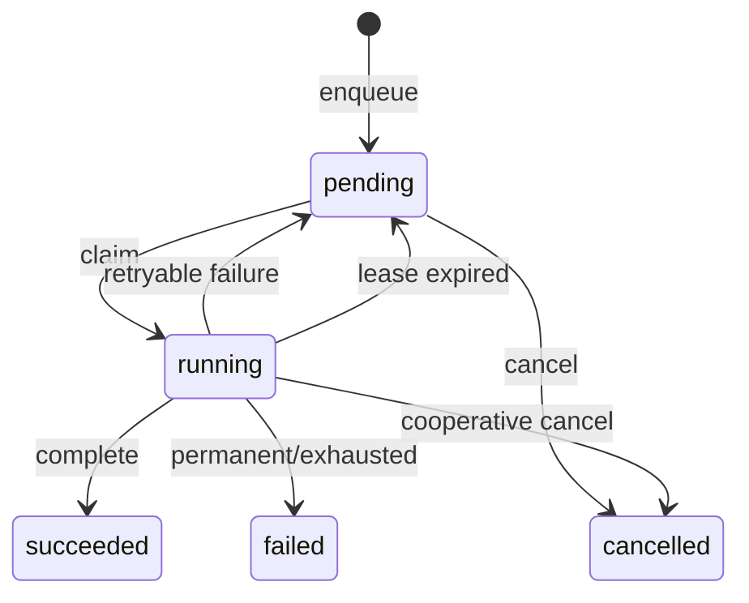

# Worker、任务队列与并发设计

> 状态：Accepted
> 版本：1.3.0
> 日期：2026-08-28

## 1. 运行模型

首期运行一个长期 Worker 进程和任意短生命周期 CLI 进程。Web 加入后同样只提交任务，不直接执行网络或模型工作。SQLite 允许并发读，但所有进程都必须保持短写事务。

Worker 内部包含：

- `SchedulerLoop`：将到期计划转为持久化任务。
- `ClaimLoop`：每个任务类型按配置启动一个或多个消费槽位，领取该类型的到期任务。
- `HandlerRegistry`：按 `task_type` 查找处理器与 payload Schema。
- `LeaseHeartbeat`：长任务续租。
- `RetryPolicy`：按错误类别决定重试时间。
- `GracefulShutdown`：停止领取、取消在途工作并释放或等待租约。

`resume.export.pdf@v1` 是 Worker 独占的本地浏览器任务。Web 先把已转义、无外部依赖的 HTML 快照写入临时文件，Worker 再用 Playwright 以 A4 和 `printBackground` 生成 PDF；任务按导出请求 ID 幂等，Web 进程不得直接启动 Chromium。

## 2. 任务状态机



状态转换必须通过 Repository 方法完成，调用方不能直接拼接状态更新。

## 3. 领取算法

每次领取只持有一个很短的 `BEGIN IMMEDIATE` 事务：

1. 恢复 `status = running AND lease_expires_at < now` 的过期任务；若尝试次数未耗尽则转回 `pending`，否则转为 `failed`。
2. 按 `priority DESC, available_at ASC, created_at ASC` 选择一条到期 `pending` 任务。
3. 将其更新为 `running`，设置 `lease_owner`、`lease_expires_at`，递增 `attempt_count`，首次领取时设置 `started_at`。
4. 提交事务后才解析 payload 和调用 Handler。

领取必须使用单条 `UPDATE ... RETURNING` 或在 `BEGIN IMMEDIATE` 内完成 select/update，禁止先无锁查询再更新。

首期默认参数：

- 数据库写并发：1。
- 网络任务并发：按来源分别限制，默认每来源 1、全局 3。
- 模型任务并发：默认 1。
- 默认租约：120 秒。
- 心跳间隔：30 秒。
- 空队列轮询：1 秒到 10 秒指数回退，入队可通过进程内信号提前唤醒。
- 每类队列消费并发度：通过 `worker.taskTypeConcurrency` 配置，未配置类型默认 1；每个槽位是独立异步领取循环。

`maxConcurrentNetworkTasks` 在 Worker 进程内实现为一个共享、FIFO、可取消的异步信号量。来源 HTTP、浏览器采集和模型调用在实际发起网络操作前申请许可，完整读取响应后释放；等待仅挂起 Promise，不占用线程。任务消费槽位负责制造并发，网络信号量负责施加全局背压，两者不能互相替代。

来源请求在全局信号量之前还要经过独立 Token Bucket；策略来自来源元数据的 `requestsPerMinute` 和 `burst`。这样节流等待不占全局许可，单一慢来源也不会阻塞其他来源。Worker 周期记录网络 active/queued 和事件循环 P95 延迟；若延迟持续升高，优先迁移同步 CPU 工作，而不是继续提高并发。

这些值是配置默认值，不是领域常量。

## 4. 幂等与重试

`idempotency_key` 防止同一逻辑输入重复入队；`concurrency_key` 防止不同输入但互斥的活动任务并存。数据库对非空 concurrency key 在 `pending/running` 状态建立部分唯一索引，应用层将冲突映射为“已有活动任务”。来源同步固定使用 `source-sync:{sourceId}`，不能只依赖先查后写。

任务幂等键由任务类型和不可变输入版本生成，例如：

```text
source.sync:{sourceId}:{requestedWindowOrManualToken}
job.enrich:{jobRevisionId}:{agentVersion}:{promptVersion}:{modelConfigHash}
match.compute:{profileVersionId}:{jobRevisionId}:{jobEnrichmentIdOrNone}:{rulesetVersion}
```

任务处理器必须先检查目标结果是否已经存在。即使任务因租约过期被第二次执行，也不能产生重复修订或重复匹配结果。

重试策略：

| 错误类别            | 默认策略                          |
| ------------------- | --------------------------------- |
| `rate_limited`      | 尊重 `Retry-After`，否则指数退避  |
| `network_temporary` | 指数退避 + 抖动，最多 5 次        |
| `upstream_5xx`      | 指数退避 + 抖动，最多 5 次        |
| `parse_changed`     | 不自动密集重试，来源标记 degraded |
| `invalid_config`    | 直接失败，等待配置修复            |
| `validation_failed` | 直接失败并保存脱敏样本引用        |
| `cancelled`         | 不重试，除非用户重新发起          |

退避上限默认 6 小时。错误摘要不得包含响应中的个人信息、Cookie、Token 或完整简历。

## 5. 调度语义

- Cron 使用 `schedules.timezone` 解释；默认 `Asia/Shanghai`。
- Scheduler 每次只推进一个 occurrence，并以 occurrence 时间生成幂等键。
- Worker 停机期间错过多个周期时，默认只补最近一次，不进行无界追赶。
- 同一来源已有 `pending` 或 `running` 同步任务时，`source-sync:{sourceId}` 并发键使新周期返回已有活动任务。
- 手动同步可以使用独立幂等 token，但仍使用同一来源并发键，不允许与计划同步并行。

## 6. 关闭与恢复

收到 SIGINT/SIGTERM 后：

1. 立即停止调度和领取新任务。
2. 触发在途 Handler 的 `AbortSignal`。
3. 在配置的宽限期内等待安全点。
4. 已产生外部请求但尚未写入的结果可以丢弃并重试。
5. 正在短事务中的写操作完成或回滚。
6. 未完成任务保留租约；租约到期后自动恢复。

不得通过强行把所有在途任务改回 `pending` 来关闭，因为无法确定外部操作是否已完成。幂等检查和租约恢复共同处理不确定结果。

## 7. 可观测性与测试

每次任务执行记录 `taskId`、`taskType`、`attempt`、`leaseOwner`、耗时和结果。队列必须可查询：待处理数、最老等待时长、运行数、失败数和租约过期数。

开发前必须具备以下测试设计：

- 两个领取者不能获得同一任务。
- Worker 在 Handler 中途退出后任务可恢复。
- 同一任务重复执行不产生重复领域结果。
- 不可重试错误不会进入循环。
- 调度器重启不会重复创建同一 occurrence。
- 取消信号能传递到网络和模型调用。
- running 取消默认优先于完成；只有最终业务事务已按 Task ID、running 与未取消条件门控的 Handler 才允许“提交先发生”时由完成获胜，避免业务结果已可见但 Task 状态为 cancelled。
- 不同幂等键但相同并发键的任务不能同时处于 pending/running。

任务诊断使用 tasks 上的批次与重试根派生字段，由数据库迁移回填、插入触发器维护；
执行 payload 与重试关系入队后不可变。普通任务及来源运行详情通过诊断仓储批量投影，
不暴露 payload。详见 [ADR-0019](../adr/0019-task-diagnostic-projection.md)。

Worker 调度循环驱动 SQLite 维护子进程；数据库维护标记与连接级写保护协调 Web 和 Worker 的短暂写入窗口。
详见 [ADR-0020](../adr/0020-sqlite-automatic-maintenance.md)，应用端口仍由数据库基础设施实现。
