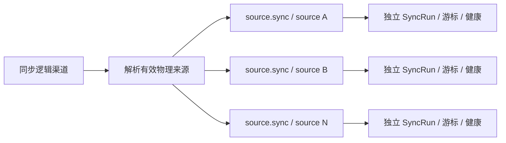

# 018 逻辑渠道与物理来源映射设计

> 状态：Implemented

## 领域边界

新增 `SourceChannel` 作为公司下的逻辑聚合入口，现有 `JobSource` 明确为物理执行来源。关系固定为：

```text
Company 1 ── 3 SourceChannel 1 ── 0..N JobSource
```

`SourceChannel` 只保存稳定渠道身份、用户说明和总开关。`JobSource` 保存所有与具体官网或协议有关的配置和运行状态。适配器 Registry 仍按物理 `adapter_key` 装配，不注册逻辑渠道。

## Catalog 结构

catalog 从扁平的“公司 + canonical source”改为两层声明：

```ts
interface SourceChannelSeed {
  id: string;
  companyId: string;
  channel: 'intern' | 'campus' | 'social';
  slug: string;
  enabled: boolean;
  supportNote?: string;
  sources: PhysicalSourceSeed[];
}

interface PhysicalSourceSeed {
  id: string;
  slug: string;
  adapterKey: string;
  coverageRole: 'required' | 'supplemental';
  // 其余现有来源配置
}
```

逻辑渠道 slug 保持公司与渠道维度的稳定选择器，例如 `netease-campus`。多个物理来源使用业务线或官网范围后缀，例如 `netease-campus-internet`、`netease-campus-games`、`netease-campus-leihuo`；adapter key 同理。已有一对一来源继续保留原 source UUID、slug 和 adapter key，避免无意义迁移。

只有真实存在的官方入口或协议才建立物理来源。逻辑渠道的 `sources` 可以为空，此时通过 `supportNote` 说明阻断事实，不再用 unavailable adapter 填充结构矩阵。

## 持久化

新增 `source_channels`：

| 字段                    | 说明             |
| ----------------------- | ---------------- |
| `id`                    | 稳定 UUID        |
| `company_id`            | 所属公司         |
| `channel`               | `intern          | campus | social` |
| `slug`                  | 全局唯一机器标识 |
| `enabled`               | 渠道总开关       |
| `support_note`          | 渠道级非敏感说明 |
| `created_at/updated_at` | 审计时间         |

现有 `job_sources` 增加非空 `channel_id` 和 `coverage_role`。物理来源继续拥有支持状态与健康字段，`sync_runs.source_id`、`jobs.source_id` 及其历史关联不变。

迁移采用“新增、回填、收紧”顺序：

1. 创建三渠道逻辑记录，使用 catalog 中固定 UUID。
2. 为 `job_sources` 增加可空 `channel_id` 并按现有显式 channel 回填。
3. 校验无孤立来源、每家公司逻辑渠道唯一、物理 key 唯一后，将 `channel_id` 收紧为非空外键。
4. 增加 `coverage_role`，现有真实来源默认 `required`；仅扩充发现面的来源经显式复核后标为 `supplemental`。
5. 保留现有物理 source UUID 及所有外键，不迁移职位和同步历史。

## 支持与健康派生

逻辑支持状态不另存一份可漂移的字段，而由 required 成员计算：

```text
supported    := required 非空且全部 supported
blocked      := required 为空，或 required 全部 blocked
experimental := 其他组合
```

逻辑健康为查询时派生摘要：有效 required 来源全部 healthy 时为 healthy；任一 unhealthy 时为 degraded；全部不可运行时为 unhealthy；没有运行证据时为 unknown。该摘要只服务展示，不覆盖成员健康，也不参与来源级重试。

## 同步编排

渠道级命令先读取有效成员，再为每个物理来源创建独立任务：



渠道级调用返回子任务集合，不新增跨来源数据库事务或共享 SyncRun。已有来源级 CLI、Worker task payload 和 Repository 契约保留；新增渠道级应用用例只负责编排扇出。未来若需要批次审计，可另增轻量 batch 实体，但不作为本次前置条件。

## 职位身份与关闭语义

`jobs.source_id` 始终指向物理来源，唯一身份仍为 `(source_id, external_job_id)`。兄弟来源之间不共享 seen set，不互相推进 missing_count，也不因内容相似自动合并。逻辑渠道只提供查询过滤条件，Repository 通过 `job_sources.channel_id` 连接查询。

## 接口兼容

- 现有 `sync source <source_id>` 继续同步一个物理来源。
- 新增 `sync channel <channel_id>` 扇出所有有效物理来源。
- Web 默认返回逻辑渠道摘要，并在展开项返回物理来源列表。
- 现有只认识物理 source ID 的任务和历史 URL 在兼容期保持有效。

## 验证

- catalog 测试证明公司三渠道唯一、物理来源 0..N、物理归属唯一及 key 全局唯一。
- 迁移集成测试证明历史 source/job/run/task 外键与数量不变。
- 应用测试证明渠道级扇出、三层开关、任务幂等和兄弟失败隔离。
- 同步测试证明 missing/closed 只在物理来源范围内计算。
- Web/CLI 测试证明默认展示逻辑渠道、展开物理来源且旧 source ID 入口兼容。
