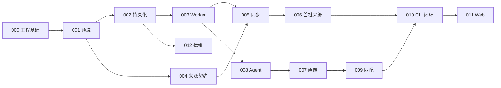

# 首期规格索引与开发顺序

> 状态：Ready
> 基线：2026-08-19

## 1. 发布范围

首期分两个连续里程碑，但本目录在正式编码前同时完成设计：

- **R1 数据与 Agent 内核**：通过 CLI 完成初始化、官网同步、简历画像、匹配、建议、查询和导出。
- **R2 本地 Web 管理台**：复用 R1 应用层，提供职位、画像、来源和任务的可视化管理。

R1 是首个可运行闭环，R2 不改变领域和持久化边界。自动投递、聚合招聘平台和多用户不在本基线范围。

## 2. 规格清单

| 规格                          | 能力                               | 里程碑 | 依赖                         |
| ----------------------------- | ---------------------------------- | ------ | ---------------------------- |
| `000-engineering-foundation`  | Workspace、包边界和质量门禁        | R1     | 无                           |
| `001-domain-model`            | 核心类型、状态和不变量             | R1     | 000                          |
| `002-sqlite-persistence`      | SQLite、文件、迁移、查询与备份基础 | R1     | 001                          |
| `003-task-worker`             | 持久化任务、计划、租约和恢复       | R1     | 001, 002                     |
| `004-source-adapter-contract` | 官网适配器 SDK 与契约测试          | R1     | 001                          |
| `005-job-sync-pipeline`       | 原始记录、标准化、修订与职位状态   | R1     | 001–004                      |
| `006-first-party-sources`     | 首批 10 家官网调查与适配器交付     | R1     | 004, 005                     |
| `007-resume-profile`          | 简历导入、解析、画像和人工锁定     | R1     | 001–003, 008                 |
| `008-agent-runtime`           | 模型端口、Agent Runner、缓存与评测 | R1     | 001–003                      |
| `009-job-matching`            | 过滤、评分、排序与 Agent 建议      | R1     | 001–003, 007, 008            |
| `010-cli`                     | R1 用户入口、机器输出与退出码      | R1     | 002–009                      |
| `011-web-console`             | 本地管理台                         | R2     | 002–010                      |
| `012-operations`              | 配置、日志、健康、清理、备份恢复   | R1/R2  | 002, 003                     |
| `013-resume-driven-intake`    | 简历驱动的异步摄取与目标岗位筛选   | R2/R3  | 007, 009, 011, 012           |
| `014-ui-redesign`             | 全系统 UI 重设计                   | R2     | 011                          |
| `015-resume-ocr`              | 简历图片 OCR 与画像填充            | R2     | 003, 007, 008, 011, 013, 014 |

`007` 在实现顺序上依赖 `008`，但两者设计可以并行评审。

## 3. 推荐实施顺序

允许在公共来源契约完成后并行开发各公司适配器，但每个适配器都必须单独通过开发门禁。

## 4. R1 发布验收

R1 必须证明：

1. 新环境可初始化数据库、配置和默认公司/来源。
2. 至少两种技术类型的官网适配器端到端通过，且 10 家目标来源全部通过 supported 门禁；外部阻断不能伪装为已支持，若确需延期必须先形成显式范围例外并更新本发布范围。
3. 重复和部分失败同步不产生重复职位，也不错误关闭职位。
4. 可导入简历、生成并修正画像，锁定字段不会被重解析覆盖。
5. 可生成有版本和证据的确定性匹配结果；模型不可用时基础结果仍可用。
6. CLI 可查询、筛选、导出并定位同步/任务/Agent 错误。
7. 备份、恢复、敏感数据清理和完整性检查有可执行路径。

## 5. 开发门禁

正式编码前：

- 本索引中的所有规格目录必须含 `spec.md`、`design.md`、`tasks.md`。
- 文档状态必须为 `Ready`，且没有未决问题。
- 总体架构、专题架构、ADR 和表设计必须与规格一致。
- 需求 ID、任务 ID 和依赖必须通过文档检查脚本或人工审计。
